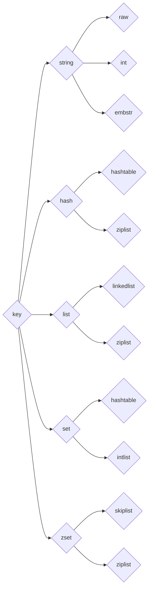
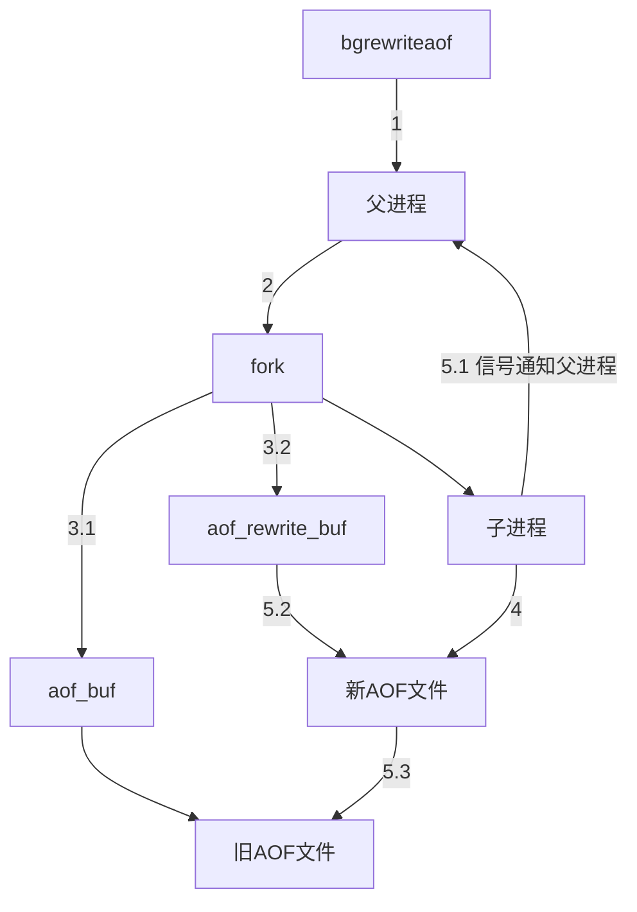
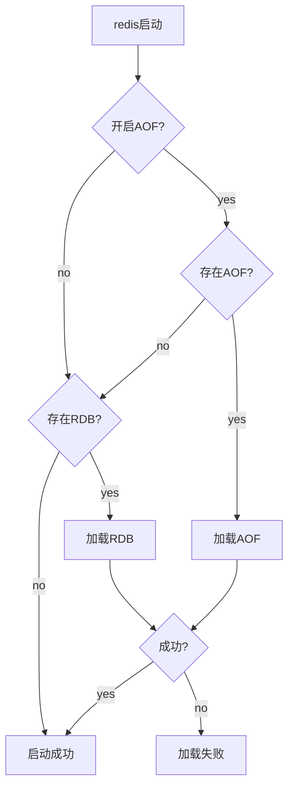

###### 一、初识Redis

1、Redis提供了两种持久化方式：RDB和AOF，即可以用这两种策略将内存的数据保存到硬盘中。

2、复制功能是分布式Redis的基础。

3、一般推荐使用的安装方式：源码的方式进行安装。下面以3.0.7版本为例(只需6步)：
```
$ wget http://download.redis.io/releases/redis-3.0.7.tar.gz
$ tar xzf redis-3.0.7.tar.gz
$ ln -s redis-3.0.7 redis           // 建立一个redis目录的软连接，指向redis-3.0.7。
$ cd redis
$ make                              // 编译(编译前确保操作系统已经安装gcc)
$ make install

$ redis-cli -v          // 查看Redis的版本
```
- 建立一个redis目录的软链接是为了不把redis目录固定在指定版本上，有利于Redis未来版本升级，算是安装软件的一个好习惯。
- 第6步的安装是将Redis的相关运行文件放到/usr/local/bin/下，这样就可以在任意目录下执行Redis的命令。

4、Redis可执行文件说明

可执行文件 | 作用
---|---
redis-server | 启动Redis
redis-cli | Redis命令行客户端
redis-benchmark | Redis基准测试工具
redis-check-aof | Redis AOF持久化文件检测和修复工具
redis-check-dump | Redis RDB持久化文件检测和修复工具
redis-sentinel | 启动Redis Sentinel

5、启动Redis

有三种方法启动Redis：默认配置、运行配置、配置文件启动。

1) 默认配置
- 这种方法会使用Redis的默认配置来启动。
```
$ redis-server
```

2) 运行启动
- redis-server加上要修改的配置名和值(可以是多对)，没有设置的配置将使用默认配置。
```
# redis-server --configKey1 configValue1 --configKey2 configValue2
# redis-server --port 6380
```

3）配置文件启动
- 将配置写到指定文件里，例如我们将配置写到了/opt/redis/redis.conf中，那么只需要执行如下命令即可启动Redis：
```
# redis-server /opt/redis/redis.conf
```

6、Redis的基础配置(Redis有60多个配置)

配置名 | 配置说明
---|---
port | 端口
logfile | 日志文件
dir | Redis工作目录(存放持久化文件和日志文件)
daemonize | 是否以守护进程的方式启动Redis

7、Redis命令行客户端

1）第一种是交互式方式：通过redis-cli -h {host} -p {port}的方式连接到Redis服务，之后所有的操作都是通过交互的方式实现，不需要再执行redis-cli了。
```
redis-cli -h 127.0.0.1 -p 6379
127.0.0.1:6379> set hello world
OK
127.0.0.1:6379> get hello
"world"
```

2）第二种是命令方式：通过redis-cli -h {host} -p {port} {command}就可以直接得到命令的返回结果。
```
redis-cli -h 127.0.0.1 -p 6379 get hello
"world"
```
- 如果没有-h参数，那么默认连接127.0.0.1；如果没有-p，那么默认6379端口。

8、 停止Redis服务

Redis提供了shutdown命令来停止Redis服务。
```
$ redis-cli shutdown        // 停掉127.0.0.1上6379端口上的Redis服务
```
- Redis关闭的过程：断开与客户端的连接、持久化文件生成，是一种相对优雅的关闭方式。
- 除了可以通过shutdown命令关闭Redis服务以外，还可以通过kill进程号的方式关闭掉Redis，但是不要粗暴地使用kill -9强制杀死Redis服务，不但不会做持久化操作，还会造成缓冲区等资源不能被优雅关闭，极端情况会造成AOF和复制丢失数据的情况。
- shutdown还有一个参数，代表是否在关闭Redis前，生成持久化文件。
```
$ redis-cli shutdown nosave|save
```

*** 

###### 二、API的理解和使用

1、全局命令

1）查看所有键
```
key *

127.0.0.1:6379> set hello world
OK
127.0.0.1:6379> set java jredis
OK
127.0.0.1:6379> set python redis-py
OK

127.0.0.1:6379> keys *
1) "python"
2) "java"
3) "hello"
```

2）键总数
```
dbsize

127.0.0.1:6379> rpush mylist a b c d e f g      // 插入一个列表类型的键值对(值是多个元素组成)
(integer) 7

127.0.0.1:6379> dbsize
(integer) 4                 // hello、java、python、mylist
```
- dbsize命令会返回当前数据库中键的总数。
- dbsize命令在计算键总数时不会遍历所有键，而是直接获取Redis内置的键总数变量，所以dbsize命令的时间复杂度是O(1)。而keys命令会遍历所有键，所以它的时间复杂度是O(n)，当Redis保存了大量键时，线上环境禁止使用。

3）检查键是否存在
```
exists key

127.0.0.1:6379> exists java
(integer) 1

127.0.0.1:6379> exists not_exist_key
(integer) 0
```
- 如果键存在则返回1，不存在则返回0.

4）删除键
```
del key [key ...]

127.0.0.1:6379> del java
(integer) 1
127.0.0.1:6379> exists java
(integer) 0
127.0.0.1:6379> del mylist
(integer) 1
127.0.0.1:6379> exists mylist
(integer) 0

127.0.0.1:6379> set a 1
OK
127.0.0.1:6379> set b 2
OK
127.0.0.1:6379> set c 3
OK
127.0.0.1:6379> del a b c
(integer) 3
```
- del是一个通用命令，无论值是什么数据结果类型，del命令都可以将其删除。
- 返回结果为成功删除键的个数，假设删除一个不存在的键，就会返回0.
- 同时del命令可以支持删除多个键。

5）键过期
```
expire key seconds

127.0.0.1:6379> set hello world
OK
127.0.0.1:6379> expire hello 10     // 为键hello设置了10秒过期时间
(integer) 1

127.0.0.1:6379> ttl hello
(integer) 7                         // 剩余7秒
127.0.0.1:6379> ttl hello
(integer) -2                        // 说明键hello已经被删除
127.0.0.1:6379> get hello
(nil)
```
- Redis支持对键添加过期时间，当超过过期时间后，会自动删除键。
- ttl命令会返回键的剩余过期时间，它有3种返回值：
    1. 大于等于0的整数：键剩余的过期时间。
    2. -1：键没设置过期时间。
    3. -2：键不存在。

2、键的数据结构类型

```
type key

127.0.0.1:6379> set a b
OK
127.0.0.1:6379> type a
string
127.0.0.1:6379> rpush mylist a b c d e f g 
(integer) 7  
127.0.0.1:6379> type mylist
list

127.0.0.1:6379> type not_exsit_key
none
```
- 如果键不存在，则返回none。

3、数据结构和内部编码



- type命令实际返回的就是当前键的数据结构类型，它们(5种)分别是string(字符串)、hash(哈希)、list(列表)、set(集合)、zset(有序集合)，但这些都是Redis对外的数据结构。
- 实际上每种数据结构都有自己底层的内部编码实现，而且是多种实现，这样Redis会在合适的场景选择合适的内部编码。
- 可以看到每种数据结构都有两种以上的内部编码实现，例如list数据结构包含了linkedlist和ziplist两种内部编码。
- 同时有些内部编码，例如ziplist，可以作为多种外部数据结构的内部实现，可以通过object encoding命令查询内部编码。

```
127.0.0.1:6379> object encoding hello
"embstr"
127.0.0.1:6379> object encoding mylist
"ziplist"
```

4、单线程架构

- Redis将所有数据放在内存中，内存的响应时长大约为100ns。
- Redis使用epoll作为I/O多路复用技术的实现，再加上Redis自身的事件处理模型将epoll中的连接、读写、关闭都转换为事件，不在网络I/O上浪费过多的时间。
- 单线程避免了线程切换和竞态产生的消耗。

5、字符串

- 键都是字符串类型。
- 字符串类型的值实际可以是字符串(简单的字符串、复杂的字符串(例如JSON、XML))、数字(整数、浮点数)，甚至是二进制(图片、音频、视频)，但是值最大不能超过512MB。

1）字符串常用命令
```
①设置值：
set key value [ex seconds] [px milliseconds] [nx|xx]
setex key seconds value
setnx key value

127.0.0.1:6379> exists hello
(integer) 0
127.0.0.1:6379> set hello world
OK
127.0.0.1:6379> setnx hello redis
(integer) 0                         // setnx失败，返回结果为0。
127.0.0.1:6379> set hello jredis xx
OK                                  // set xx成功，返回结果为OK。


②获取值：
get key

127.0.0.1:6379> get hello 
"world"
127.0.0.1:6379> get not_exist_key
(nil)                               // 如果要获取的键不存在，则返回nil(空)。


③批量设置值：
mset key value [key value ...]

127.0.0.1:6379> mset a 1 b 2 c 3 d 4    // 通过mset命令一次性设置4个键值对
OK


④批量获取值：
mget key [key ...]

127.0.0.1:6379> mget a b c d        // 批量获取键a、b、c、d的值
1) "1"
2) "2"
3) "3"
4) "4"
127.0.0.1:6379> mget a b c f
1) "1"
2) "2"
3) "3"
4) (nil)


⑤计数：
incr key
decr key
incrby key increment
decrby key decrement
incrbyfloat key increment

127.0.0.1:6379> exists key
(integer) 0
127.0.0.1:6379> incr key
(integer) 1
127.0.0.1:6379> incr key
(integer) 2
127.0.0.1:6379> set hello world
OK
127.0.0.1:6379> incr hello
(error) ERR value is not an integer or out of range
```
- set命令有几个选项：
    1. ex seconds：为键设置秒级过期时间
    2. px milliseconds：为键设置毫秒级过期时间。
    3. nx：键必须不存在，才可以设置成功，用于添加。
    4. xx：与nx相反，键必须存在，才可以设置成功，用于更新。
- setex和setnx命令的作用和ex和nx选项是一样的。
- setnx可以作为分布式锁的一种实现方案(多个客户端同时指向setnx key value时，只有一个客户端能设置成功)。
- 批量获取值时，如果有些键不存在，那么它的值为nil(空)，结果是按照传入键的顺序返回。
- 批量操作命令可以有效提高开发效率。但每次批量操作所发送的命令数不是无节制的，如果数量过多可能造成Redis阻塞或者网络拥塞。
- incr命令用于对值做自增操作，返回结果分为三种情况：
    1. 值不是整数，返回错误。
    2. 值是整数，返回自增后的结果。
    3. 键不存在，按照值为0自增，返回结果为1。
- 除了incr指令，Redis提供了decr(自减)、incrby(自增指定数字)、decrby(自减指定数字)、incrbyfloat(自增浮点数)。

2）字符串不常用命令
```
①追加值：
append key value

127.0.0.1:6379> get key
"redis"
127.0.0.1:6379> append key world
(integer) 10
127.0.0.1:6379> get key
"redisworld"


②字符串长度：
strlen key

127.0.0.1:6379> get key
"redisworld"
127.0.0.1:6379> strlen key
(integer) 10
127.0.0.1:6379> set hello "世界"
OK
127.0.0.1:6379> strlen hello
(integer) 6                     // 每个中文占用3个字节。


③设置并返回原值：
getset key value

127.0.0.1:6379> getset hello world
(nil)
127.0.0.1:6379> getset hello redis
"world"


④设置指定位置的字符
setrange key offeset value

127.0.0.1:6379> set redis pest
OK
127.0.0.1:6379> setrange redis 0 b
(integer) 4
127.0.0.1:6379> get redis
"best"


⑤获取部分字符串
getrange key start end      // start和end分别是开始和结束的偏移量，偏移量从0开始计算。

127.0.0.1:6379> getrange redis 0 1
"be"
```

6、字符串内部编码

1）字符串类型的内部编码有3种：
- int：8个字节的长整型。
- embstr：小于等于39个字节的字符串。
- raw：大于39个字节的字符串。

Redis会根据当前值的类型和长度决定使用哪种内部编码实现。

```
127.0.0.1:6379> set key 8653
OK
127.0.0.1:6379> object encoding key
"int"

127.0.0.1:6379> set key "hello,world"
OK
127.0.0.1:6379> object encoding key
"embstr"

127.0.0.1:6379> set key "one string greater than 39 byte........."
OK
127.0.0.1:6379> object encoding key
"raw"
127.0.0.1:6379> strlen key
(integer) 40
```

7、字符串典型使用场景

1）缓存功能
- Redis作为缓存层，MySQL作为存储层，绝大部分请求的数据都是从Redis中获取。由于Redis具有支撑高并发的特性，所以缓存通常能起到加速读写和降低后端压力的作用。
- 
```
UserInfo getUserInfo(long id)
{
    userRedisKey = "user:info" + id
    value = redis.get(userRedisKey);
    UserInfo userInfo;
    if(value != null)
    {
        userInfo = deserialize(value);
    }
    else
    {
        userInfo = mysql.get(id);   // 从MySQL获取用户信息
        if(userInfo != null)
            redis.setex(userRedisKey, 3600, serialize(userinfo));   // 将userInfo序列化，并存入Redis
    }
    return userInfo;
}
```
**与MySQL等关系型数据库不同的是，Redis没有命令空间，而且也没有对键名有强制要求(除了不能使用一些特殊字符)。但设计合理的键名，有利于防止键冲突和项目的可维护性，比较推荐的方式是使用“业务名:对象名:id:[属性]”作为键名(也可以不是分号)。**

2）计数
- 许多应用都会使用Redis作为计数的基础工具，它可以实现快速计数、查询缓存的功能，同时数据可以异步落地到其他数据源。
```
long incrVideoCounter(long id)
{
    key = "video:playCount:" + id;
    return redis.incr(key);
}
```

3）共享Session
- 例如，一个分布式Web服务使用Redis将用户的Session进行集中管理。

4）限速
- 例如，限制用户获取短信验证码频率、限制一个IP地址不能在一秒钟之内访问超过n次。
```
phoneNum = "138xxxxxxx";
key = "shortMsg:limit:" + phoneNum;
// SET key value EX 60 NX
isExists = redis.set(key, 1, "EX 60", "NX");
if(isExists != null || redis.incr(key) <= 5)
    // 通过
else
    // 限速
```

8、哈希命令

在Redis中，哈希类型是指键值本身又是一个键值对结构，形如value={{field1, value1},...{fieldN, valueN}}。

```
①设置值：
hset key field value

127.0.0.1:6379> hset user:1 name tom        // 为user:1添加一对field-value
(integer) 1


②获取值：
hget key field

127.0.0.1:6379> hget user:1 name    // 获取user:1的name域(属性)对应的值
"tom"

127.0.0.1:6379> hget user:2 name     // 如果键或filed不存在，会返回nil。
(nil)
127.0.0.1:6379> hget user:1 age
(nil)


③删除field：
hdel key field [field ...]

127.0.0.1:6379> hdel user:1 name
(integer) 1
127.0.0.1:6379> hdel user:1 age
(integer) 0


④计算field个数：
hlen key

127.0.0.1:6379> hset user:1 name tom
(integer) 1
127.0.0.1:6379> hset user:1 age 23
(integer) 1
127.0.0.1:6379> hset user:1 city tianjin
(integer) 1
127.0.0.1:6379> hlen user:1
(integer) 3


⑤批量设置或获取field-value：
hmget key field [field ...]
hmset key field value [field value ...]

127.0.0.1:6379> hmset user:1 name mike age 12 city tianjin
OK
127.0.0.1:6379> hmget user:1 name city
1) "mike"
2) "tianjin"


⑥判断field是否存在：
hexists key field

127.0.0.1:6379> hexists user:1 name
(integer) 1


⑦获取所有field：
hkeys key

127.0.0.1:6379> hkeys user:1
1) "name"
2) "age"
3) "city"


⑧获取所有value：
hvals key

127.0.0.1:6379> hvals user:1
1) "mike"
2) "12"
3) "tianjin"


⑨获取所有的field-value：
hgetall key

127.0.0.1:6379> hgetall user:1
1) "name"
2) "mike"
3) "age"
4) "12"
5) "city"
6) "tianjin"


⑩hincrby hincrbyfloat
hincrby key field
hincrbyfloat key field


⑪计算value的字符串长度(需要Redis3.2以上)
hstrlen key field

127.0.0.1:6379> hstrlen user:1 name
(integer) 3         // hget user:1 name的value是tom，所有hstrlen的返回结果是3.
```
- 设置值如果设置成功会返回1，反之会返回0。此外，Redis提供了hsetnx命令，它们的关系就像set和setnx命令一样，只不过作用域由键变为field。
- hdel会删除一个或多个field，返回结果为成功删除field的个数。
- hmset和hget分别是批量设置和获取field-value，hmset需要的参数是key和多对field-value，hmget需要的是参数key和多个field。
- hexists判断存在时返回结果为1，不包含时返回0。
- hkeys命令应该叫hfields更为恰当，它返回指定哈希键所有的field。
- 在使用hgetall时，如果哈希元素个数比较多，会存在阻塞Redis的可能。如果开发人员只需要获取部分field，可以使用hmget，如果一定要获取全部field-value，可以使用hscan命令，该命令会渐进式遍历哈希类型。
- hincrby和hincrbyfloat，就像incrby和incrbyfloat命令一样，但是它们的作用域是field。

9、哈希内部编码

哈希类型的内部编码有两种：
- ziplist(压缩列表)：当哈希类型元素个数小于hash-max-ziplist-entries配置(默认512个)、同时所有值都小于hash-max-ziplist-value配置(默认64字节)时，Redis会使用ziplist作为哈希的内部实现，ziplist使用更加紧凑的结构实现多个元素的连续存储，所以在节省内存方面比hashtable更加优秀。
- hashtable(哈希表)：当哈希类型无法满足ziplist的条件时，Redis会使用hashtable作为哈希的内部实现，因为此时ziplist的读写效率会下降，而hashtable的读写时间复杂度为O(1)。

```
1、当field个数比较少且没有大的value时，内部编码为ziplist：
127.0.0.1:6379> hmset hashkey f1 v1 f2 v2
OK
127.0.0.1:6379> object encoding hashkey
"ziplist"

2、当有value大于64字节，内部编码会由ziplist变为hashtable：
127.0.0.1:6379> hset hashkey f3 "one string is bigger than 64 byte ...忽略..."
OK
127.0.0.1:6379> object encoding hashkey
"hashtable"

3、当field个数超过512，内部编码也会由ziplist变为hashtable：
127.0.0.1:6379> hset hashkey f1 v1 f2 v2 f3 v3 ...忽略... f513 v513
OK
127.0.0.1:6379> object encoding hashkey
"hashtable"
```

10、哈希使用场景

1）例如用户信息表。相对于使用字符串序列化缓存用户信息，哈希类型变得更加直观，并且在更新操作上会更加便捷。可以将每个用户的id定义为键后缀，多对field-value对应每个用户的属性。
```
UserInfo getUserInfo(long id)
{
    // 用户id作为key后缀
    userRedisKey = "user:info:" + id;
    // 使用hgetall获取所有用户信息映射关系
    userInfoMap = redis.hgetAll(userRedisKey);
    UserInfo userInfo;
    if(userInfoMap != null)
    {
        // 将映射关系转换为UserInfo
        userInfo = transferMapToUserInfo(userInfoMap);
    }
    else
    {
        // 从MySQL中获取用户信息
        userInfo = mysql.get(id);
        // 将userInfo变为映射关系使用hmset保存到Redis中
        redis.hmset(userRedisKey, transferUserInfoToMap(userInfo));
        // 添加过期时间
        redis.expire(userRedisKey, 3600);
    }
    return userInfo;
}
```
但是需要注意的是哈希类型和关系型数据库有两点不同之处：
- 哈希类型是稀疏的，而关系型数据库是完全结构化的，例如哈希类型每个键可以有不同的field，而关系型数据库一旦添加新的列，所有行都要为其设置值(即使为NULL)。
- 关系型数据库可以用复杂的关系查询，而Redis去模拟关系型复杂查询开发困难，维护成本高。

11、到目前为止，我们已经能够使用三种方法缓存用户信息，下面给出三种方案的实现方法和优缺点分析：
1）原生字符串类型：每个属性一个键。
```
set user:1:name tom
set user:1:age 23
set user:1:city beijing
```
- 优点：简单直观，每个属性都支持更新操作。
- 缺点：占用过多的键，内存占用量较大，同时用户信息内聚性比较差，所以此种方案一般不会在生产环境使用。

2）序列化字符串类型：将用户信息序列化后用一个键保存。
```
set user:1 serialize(userInfo)
```
- 优点：简化编程，如果合理的使用序列化可以提高内存的使用效率。
- 缺点：序列化和反序列化有一定的开销，同时每次更新属性都需要把全部数据去除进行反序列化，更新后再序列化到Redis中。

3）哈希类型：每个用户属性使用一对field-value，但是只用一个键保存。
```
hmset user:1 name tom age 23 city beijing
```
- 优点：简单直观，如果使用合理可以减少内存空间的使用。
- 缺点：要控制哈希在ziplist和hashtable两种内部编码的转换，hashtable会消耗更多内存。

12、列表概述

- 列表类型是用来存储多个有序的字符串。列表中的每个字符串称为元素，一个列表最多可以存储2^32-1个元素。
- 在Redis中，可以对列表两端插入(push)和弹出(pop)，还可以获取指定范围的元素列表、获取指定索引下标的元素等。
- 列表可以充当栈和队列的角色。

列表类型有两个特点：第一、列表中的元素是有序的，这就意味着可以通过索引下标获取某个元素或者某个范围内的元素列表。第二、列表中的元素可以是重复的。

13、列表命令

操作类型 | 操作
---|---
添加 | rpush lpush linsert
查 | lrange lindex llen
删除 | lpop rpop lrem ltrim
修改 | lset
阻塞操作 | blpop brpop

1）添加操作
```
①从右边插入元素：
rpush key value [value . . .]

127.0.0.1:6379> rpush listkey c b a         // 从右向左插入元素c、b、a
(integer) 3
127.0.0.1:6379> lrange listkey 0 -1         // 从左到右获取列表的所有元素
1) "c"
2) "b"
3) "a"


②从左边插入元素：
rpush key value [value . . .]


③向某个元素前或者后插入元素：
linsert key before|after pivot value

127.0.0.1:6379> linsert listkey before b java       // 在列表的元素b前插入java。
(integer) 4         // 返回结果4，代表当前列表的长度。
127.0.0.1:6379> lrange listkey 0 -1
1) "c"
2) "java"
3) "b"
4) "a"
```
- linsert命令会从列表中找到等于pivot的元素，在其前(before)或者后(after)插入一个新的元素value。

2）查找
```
①获取指定范围内的元素列表：
lrange key start end

127.0.0.1:6379> lrange listkey 1 3      // 获取列表的第2到第4个元素。
1) "java"
2) "b"
3) "a"


②获取列表指定索引下标的元素：
lindex key index

127.0.0.1:6379> lindex listkey -1       // 当前列表的最后一个元素为a
"a"


③获取列表长度：
llen key

127.0.0.1:6379> llen listkey
(integer) 4
```
- lrange操作会获取列表指定索引范围所有的元素。索引下标有两个特点：第一，索引下标从左到右分别是0到N-1 ，但是从右到左分别是-1到-N；第二，lrange中的end选项包含了自身，这个和很多编程语言不包含end不太相同。

3）删除
```
①从列表左侧弹出元素：
lpop key

127.0.0.1:6379> lpop listkey
"c"
127.0.0.1:6379> lrange listkey 0 -1
1) "java"
2) "b"
3) "a"


②从列表右侧弹出：
rpop key


③删除指定元素：
lrem key count value


④按照索引范围修剪列表：
ltrim key start end

127.0.0.1 :6379> lrange listkey 0 -1
1) "a"
2) "java"
3) "b"
4) "a"
127.0.0.1 :6379> ltrim listkey 1 3      // 只保留列表listkey的第2个到第4个元素。
OK
127.0.0.1 :6379> lrange listkey 0 -1
1) "java"
2) "b"
3) "a"
```
- lrem命令会从列表中找到等于value的元素进行删除，根据count的不同 分为三种情况：
    1. count>0 ，从左到右，删除最多count个元素。
    2. count<0 ，从右到左，删除最多count绝对值个元素。
    3. count=0 ，删除所有。

4）修改
```
①修改指定索引下标的元素：
lset key index newValue

127.0.0.1:6379> lset listkey 2 python   // 将列表listkey中的第3个元素设置为python
OK
127.0.0.1:6379> lrange listkey 0 -1
1) "java"
2) "b"
3) "python"
```

5）阻塞操作
```
blpop key [key . . .] timeout
brpop key [key . . .] timeout
```
- blpop和brpop是lpop和rpop的阻塞版本，它们除了弹出方向不同，使用方法基本相同。
- blpop/brpop命令包含两个参数：
    1. key[key...]：多个列表的键。
    2. timeout：阻塞时间（单位：秒）。
- 列表为空：如果timeout=3，那么客户端要等到3秒后返回；如果timeout=0，那么客户端一直阻塞等下去，如果此期间添加了数据element1 ，客户端立即返回。
- 列表不为空：客户端会立即返回。
- 在使用blpop/brpop时，有两点需要注意:
    1. 第一点，如果是多个键，那么brpop会从左至右遍历键，一旦有一个键能弹出元素，客户端立即返回。
    2. 第二点，如果多个客户端对同一个键执行brpop，那么最先执行brpop命令的客户端可以获取到弹出的值。

14、列表的内部编码

列表类型的内部编码有两种。
- ziplist(压缩列表)：当列表的元素个数小于list-max-ziplist-entries配置(默认512个)，同时列表中每个元素的值都小于list-max-ziplist-value配置时(默认64字节)，Redis会选用ziplist来作为列表的内部实现来减少内存的使用。
- linkedlist(链表) ：当列表类型无法满足ziplist的条件时，Redis会使用linkedlist作为列表的内部实现。

```
1、当元素个数较少且没有大元素时，内部编码为ziplist：
127.0.0.1:6379> rpush listkey e1 e2 e3
(integer) 3
127.0.0.1:6379> object encoding listkey
"ziplist"

2、当元素个数超过512个，内部编码变为linkedlist：
127.0.0.1:6379> rpush listkey e4 e5 . . .忽略 . . . e512 e513
(integer) 513
127.0.0.1:6379> object encoding listkey
"linkedlist"

3、当某个元素超过64字节，内部编码也会变为linkedlist：
127.0.0.1:6379> rpush listkey "one string is bigger than 64 byte . . . . . . . . . . . . . . .. . . . . . . . . . . . . . . . . "
(integer) 4
127.0.0.1:6379> object encoding listkey
"linkedlist"
```
- Redis3.2版本提供了quicklist内部编码，简单地说它是以一个ziplist为节点的linkedlist，它结合了ziplist和linkedlist两者的优势，为列表类型提供了一种更为优秀的内部编码实现。

15、使用场景

1）消息队列

Redis的lpush+brpop命令组合即可实现阻塞队列，生产者客户端使用lrpush从列表左侧插入元素，多个消费者客户端使用brpop命令阻塞式的“抢”列表尾部的元素，多个客户端保证了消费的负载均衡和高可用性。

2）文章列表

每个用户有属于自己的文章列表，现需要分页展示文章列表。此时可以考虑使用列表，因为列表不但是有序的，同时支持按照索引范围获取元素。

使用列表类型保存和获取文章列表会存在两个问题。
- 第一，如果每次分页获取的文章个数较多，需要执行多次hgetall操作，此时可以考虑使用Pipeline批量获取，或者考虑将文章数据序列化为字符串类型，使用mget批量获取。
- 第二，分页获取文章列表时，lrange命令在列表两端性能较好，但是如果列表较大，获取列表中间范围的元素性能会变差，此时可以考虑将列表做二级拆分，或者使用Redis3.2的quicklist内部编码实现，它结合ziplist和linkedlist的特点，获取列表中间范围的元素时也可以高效完成。

3）实际上列表的使用场景很多，在选择时可以参考以下口诀：
- lpush+lpop=Stack（栈）
- lpush+rpop=Queue（队列）
- lpush+ltrim=Capped Collection（有限集合）
- lpush+brpop=Message Queue（消息队列）

16、集合概述

- 集合(set)类型也是用来保存多个的字符串元素，但和列表类型不一样的是，集合中不允许有重复元素，并且集合中的元素是无序的，不能通过索引下标获取元素。
- 一个集合最多可以存储2^32-1个元素。
- Redis除了支持集合内的增删改查，同时还支持多个集合取交集、并集、差集。

17、集合命令

1）集合内操作
```
①添加元素：
sadd key element [element . . .]

127.0.0.1:6379> exists myset
(integer) 0
127.0.0.1:6379> sadd myset a b c
(integer) 3
127.0.0.1:6379> sadd myset a b
(integer) 0


②删除元素：
srem key element [element . . .]

127.0.0.1:6379> srem myset a b
(integer) 2
127.0.0.1:6379> srem myset hello
(integer) 0


③计算元素个数：
scard key

127.0.0.1:6379> scard myset
(integer) 1


④判断元素是否在集合中：
sismember key element

127.0.0.1:6379> sismember myset c
(integer) 1


⑤随机从集合返回指定个数元素：
srandmember key [count]

127.0.0.1:6379> srandmember myset 2
1) "a"
2) "c"
127.0.0.1:6379> srandmember myset
"d"

⑥从集合随机弹出元素：
spop key

127.0.0.1:6379> spop myset
"c"
127.0.0.1:6379> smembers myset
1) "d"
2) "b"
3) "a"


⑦获取所有元素
smembers key

127.0.0.1:6379> smembers myset
1) "d"
2) "b"
3) "a"

```
- sadd返回结果为添加成功的元素个数。
- srem返回结果为成功删除元素个数。
- scard的时间复杂度为O(1)，它不会遍历集合所有元素，而是直接用Redis内部的变量。
- sismember如果给定元素element在集合内返回1，反之返回0。
- srandmember中的[count]是可选参数，如果不写默认为1。
- spop操作可以从集合中随机弹出一个元素。
- 注意Redis从3.2版本开始，spop也支持[count]参数。
- srandmember和spop都是随机从集合选出元素，两者不同的是spop命令执行后，元素会从集合中删除，而srandmember不会。
- smembers获取集合myset所有元素，并且返回结果是无序的。
- smembers和lrange、hgetall都属于比较重的命令，如果元素过多存在阻塞Redis的可能性，这时候可以使用sscan来完成。

2）集合间操作
```
①求多个集合的交集
sinter key [key . . .]

127.0.0.1:6379> sinter user:1:follow user:2:follow
1) "sports"
2) "it"


②求多个集合的并集
suinon key [key . . .]

127.0.0.1:6379> sunion user:1:follow user:2:follow
1) "sports"
2) "it"
3) "his"
4) "news"
5) "music"
6) "ent"


③求多个集合的差集
sdiff key [key . . .]

127.0.0.1:6379> sdiff user:1:follow user:2:follow
1) "music"
2) "his"


④将交集、并集、差集的结果保存
sinterstore destination key [key . . .]
suionstore destination key [key . . .]
sdiffstore destination key [key . . .]

127.0.0.1:6379> sinterstore user:1_2:inter user:1:follow user:2:follow
(integer) 2
127.0.0.1:6379> type user:1_2:inter
set
127.0.0.1:6379> smembers user:1_2:inter
1) "it"
2) "sports"
```
- 集合间的运算在元素较多的情况下会比较耗时，所以Redis提供了上面三个命令(原命令+store)将集合间交集、并集、差集的结果保存在destination key中。

18、集合的内部编码

集合类型的内部编码有两种：
- intset(整数集合)：当集合中的元素都是整数且元素个数小于set-max-intset-entries配置(默认512个) 时，Redis会选用intset来作为集合的内部实现，从而减少内存的使用。
- hashtable(哈希表)：当集合类型无法满足intset的条件时，Redis会使用hashtable作为集合的内部实现。
```
1、当元素个数较少且都为整数时，内部编码为intset：
127.0.0.1:6379> sadd setkey 1 2 3 4
(integer) 4
127.0.0.1:6379> object encoding setkey
"intset"

2、当元素个数超过512个，内部编码变为hashtable：
127.0.0.1:6379> sadd setkey 1 2 3 4 5 6 ... 512 513
(integer) 509
127.0.0.1:6379> scard setkey
(integer) 513
127.0.0.1:6379> object encoding
"hashtable"

3、当某个元素不为整数时，内部编码也会变为hashtable：
127.0.0.1 :6379> sadd setkey a
(integer) 1
127.0.0.1 :6379> object encoding setkey
"hashtable"
```

19、集合的使用场景

1）集合类型比较典型的使用场景是标签(tag)。例如给用户打上喜好的标签(音乐、体育等等)。


```
下面使用集合类型实现标签功能的若干功能。
1、给用户添加标签
sadd user:1:tags tag1 tag2 tag5
sadd user:2:tags tag2 tag3 tag5
. . .
sadd user:k:tags tag1 tag2 tag4
. . .

2、给标签添加用户
sadd tag1:users user:1 user:3
sadd tag2:users user:1 user:2 user:3
...
sadd tagk:users user:1 user:2

3、删除用户下的标签
srem user:1:tags tag1 tag5
. . .

4、删除标签下的用户
srem tag1:users user:1
srem tag5:users user:1
. . .

5、计算用户共同感兴趣的标签(可以使用sinter命令，来计算用户共同感兴趣的标签)
sinter user:1:tags user:2:tags
```
- 用户和标签的关系维护应该在一个事务内执行，防止部分命令失败造成的数据不一致。例如上面的1和2。

2）集合类型的应用场景通常为以下几种：
- sadd=Tagging（标签）
- spop/srandmember=Random item（生成随机数，比如抽奖） 
- sadd+sinter=Social Graph（社交需求）

20、有序集合概述

有序集合保留了集合不能有重复成员的特性，但不同的是，有序集合中的元素可以排序。但是它和列表使用索引下标作为排序依据不同的是，它给每个元素设置一个分数(score)作为排序的依据。

注意：有序集合中的元素不能重复，但是score可以重复，就和一个班里的同学学号不能重复，但是考试成绩可以相同。

下表为列表、集合、有序集合三者的异同点：
数据结构 | 是否允许重复元素 | 是否有序 | 有序实现方式 | 应用场景
---|---|---|---|---
列表 | 是 | 是 | 索引下标 | 时间轴、消息队列等
集合 | 否 | 否 | 无 | 标签、社交等
有序集合 | 否 | 是 | 分值 | 排行榜系统、社交等

21、有序结合命令

1）集合内
```
①添加成员
zadd key score member [score member . . .]

127.0.0.1:6379> zadd user:ranking 251 tom
(integer) 1
127.0.0.1:6379> zadd user:ranking 1 kris 91 mike 200 frank 220 tim 250 martin (integer) 5


②计算成员个数
zcard key

127.0.0.1:6379> zcard user:ranking
(integer) 5


③计算某个成员的分数
zscore key member
127.0.0.1:6379> zscore user:ranking tom
"251"
127.0.0.1:6379> zscore user:ranking test
(nil)


④计算成员的排名
zrank key member
zrevrank key member

127.0.0.1:6379> zrank user:ranking tom
(integer) 5
127.0.0.1:6379> zrevrank user:ranking tom
(integer) 0


⑤删除成员
zrem key member [member . . .]

127.0.0.1:6379> zrem user:ranking mike
(integer) 1


⑥增加成员的分数
zincrby key increment member

127.0.0.1:6379> zincrby user:ranking 9 tom
"260"


⑦返回指定排名范围的成员
zrange    key start end [withscores]
zrevrange key start end [withscores]

127.0.0.1:6379> zrange user:ranking 0 2 withscores
1) "kris"
2) "1"
3) "frank"
4) "200"
5) "tim"
6) "220"
127.0.0.1:6379> zrevrange user:ranking 0 2 withscores
1) "tom"
2) "260"
3) "martin"
4) "250"
5) "tim"
6) "220"

⑧返回指定分数范围的成员
zrangebyscore    key min max [withscores] [limit offset count]
zrevrangebyscore key max min [withscores] [limit offset count]

127.0.0.1:6379> zrangebyscore user:ranking 200 221 withscores
1) "frank"
2) "200"
3) "tim"
4) "220"
127.0.0.1:6379> zrevrangebyscore user:ranking 221 200 withscores
1) "tim"
2) "220"
3) "frank"
4) "200"
127.0.0.1:6379> zrangebyscore user:ranking (200 +inf withscores
1) "tim"
2) "220"
3) "martin"
4) "250"
5) "tom"
6) "260"

⑨返回指定分数范围成员个数
zcount key min max

127.0.0.1:6379> zcount user:ranking 200 221     // 返回200到221分的成员的个数
(integer) 2

⑩删除指定排名内的升序元素
zremrangebyrank key start end

127.0.0.1:6379> zremrangebyrank user:ranking 0 2
(integer) 3

⑪删除指定分数范围的成员
zremrangebyscore key min max

127.0.0.1:6379> zremrangebyscore user:ranking (250 +inf     // 将250分以上的成员全部删除
(integer) 2
```
- zadd返回结果代表成功添加成员的个数。
- 有关zadd命令有两点需要注意：
    1. Redis3.2为zadd命令添加了nx、xx、ch、incr 四个选项：
        1. nx：member必须不存在，才可以设置成功，用于添加。
        2. xx：member必须存在，才可以设置成功，用于更新。
        3. ch：返回此次操作后，有序集合元素和分数发生变化的个数。
        4. incr：对score做增加，相当于后面介绍的zincrby。
    2. 有序集合相比集合提供了排序字段，但是也产生了代价，zadd的时间复杂度为O(log (n))，sadd的时间复杂度为O(1)。
- 和集合类型的scard命令一样，zcard的时间复杂度为O(1)。
- zscore如果成员不存在则返回nil。
- zrank是从分数从低到高返回排名，zrevrank反之。(排名从0开始计算)
- zrem返回结果为成功删除的个数。
- zincrby返回增加后的分数。
- 有序集合是按照分值排名的，zrange是从低到高返回，zrevrange反之。
- zrangebyscore按照分数从低到高返回，zrevrangebyscore反之。
    1. [limit offset count]选项可以限制输出的起始位置和个数。
    2. min和max还支持开区间(小括号)和闭区间(中括号)，-inf和+inf分别代表无限小和无限大。
- withscores选项会同时返回每个成员的分数。
- zremrangebyrank删除第start到第end名的成员，返回结果为成功删除的个数。

2）集合外
```
①交集
zinterstore destination numkeys key [key . . .] [weights weight [weight . . .]] [aggregate sum|min|max]

127.0.0.1:6379> zinterstore user:ranking:1_inter_2 2 user:ranking:1 user:ranking:2
(integer) 3
127.0.0.1 :6379> zrange user:ranking:1_inter_2 0 -1 withscores
1) "mike"
2) "168"
3) "martin"
4) "875"
5) "tom"
6) "1139"

127.0.0.1:6379> zinterstore user:ranking:1_inter_2 2 user:ranking:1 user:ranking:2 weights 1 0.5 aggregate max          // user:ranking:2的权重变为0.5，并且聚合效果使用max
(integer) 3
127.0.0.1 :6379> zrange user:ranking:1_inter_2 0 -1 withscores
1) "mike"
2) "91"
3) "martin"
4) "312.5"
5) "tom"
6) "444"

②并集
zunionstore destination numkeys key [key ...] [weights weight [weight ...] [aggregate sum|min|max]

127.0.0.1:6379> zunionstore user:ranking:1_union_2 2 user:ranking:1 user:ranking :2
(integer) 7
127.0.0.1:6379> zrange user:ranking:1_union_2 0 -1 withscores
1) "kris"
2) "1"
3) "james"
4) "8"
5) "mike"
6) "168"
7) "frank"
8) "200"
9) "tim"
10) "220"
11) "martin"
12) "875"
13) "tom"
14) "1139"
```
- zinterstore的命令参数：
    1. destination：交集计算结果保存到这个键。
    2. numkeys ：需要做交集计算键的个数。
    3. key[key...] ：需要做交集计算的键。
    4. weights weight[weight...]：每个键的权重，在做交集计算时，每个键中的每个member会将自己分数乘以这个权重，每个键的权重默认是1。
    5. aggregate sum|min|max：计算成员交集后，分值可以按照sum(和) 、min(最小值) 、max(最大值)做汇总，默认值是sum。

22、有序集合内部编码

有序集合类型的内部编码有两种：
- ziplist(压缩列表) ：当有序集合的元素个数小于zset-max-ziplist-entries配置(默认128个)，同时每个元素的值都小于zset-max-ziplist-value配置(默认64字节)时，Redis会用ziplist来作为有序集合的内部实现，ziplist可以有效减少内存的使用。
- skiplist(跳跃表)：当ziplist条件不满足时，有序集合会使用skiplist作为内部实现，因为此时ziplist的读写效率会下降。

```
1、当元素个数较少且每个元素较小时，内部编码为skiplist：
127.0.0.1:6379> zadd zsetkey 50 e1 60 e2 30 e3
(integer) 3
127.0.0.1:6379> object encoding zsetkey
"ziplist"

2、当元素个数超过128个，内部编码变为ziplist：
127.0.0.1:6379> zadd zsetkey 50 e1 60 e2 30 e3 12 e4 ...忽略... 84 e129
(integer) 129
127.0.0.1:6379> object encoding
"skiplist"

3、当某个元素大于64字节时，内部编码也会变为hashtable：
127.0.0.1:6379> zadd zsetkey 20 "one string is bigger than 64 byte . . . . . . . . . . . . . . . . . . . . . . . . . . . . . . . . "
(integer) 1
127.0.0.1:6379> object encoding
"skiplist"
```

23、有序集合使用场景

有序集合比较典型的使用场景就是排行榜系统。
```
1、添加用户赞数
zadd user:ranking:2016_03_15 mike 3

2、取消用户赞数
zrem user:ranking:2016_03_15 mike

3、展示获取赞数最多的十个用户
zrevrangebyrank user:ranking:2016_03_15	0 9

4、展示用户信息以及用户分数
hgetall user:info:tom
zscore user:ranking:2016_03_15 mike     // 用户分数
zrank user:ranking:2016_03_15 mike      // 用户排名
```


24、单个键管理
```
1、键重命名
rename key newkey

127.0.0.1:6379> get python
"jedis"
127.0.0.1:6379> set python jedis
OK
127.0.0.1:6379> rename python java      // 如果在rename之前，键java 已经存在，那么它的值也将被覆盖
OK
127.0.0.1:6379> get python
(nil)
127.0.0.1:6379> get java
"jedis"

127.0.0.1:6379> set java jedis
OK
127.0.0.1:6379> set python redis-py
OK
127.0.0.1:6379> renamenx java python
(integer) 0                             // 返回结果是0代表没有完成重命名
127.0.0.1:6379> get java
"jedis"
127.0.0.1:6379> get python
"redis-py"

2、随机返回一个键
randomkey

127.0.0.1:6379> dbsize
1000
127.0.0.1:6379> randomkey
"hello"
127.0.0.1:6379> randomkey
"jedis"

3、键过期
127.0.0.1:6379> expireat hello 1469980800   // 将键hello在2016-08-01 00:00:00(秒级时间戳为1469980800)过期
(integer) 1

127.0.0.1:6379> expire not_exist_key 30
(integer) 0

127.0.0.1:6379> set hello world
OK
127.0.0.1:6379> expire hello -2
(integer) 1
127.0.0.1:6379> get hello
(nil)

127.0.0.1:6379> hset key f1 v1
(integer) 1
127.0.0.1:6379> expire key 50
(integer) 1
127.0.0.1:6379> ttl key
(integer) 46
127.0.0.1:6379> persist key
(integer) 1
127.0.0.1:6379> ttl key
(integer) -1

127.0.0.1:6379> expire hello 50
(integer) 1
127.0.0.1:6379> ttl hello
(integer) 46
127.0.0.1:6379> set hello world
OK
127.0.0.1:6379> ttl hello
(integer) -1


4、迁移键
①move key db

②dump key
restore key ttl value

第一步：在源Redis上执行dump：
redis-source> set hello world
OK
redis-source> dump hello "\x00\x05world\x06\x00\x8f<T\x04%\xfcNQ"

第二步：在目标Redis上执行restore：
redis-target> get hello
(nil)
redis-target> restore hello 0 "\x00\x05world\x06\x00\x8f<T\x04%\xfcNQ"
OK
redis-target> get hello
"world"

上面2步对应的伪代码如下：
Redis sourceRedis = new Redis ("sourceMachine", 6379);
Redis targetRedis = new Redis ("targetMachine", 6379);
targetRedis.restore("hello", 0, sourceRedis.dump(key));

③migrate
migrate host port key|"" destination-db timeout [copy] [replace] [keys key [key ...]]

127.0.0.1:6379> migrate 127.0.0.1 6379 hello 0 1000 replace
OK

127.0.0.1:6379> migrate 127.0.0.1 6380 "" 0 5000 keys key1 key2 key3
OK
```
- 为了防止被强行rename，Redis提供了renamenx命令，确保只有newKey不存在时候才被覆盖。
- 在使用重命名命令时，有两点需要注意：
    1. 由于重命名键期间会执行del命令删除旧的键，如果键对应的值比较大，会存在阻塞Redis的可能性，这点不要忽视。
    2. 如果rename和renamenx中的key和newkey如果是相同的，在Redis3.2和之前版本返回结果略有不同。Redis3.2中会返回OK，Redis3.2之前的版本会提示错误。
- 除了expire、ttl命令以外，Redis还提供了expireat、pexpire、pexpireat、pttl、persist等一系列命令，下面分别进行说明：
    1. expire key seconds ：键在seconds秒后过期。
    2. expireat key timestamp ：键在秒级时间戳timestamp后过期。
- ttl命令和pttl都可以查询键的剩余过期时间，但是pttl精度更高可以达到毫秒级别，有3种返回值：
    1. 大于等于0的整数：键剩余的过期时间（ttl是秒，pttl是毫秒）。
    2. -1：键没有设置过期时间。
    3. -2：键不存在。
- expireat命令可以设置键的秒级过期时间戳。
- 除此之外，Redis2.6版本后提供了毫秒级的过期方案：
    1. pexpire key milliseconds：键在milliseconds毫秒后过期。
    2. pexpireat key milliseconds-timestamp键在毫秒级时间戳timestamp后过期。
- 注意：但无论是使用过期时间还是时间戳，秒级还是毫秒级，在Redis内部最终使用的都是pexpireat。
- 在使用Redis相关过期命令时，需要注意以下几点：
    1. 如果expire key的键不存在，返回结果为0。
    2. 如果过期时间为负值，键会立即被删除，犹如使用del命令一样。
    3. persist命令可以将键的过期时间清除。
    4. 对于字符串类型键，执行set命令会去掉过期时间，这个问题很容易在开发中被忽视。
    5. Redis不支持二级数据结构(例如哈希、列表)内部元素的过期功能，例如不能对列表类型的一个元素做过期时间设置。
    6. setex命令作为set+expire的组合，不但是原子执行，同时减少了一次网络通讯的时间。
- 迁移键功能非常重要，因为有时候我们只想把部分数据由一个Redis迁移到另一个Redis(例如从生产环境迁移到测试环境)，Redis发展历程中提供了move、dump+restore、migrate三组迁移键的方法。
- move命令用于在Redis内部进行数据迁移，Redis内部可以有多个数据库，彼此在数据上是相互隔离的，move key db就是把指定的键从源数据库移动到目标数据库中，但笔者认为多数据库功能不建议在生产环境使用。
- dump+restore可以实现在不同的Redis实例之间进行数据迁移的功能，整个迁移的过程分为两步：
    1. 在源Redis上，dump命令会将键值序列化，格式采用的是RDB格式。
    2. 在目标Redis上，restore命令将上面序列化的值进行复原，其中ttl参数代表过期时间，如果ttl=0代表没有过期时间。
- 有关dump+restore有两点需要注意：第一，整个迁移过程并非原子性的，而是通过客户端分步完成的。第二，迁移过程是开启了两个客户端连接，所以dump的结果不是在源Redis和目标Redis之间进行传输。
- migrate命令也是用于在Redis实例间进行数据迁移的，实际上migrate命令就是将dump、restore、del三个命令进行组合，从而简化了操作流程。migrate命令具有原子性，而且从Redis3.0.6版本以后已经支持迁移多个键的功能，有效地提高了迁移效率，migrate在水平扩容中起到重要作用。
- migrate实现过程和dump+restore基本类似，但是有3点不太相同：第一，整个过程是原子执行的，不需要在多个Redis实例上开启客户端的，只需要在源Redis上执行migrate命令即可。第二，migrate命令的数据传输直接在源Redis和目标Redis上完成的。第三，目标Redis完成restore后会发送OK给源Redis，源Redis接收后会根据migrate对应的选项来决定是否在源Redis上删除对应的键。
- migrate的参数进行的说明：
    1. host：目标Redis的IP地址。
    2. port：目标Redis的端口。
    3. key|""：在Redis3.0.6版本之前，migrate只支持迁移一个键，所以此处是要迁移的键，但Redis3.0.6版本之后支持迁移多个键，如果当前需要迁移多个键，此处为空字符串""。
    4. destination-db：目标Redis的数据库索引，例如要迁移到0号数据库，这里就写0。
    5. timeout：迁移的超时时间(单位为毫秒)。
    6. [copy]：如果添加此选项，迁移后并不删除源键。
    7. [replace]：如果添加此选项，migrate不管目标Redis是否存在该键都会正常迁移进行数据覆盖。
    8. [keys key[key...]]：迁移多个键，例如要迁移key1、key2、key3，此处填写“keys key1 key2 key3”。

```
// 如下是Redis源码中，set命令的函数setKey，可以看到最后执行了removeExpire（db ，key）函数去掉了过期时间
void setKey (redisDb *db, robj *key, robj *val) {
    if (lookupKeyWrite (db,key) == NULL) {
        dbAdd (db,key,val);
    } else {
        dbOverwrite (db,key,val);
    }
    incrRefCount (val);
    // 去掉过期时间
    removeExpire (db,key);
    signalModifiedKey (db,key);
}
```

**笔者建议使用migrate命令进行键值迁移。**

下表为move、dump+restore、migrate三种迁移方式的异同点：
命令 | 作用域 | 原子性 | 支持多个键
---|---|---|---
move | Redis实例内部 | 是 | 否
dump+restore | Redis实例之间 | 否 | 否
migrate | Redis实例之间 | 是 | 是


25、遍历键

Redis提供了两个命令遍历所有的键，分别是keys和scan。
```
1、全量遍历键
keys pattern

127.0.0.1:6379> dbsize
(integer) 0
127.0.0.1:6379> mset hello world redis best jedis best hill high
OK
127.0.0.1:6379> keys *
1) "hill"
2) "jedis"
3) "redis"
4) "hello"
127.0.0.1:6379> keys [j,r]edis      // 匹配以j,r开头，紧跟edis字符串的所有键
1) "jedis"
2) "redis"
127.0.0.1:6379> keys hll*
1) "hill"
2) "hello"

redis-cli keys video* | xargs redis-cli del     // 删除所有以video字符串开头的键

2、渐进式遍历
scan cursor [match pattern] [count number]

// 第一次执行scan0，返回结果分为两个部分：第一个部分6就是下次scan需要的cursor，第二个部分是10个键：
127.0.0.1:6379> scan 0
1) "6"
2)  1) "w"
    2) "i"
    3) "e"
    4) "x"
    5) "j"
    6) "q"
    7) "y"
    8) "u"
    9) "b"
    10) "o"
127.0.0.1:6379> scan 6
1) "11"
2)  1) "h"
    2) "n"
    3) "m"
    4) "t"
    5) "c"
    6) "d"
    7) "g"
    8) "p"
    9) "z"
    10) "a"
127.0.0.1:6379> scan 11
1) "0"
2)  1) "s"
    2) "f"
    3) "r"
    4) "v"
    5) "k"
    6) "l"
```
- 实际上keys命令是支持pattern匹配的。
- 如果要获取所有的键，可以使用keys pattern命令。
- pattern使用的是glob风格的通配符：
    1. *代表匹配任意字符。
    2. ?代表匹配一个字符。
    3. []代表匹配部分字符，例如[1,3]代表匹配1,3 ，[1-10]代表匹配1到10的任意数字。
    4. \x用来做转义，例如要匹配星号、问号需要进行转义。
- 如果Redis包含了大量的键，执行keys命令很可能会造成Redis阻塞，所以一般建议不要生产环境下使用keys命令。但有时候确实有遍历键的需求该怎么办，可以在以下三种情况使用：
    1. 在一个不对外提供服务的Redis从节点上执行，这样不会阻塞到客户端的请求，但是会影响到主从复制。
    2. 如果确认键值总数确实比较少，可以执行该命令。
    3. 使用scan命令渐进式的遍历所有键，可以有效防止阻塞。
- Redis从2.8版本后，提供了一个新的命令scan，它能有效的解决keys命令存在的问题。和keys命令执行时会遍历所有键不同，scan采用渐进式遍历的方式来解决keys命令可能带来的阻塞问题，每次scan命令的时间复杂度是O(1)，但是要真正实现keys的功能，需要执行多次scan。Redis存储键值对实际使用的是hashtable的数据结构。
- scan的参数进行的说明：
    1. cursor是必需参数，实际上cursor是一个游标，第一次遍历从0开始，每次scan遍历完都会返回当前游标的值，直到游标值为0，表示遍历结束。
    2. match pattern是可选参数，它的作用的是做模式的匹配，这点和keys的模式匹配很像。
    3. count number是可选参数，它的作用是表明每次要遍历的键个数，默认值是10，此参数可以适当增大。
- 除了scan以外，Redis提供了面向哈希类型、集合类型、有序集合的扫描遍历命令，解决诸如hgetall、smembers、zrange可能产生的阻塞问题，对应的命令分别是hscan、sscan、zscan，它们的用法和scan基本类似。
- 渐进式遍历可以有效的解决keys命令可能产生的阻塞问题，但是scan并非完美无瑕，如果在scan的过程中如果有键的变化(增加、删除、修改)，那么遍历效果可能会碰到如下问题： 新增的键可能没有遍历到，遍历出了重复的键等情况，也就是说scan并不能保证完整的遍历出来所有的键，这些是我们在开发时需要考虑的。

```
// 以sscan为例子进行说明，当前集合有两种类型的元素，例如分别以old:user和new:user开头，先需要将old:user开头的元素全部删除:
String key = "myset";
// 定义pattern
String pattern = "old:user*";
// 游标每次从0开始
String cursor = "0";
while (true) {
    // 获取扫描结果
    ScanResult scanResult = redis.sscan (key, cursor, pattern);
    List elements = scanResult.getResult ();
    if (elements != null && elements.size () > 0) {
        // 批量删除
        redis.srem (key, elements);
    }
    // 获取新的游标
    cursor = scanResult.getStringCursor ();
    // 如果游标为0表示遍历结束
    if ("0".equals (cursor)) {
        break;
    }
}
```

26、数据库管理

Redis提供了几个面向Redis数据库的操作，它们分别是dbsize、select、flushdb/flushall命令

```
1、切换数据库
select dbIndex

127.0.0.1:6379> set hello world     // 默认进到0号数据库
OK
127.0.0.1:6379> get hello
"world"
127.0.0.1:6379> select 15           // 切换到15号数据库
OK
127.0.0.1:6379 [15]> get hello      // 因为15号数据库和0号数据库是隔离的，所以get hello为空
(nil)

2、flushdb/flushall

127.0.0.1:6379> dbsize
(integer) 4                 // 当前0号数据库有四个键值对
127.0.0.1:6379> select 1
OK
127.0.0.1:6379 [1]> dbsize
(integer) 3
127.0.0.1:6379> flushdb
OK
127.0.0.1:6379> dbsize
(integer) 0
127.0.0.1:6379> select 1
OK
127.0.0.1:6379 [1]> dbsize
(integer) 3
127.0.0.1:6379> flushall        // 在任意数据库执行flushall会将所有数据库清除.
OK
127.0.0.1:6379> select 1
OK
127.0.0.1:6379 [1]> dbsize
(integer) 0
```
- 与关系型数据库用字符来区分不同数据库名不同，Redis只是用数字作为多个数据库的实现。Redis默认配置中是有16个数据库。
- 当使用redis-cli -h{ip} -p{port}连接Redis时，默认使用的就是0号数据库，当选择其他数据库时，会有[index]的前缀标识，其中index就是数据库的索引下标。
- Redis3.0中已经逐渐弱化这个功能，例如Redis的分布式实现Redis Cluster只允许使用0号数据库，只不过为了向下兼容老版本的数据库功能，该功能没有完全废弃掉。废弃的原因有三点：
    1. Redis是单线程的。如果使用多个数据库，那么这些数据库仍然是使用一个CPU，彼此之间还是会受到影响的。
    2. 多数据库的使用方式，会让调试和运维不同业务的数据库变的困难，假如有一个慢查询存在，依然会影响其他数据库，这样会使得别的业务方定位问题非常的困难。
    3. 部分Redis的客户端根本就不支持这种方式。即使支持，在开发的时候来回切换数字形式的数据库，很容易弄乱。
- 笔者建议如果要使用多个数据库功能，完全可以在一台机器上部署多个Redis实例，彼此用端口来做区分，因为现代计算机或者服务器通常是有多个CPU的。这样既保证了业务之间不会受到影响，又合理地使用了CPU资源。
- flushdb/flushall命令用于清除数据库，两者的区别的是flushdb只清除当前数据库，flushall会清除所有数据库。
- flushdb/flushall命令可以非常方便的清理数据。如果当前数据库键值数量比较多，flushdb/flushall存在阻塞Redis 的可能性。

***

###### 三、小功能大用处

1、慢查询分析

所谓慢查询日志就是系统在命令执行前后计算每条命令的执行时间，当超过预设阀值，就将这条命令的相关信息(例如：发生时间，耗时，命令的详细信息)记录下来，Redis也提供了类似的功能。

注意，慢查询只统计执行命令的时间，所以没有慢查询并不代表客户端没有超时问题(网络延时、服务端待处理命令较多等等)。

2、慢查询的两个配置参数

- Redis提供了slowlog-log-slower-than和slowlog-max-len配置来解决这两个问题。从字面意思就可以看出，slowlog-log-slower-than就是那个预设阀值，它的单位是微秒(1秒=1000毫秒= 1000000微秒)，默认值是10000 ，假如执行了一条“很慢”的命令(例如keys*)，如果它的执行时间超过了10000微秒，那么它将被记录在慢查询日志中。
- 如果slowlog-log-slower-than=0会记录所有的命令，slowlog-log-slower-than<0对于任何命令都不会进行记录。
- 实际上Redis使用了一个列表来存储慢查询日志，slowlog-max-len就是列表的最大长度。一个新的命令满足慢查询条件时被插入到这个列表中，当慢查询日志列表已处于其最大长度时，最早插入的一个命令将从列表中移出。(慢查询日志是存放在Redis内存列表中的)

1）在Redis 中有两种修改配置的方法，一种是修改配置文件，另一种是使用config set命令动态修改。

```
// 将slowlog-log-slower-than设置为20000微秒，slowlog-max-len设置为1000：
config set slowlog-log-slower-than 20000
config set slowlog-max-len 1000
config rewrite                  // // 将配置持久化到本地配置文件
```

2）实现对慢查询日志的访问和管理的命令
```
1、获取慢查询日志
slowlog get [n]

127.0.0.1:6379> slowlog get
1)  1) (integer) 666
    2) (integer) 1456786500
    3) (integer) 11615
    4)  1) "BGREWRITEAOF"
2)  1) (integer) 665
    2) (integer) 1456718400
    3) (integer) 12006
    4)  1) "SETEX"
        2) "video_info_200"
        3) "300"
        4) "2"
...

2、获取慢查询日志列表当前的长度
slowlog len

127.0.0.1:6379> slowlog len
(integer) 45


3、慢查询日志重置(实际是对列表做清理操作)
slowlog reset

127.0.0.1:6379> slowlog len
(integer) 45            
127.0.0.1:6379> slowlog reset
OK
127.0.0.1:6379> slowlog len
(integer) 0
```
- slowlog get的参数n可以指定条数。
- 每个慢查询日志有4个属性组成，分别是慢查询日志的标识id、发生时间戳、命令耗时、执行命令和参数。


3、慢查询功能可以有效地帮助我们找到Redis可能存在的瓶颈，但在实际使用过程中要注意以下几点：

- slowlog-max-len配置建议： 线上建议调大慢查询列表，记录慢查询时Redis会对长命令做截断操作，并不会占用大量内存。增大慢查询列表可以减缓慢查询被剔除的可能，例如线上可设置为1000以上。
- slowlog-log-slower-than配置建议： 默认值超过10毫秒判定为慢查询，需要根据Redis并发量调整该值。由于Redis采用单线程响应命令，对于高流量的场景，如果命令执行时间在1毫秒以上，那么Redis最多可支撑OPS不到 1000。因此对于高OPS场景的Redis建议设置为1毫秒。
- 慢查询只记录命令执行时间，并不包括命令排队和网络传输时间。因此客户端执行命令的时间会大于命令实际执行时间。因为命令执行排队机制，慢查询会导致其他命令级联阻塞，因此当客户端出现请求超时，需要检查该时间点是否有对应的慢查询，从而分析出是否为慢查询导致的命令级联阻塞。
- 由于慢查询日志是一个先进先出的队列，也就是说如果慢查询比较多的情况下，可能会丢失部分慢查询命令，为了防止这种情况发生，可以定期执行slow get命令将慢查询日志持久化到其他存储中(例如MySQL)，然后可以制作可视化界面进行查询。

4、Redis提供了redis-cli、redis-server、redis-benchmark等Shell工具。

5、redis-cli详解

要了解redis-cli的全部参数，可以执行redis-cli-help命令来进行查看。

```
1）-r
$ redis-cli -r 3 ping     // 执行三次ping命令
pong
pong
pong

2）-i
$ redis-cli -r 5 -i 1 ping      // 每隔1秒执行一次ping命令，一共执行5次
PONG
PONG
PONG
PONG
PONG

$ redis-cli -r 100 -i 1 info | grep used_memory_human   // 每隔1秒输出内存的使用量，一共输出 100次
used_memory_human:2.95G
used_memory_human:2.95G
. . . . . . . . . . . . . . . . . . . . . .
used_memory_human:2.94G

3）-x
$ echo "world" | redis-cli -x set hello
OK

4）-c
5）-a
6）--scan和--pattern
7）--slave
①下面开启第一个客户端，使用--slave选项，看到同步已完成：
$ redis-cli --slave
SYNC with master, discarding 72 bytes of bulk transfer . . .
SYNC done . Logging commands from master .

②再开启另一个客户端做一些更新操作：
redis-cli
127.0.0.1:6379> set hello world
OK
127.0.0.1:6379> set a b
OK
127.0.0.1:6379> incr count
1
127.0.0.1:6379> get hello
"world"

③第一个客户端会收到Redis节点的更新操作：(PING命令是由于主从复制产生的)
redis-cli --slave
SYNC with master, discarding 72 bytes of bulk transfer . . .
SYNC done . Logging commands from master .
"PING"
"PING"
"PING"
"PING"
"PING"
"SELECT","0"
"set","hello","world"
"set","a","b"
"PING"
"incr","count"


8）--rdb
9）--pipe
下面操作同时执行了set hello world和incr counter两条命令：
echo -en '*3\r\n$3\r\nSET\r\n$5\r\nhello\r\n$5\r\nworld\r\n*2\r\n$4\r\nincr\r\ n$7\r\ncounter\r\n ' | redis-cli --pipe

10）--bigkeys
11）--eval
12）--latency
redis-cli -h {machineB} --latency
min: 0, max: 1, avg: 0.07 (4211 samples)

// 延时信息每15秒输出一次，可以通过-i参数控制间隔时间
redis-cli -h 10.10.xx.xx --latency-history
min: 0, max: 1, avg: 0.28 (1330 samples) -- 15.01 seconds range…
min: 0, max: 1, avg: 0.05 (1364 samples)    15.01 seconds range

13）--stat

14）--raw和--no-raw
①在Redis中设置一个中文的value：
$redis-cli set hello "你好"
OK

②如果正常执行get或者使用--no-raw选项，那么返回的结果是二进制格式；如果使用了--raw选项，将会返回中文。
$redis-cli get hello
"\xe4\xbd\xa0\xe5\xa5\xbd"
$redis-cli --no-raw get hello
"\xe4\xbd\xa0\xe5\xa5\xbd"
$redis-cli --raw get hello
你好
```
- -r(repeat)选项代表将命令执行多次
- -i(interval)选项代表每隔几秒执行一次命令，但是-i选项必须和-r选项一起使用。
- 注意-i的单位是秒，不支持毫秒为单位，但是如果想以每隔10毫秒执行一次，可以用-i0.0。
- -x选项代表从标准输入(stdin)读取数据作为redis-cli的最后一个参数。
- -c(cluster)选项是连接Redis Cluster节点时需要使用的，-c选项可以防止moved和ask异常。
- 如果Redis配置了密码，可以用-a(auth)选项，有了这个选项就不需要手动输入auth命令。
- --scan选项和--pattern选项用于扫描指定模式的键，相当于使用scan命令。
- --slave选项是把当前客户端模拟成当前Redis节点的从节点，可以用来获取当前Redis节点的更新操作。合理的利用这个选项可以记录当前连接Redis节点的一些更新操作，这些更新操作很可能是实际开发业务时需要的数据。
- --rdb选项会请求Redis实例生成并发送RDB持久化文件，保存在本地。可使用它做持久化文件的定期备份。
- --pipe选项用于将命令封装成Redis通信协议定义的数据格式，批量发送给Redis执行。
- --bigkeys选项使用scan命令对Redis 的键进行采样，从中找到内存占用比较大的键值，这些键可能是系统的瓶颈。
- --eval选项用于执行指定Lua脚本。
- latency有三个选项，分别是--latency、--latency-history、--latency-dist。它们都可以检测网络延迟。
    1. --latency：该选项可以测试客户端到目标Redis的网络延迟。
    2. --latency-history：--latency的执行结果只有一条，而--latency-history可以以分时段的形式了解延迟信息。
    3. --latency-dist：该选项会使用统计图表的形式从控制台输出延迟统计信息。
- --stat选项可以实时获取Redis的重要统计信息，虽然info命令中的统计信息更全，但是能实时看到一些增量的数据(例如requests)对于Redis的运维还是有一定帮助的。
- --no-raw选项是要求命令的返回结果必须是原始的格式，--raw恰恰相反，返回格式化后的结果。


6、redis-server详解

redis-server除了启动Redis外，还有一个--test-memory选项。redis-server--test-memory可以用来检测当前操作系统能否稳定地分配指定容量的内存给Redis，通过这种检测可以有效避免因为内存问题造成Redis崩溃。
```
下面操作检测当前操作系统能否提供1G的内存给Redis：
redis-server --test-memory 1024
```
- 整个内存检测的时间比较长。当输出passed this test时说明内存检测完毕，最后会提示--test-memory只是简单检测，如果有质疑可以使用更加专业的内存检测工具。
- 通常无需每次开启Redis实例时都执行--test-memory选项，该功能更偏向于调试和测试。


7、redis-benchmark详解

redis-benchmark可以为Redis做基准性能测试。
```
1）-c

2）-n<requests>
redis-benchmark -c 100 -n 20000代表100个客户端同时请求Redis，一共执行20000次。
redis-benchmark会对各类数据结构的命令进行测试，并给出性能指标.
====== GET ======
20000 requests completed in 0.27 seconds
100 parallel clients
3 bytes payload keep alive: 1
99.11% <= 1 milliseconds
100.00% <= 1 milliseconds
73529.41 requests per second

3）-q
$redis-benchmark -c 100 -n 20000 -q
PING_INLINE: 74349.45 requests per second
PING_BULK: 68728.52 requests per second
SET : 71174.38 requests per second…
LRANGE_500 (first 450 elements) : 11299.44 requests per second
LRANGE_600 (first 600 elements) : 9319.67 requests per second
MSET (10 keys) : 70671.38 requests per second

4）-r
在一个空的Redis上执行了redis-benchmark会发现只有3个键：
127.0.0.1:6379> dbsize
(integer) 3
127.0.0.1:6379> keys *
1) "counter:__rand_int__"
2) "mylist"
3) "key:__rand_int__"

$redis-benchmark -c 100 -n 20000 -r 10000

5）-P

6）-k<boolean>

7）-t
redis-benchmark -t get,set -q
SET: 98619.32 requests per
GET: 97560.98 requests per

8）--csv
redis-benchmark -t get,set --csv
"SET","81300.81"
"GET","79051.38"
```
- -c(clients)选项代表客户端的并发数量(默认是50)。
- -n(num)选项代表客户端请求总量(默认是100000)。
- -q选项仅仅显示redis-benchmark的requests per second信息
- 如果想向Redis插入更多的键，可以执行使用-r(random)选项，可以向Redis插入更多随机的键。
- -r选项会在key、counter键上加一个12位的后缀，-r 10000代表只对后四位做随机处理(-r不是随机数的个数)。
- -P选项代表每个请求pipeline的数据量(默认为1)。
- -k选项代表客户端是否使用keepalive，1为使用，0为不使用，默认值为1。
- -t选项可以对指定命令进行基准测试。
- --csv选项会将结果按照csv格式输出，便于后续处理，如导出到Excel等。


8、Pipeline概念

Redis客户端执行一条命令分为如下四个过程：
①发送命令
②命令排队
③命令执行
④返回结果
其中①+④称为Round Trip Time (RTT,往返时间)。

- Redis提供了批量操作命令(例如mget、mset等)，有效地节约RTT。大部分命令是不支持批量操作的，例如要执行n次hgetall命令，并没有mhgetall命令存在，需要消耗n次RTT。
- Pipeline(流水线)机制能改善上面这类问题，它能将一组Redis命令进行组装，通过一次RTT传输给Redis，再将这组Redis命令的执行结果按顺序返回给客户端。
- 但大部分开发人员更倾向于使用高级语言客户端中的Pipeline，目前大部分Redis客户端都支持Pipeline。


9、Pipeline性能测试

- Pipeline执行速度一般比逐条执行要快。
- 客户端和服务端的网络延时越大，Pipeline的效果越明显。

10、原生批量命令与Pipeline对比

Pipeline与原生批量命令的区别，具体包含以下几点：
- 原生批量命令是原子的，Pipeline是非原子的。
- 原生批量命令是一个命令对应多个key，Pipeline支持多个命令。
- 原生批量命令是Redis服务端支持实现的，而Pipeline需要服务端和客户端的共同实现。

11、Pipeline最佳实践

- 每次Pipeline组装的命令个数不能没有节制，否则一次组装Pipeline数据量过大，一方面会增加客户端的等待时间，另一方面会造成一定的网络阻塞，可以将一次包含大量命令的Pipeline拆分成多次较小的Pipeline来完成。
- Pipeline只能操作一个Redis实例，但是即使在分布式Redis场景中，也可以作为批量操作的重要优化手段。

12、事务

为了保证多条命令组合的原子性，Redis提供了简单的事务功能以及集成Lua脚本来解决这个问题。

事务表示一组动作，要么全部执行，要么全部不执行。

Redis提供了简单的事务功能，将一组需要一起执行的命令放到multi和exec两个命令之间。multi命令代表事务开始，exec命令代表事务结束，它们之间的命令是原子顺序执行的。

```
// 用户关注的例子
127.0.0.1:6379> multi
OK
127.0.0.1:6379> sadd user:a:follow user:b
QUEUED
127.0.0.1:6379> sadd user:b:fans user:a
QUEUED
127.0.0.1:6379> sismember user:a:follow user:b
(integer) 0
127.0.0.1:6379> exec
1) (integer) 1
2) (integer) 1
127.0.0.1:6379> sismember user:a:follow user:b
(integer) 1

127.0.0.1:6379> discard
OK
127.0.0.1:6379> sismember user:a:follow user:b
(integer) 0

127.0.0.1:6379> multi
OK
127.0.0.1:6379> sadd user:a:follow user:b
QUEUED
127.0.0.1:6379> zadd user:b:fans 1 user:a
QUEUED
127.0.0.1:6379> exec
1) (integer) 1
2) (error) WRONGTYPE Operation against a key holding the wrong kind of value 127.0.0.1:6379> sismember user:a:follow user:b
(integer) 1

#T1：客户端1
127.0.0.1:6379> set key "java"
OK
#T2：客户端1
127.0.0.1:6379> watch key
OK
#T3：客户端1
127.0.0.1:6379> multi
OK
#T4：客户端2
127.0.0.1:6379> append key python
(integer) 11
#T5：客户端1
127.0.0.1:6379> append key jedis
QUEUED
#T6：客户端1
127.0.0.1:6379> exec
(nil)
#T7：客户端1
127.0.0.1:6379> get key
"javapython"
```
- sadd命令此时的返回结果是QUEUED，代表命令并没有真正执行，而是暂时保存在Redis中。只有当exec执行后，用户A关注用户B的行为才算完成。
- 如果要停止事务的执行，可以使用discard命令代替exec命令即可。
- 如果事务中的命令出现错误，Redis的处理机制也不尽相同：
    1. 命令错误：
    2. 运行时错误：Redis并不支持回滚功能，sadd user:a:follow user:b命令已经执行成功，开发人员需要自己修复这类问题。
- 有些应用场景需要在事务之前，确保事务中的key没有被其他客户端修改过，才执行事务，否则不执行(类似乐观锁)。Redis提供了watch命令来解决这类问题。


13、Lua用法概述

Redis将Lua作为脚本语言可帮助开发者定制自己的Redis命令，在这之前，必须修改源码。

1）数据类型及其逻辑处理

Lua语言提供了如下几种数据类型： booleans（布尔）、numbers（数值）、strings（字符串）、tables（表格），和许多高级语言相比，相对简单。

```
1、字符串
-- local代表val是一个局部变量，如果没有local代表是全局变量。 print函数可以打印出变量的值
local strings val = "world";

-- 结果是"world"
print (hello)

2、数组
local tables myArray = {"redis", "jedis", true, 88.0}
-- true
print (myArray[3])

①for
local int sum = 0
for i = 1, 100
do
    sum = sum + i
end
-- 输出结果为5050
print (sum)

for i = 1, #myArray
do
    print (myArray [i])
end

for index,value in ipairs (myArray)
do
    print (index)
    print (value)
end


②while
local int sum = 0
local int i = 0
while i <= 100
do
    sum = sum +i
    i = i + 1
end
--输出结果为5050
print (sum)


③if else
local tables myArray = {"redis", "jedis", true, 88 .0}
for i = 1, #myArray
do
    if myArray [i] == "jedis"
    then
        print ("true")
        break
    else
        --do nothing
    end
end


3、哈希
local tables user_1 = {age = 28, name = "tome"}
--user_1 age is 28
print ("user_1 age is " . . user_1 ["age"])

for key,value in pairs (user_1)
do print (key . . value)
end
```
- "--"是Lua语言的注释。
- 在Lua中，如果要使用类似数组的功能，可以用tables类型。但和大多数编程语言不同的是，Lua的数组下标从1开始计算。
- 关键字for以end作为结束符。
- 要遍历myArray，首先需要知道tables的长度，只需要在变量前加一个#号即可。
- 除此之外，Lua还提供了内置函数ipairs，使用for index，value ipairs(tables)可以遍历出所有的索引下标和值。
- while循环同样以end作为结束符。
- if以end结尾，if后紧跟then。
- 如果要使用类似哈希的功能，同样可以使用tables类型。
- strings 1..string2是将两个字符串进行连接。

2）函数定义

在Lua中，函数以function开头，以end结尾，funcName是函数名，中间部分是函数体。

```
function funcName ()
    . . .
end
// contact函数将两个字符串拼接：
function contact (str1, str2)
    return str1 . . str2
end
--"hello world"
print (contact ("hello ", "world"))
```

14、在Redis中使用Lua

在Redis中执行Lua脚本有两种方法：eval和evalsha。
```
1）eval
eval 脚本内容 key个数 key列表 参数列表

// 此时KEYS[1]="redis"，ARGV[1]="world"，所以最终的返回结果是"hello redisworld"。
127.0.0.1:6379> eval 'return "hello " . . KEYS [1] . . ARGV [1] ' 1 redis world
"hello redisworld"

2）evalsha
①加载脚本：script load命令可以将脚本内容加载到Redis内存中：

将lua_get.lua加载到Redis中，得到SHA1
# redis-cli script load "$ (cat lua_get.lua)"
"7413dc2440db1fea7c0a0bde841fa68eefaf149c"

②执行脚本：evalsha 的使用方法如下，参数使用SHA1值，执行逻辑和eval一致。
evalsha 脚本SHA1值 key个数 key列表 参数列表

127.0.0.1 :6379> evalsha 7413dc2440db1fea7c0a0bde841fa68eefaf149c 1 redis world
"hello redisworld"
```
- 如果Lua脚本较长，还可以使用redis-cli--eval直接执行文件。
- eval命令和--eval参数本质是一样的，客户端如果想执行Lua脚本，首先在客户端编写好Lua脚本代码，然后把脚本作为字符串发送给服务端，服务端会将执行结果返回给客户端。
- evalsha命令来执行Lua脚本：首先要将Lua脚本加载到Redis服务端，得到该脚本的SHA1校验和，evalsha命令使用SHA1作为参数可以直接执行对应Lua脚本，避免每次发送Lua脚本的开销。这样客户端就不需要每次执行脚本内容，而脚本也会常驻在服务端，脚本功能得到了复用。


15、Lua的Redis API

Lua可以使用redis.call函数实现对Redis的访问。
```
redis.call ("set", "hello", "world")
redis.call ("get", "hello")

放在Redis 的执行效果如下：
127.0.0.1 :6379> eval 'return redis.call ("get", KEYS [1]) ' 1 hello
"world"
```
- Lua还可以使用redis.pcall函数实现对Redis的调用，redis.call和redis.pcall的不同在于，如果redis.call执行失败，那么脚本执行结束会直接返回错误，而redis.pcall会忽略错误继续执行脚本。
- Lua可以使用redis.log函数将Lua脚本的日志输出到Redis的日志文件中，但是一定要控制日志级别。


15、Lua脚本功能为Redis开发和运维人员带来如下三个好处：
- Lua脚本在Redis中是原子执行的，执行过程中间不会插入其他命令。
- Lua脚本可以帮助开发和运维人员创造出自己定制的命令，并可以将这些命令常驻在Redis内存中，实现复用的效果。
- Lua脚本可以将多条命令一次性打包，有效地减少网络开销。


16、Redis如何管理Lua脚本

Redis提供了4个命令实现对Lua脚本的管理：
```
1、script load
script load script

2、script exists
scripts exists sha1 [sha1 … ]

127.0.0.1:6379> script exists a5260dd66ce02462c5b5231c727b3f7772c0bcc5
1) (integer) 1

3、script flush

127.0.0.1:6379> script exists a5260dd66ce02462c5b5231c727b3f7772c0bcc5
1) (integer) 1         
127.0.0.1:6379> script flush
OK
127.0.0.1:6379> script exists a5260dd66ce02462c5b5231c727b3f7772c0bcc5
1) (integer) 0

4、script kill

127.0.0.1:6379> eval 'while 1==1 do end ' 0     // 死循环，当前客户端会阻塞
127.0.0.1:6379> get hello
(error) BUSY Redis is busy running a script . You can only call SCRIPT KILL or
SHUTDOWN NOSAVE 
127.0.0.1:6379> script kill
OK
127.0.0.1:6379> get hello
"world"

```
- script load命令用于将Lua脚本加载到Redis内存中。
- script exists命令用于判断sha 1是否已经加载到Redis内存中。
- script exists返回结果代表sha 1[sha 1 …]被加载到Redis内存的个数。
- script flush命令用于清除Redis内存已经加载的所有Lua脚本。
- script kill命令用于杀掉正在执行的Lua脚本。如果Lua脚本比较耗时，甚至Lua脚本存在问题，那么此时Lua脚本的执行会阻塞Redis，直到脚本执行完毕或者外部进行干预将其结束。
- Redis提供了一个lua-time-limit参数，默认是5秒，它是Lua脚本的“超时时间”，但这个超时时间仅仅是当Lua脚本时间超过lua-time-limit后，向其他命令调用发送BUSY的信号，但是并不会停止掉服务端和客户端的脚本执行，所以当达到lua-time-limit值之后，其他客户端在执行正常的命令时，将会收到“Busy Redis is busy running a script”错误，并且提示使用script kill或者shutdown nosave命令来杀掉这个busy的脚本。
- 当script kill执行之后，客户端调用会恢复。
- 注意：如果当前Lua脚本正在执行写操作，那么script kill将不会生效。

17、Bitmaps数据结构模型

Bitmaps本身不是一种数据结构，实际上它就是字符串，但是它可以对字符串的位进行操作。

Bitmaps单独提供了一套命令，所以在Redis中使用Bitmaps和使用字符串的方法不太相同。可以把Bitmaps想象成一个以位为单位的数组，数组的每个单元只能存储0和1，数组的下标在Bitmaps中叫做偏移量。

18、Bitmaps命令

假设将每个独立用户是否访问过网站存放在Bitmaps中，将访问的用户记做1，没有访问的用户记做0，用偏移量作为用户的id。

```
1、设置值
setbit key offset value

// 将第0、5、11位用户设置为1
127.0.0.1:6379> setbit unique:users:2016-04-05 0 1
(integer) 0
127.0.0.1:6379> setbit unique:users:2016-04-05 5 1
(integer) 0
127.0.0.1:6379> setbit unique:users:2016-04-05 11 1
(integer) 0
127.0.0.1:6379> setbit unique:users:2016-04-05 15 1
(integer) 0
127.0.0.1:6379> setbit unique:users:2016-04-05 19 1
(integer) 0

2、获取值
getbit key offset

127.0.0.1:6379> getbit unique:users:2016-04-05 8
(integer) 0
127.0.0.1:6379> getbit unique:users:2016-04-05 5
(integer) 1

3、获取Bitmaps指定范围值为1的个数
bitcount [start] [end]

127.0.0.1:6379> bitcount unique:users:2016-04-05
(integer) 5

// 计算用户id在第1个字节到第3个字节之间的独立访问用户数，对应的用户id是11，15，19
127.0.0.1:6379> bitcount unique:users:2016-04-05 1 3
(integer) 3

4、Bitmaps间的运算
bitop op destkey key [key . . . .]

127.0.0.1:6379> bitop and unique:users:and:2016-04-04_03 unique:users:2016-04- unique:users:2016-04-03
(integer) 2
127.0.0.1:6379> bitcount unique:users:and:2016-04-04_03
(integer) 2

5、计算Bitmaps中第一个值为targetBit的偏移量
bitpos key targetBit [start] [end]

// 计算2016-04-04当前访问网站的最小用户id：
127.0.0.1:6379> bitpos unique:users:2016-04-04 1
(integer) 1

// 计算第0个字节到第1个字节之间，第一个值为0的偏移量
127.0.0.1:6379> bitpos unique:users:2016-04-04 0 0 1
(integer) 0             // id=0的用户
```
- 直接将用户id和Bitmaps的偏移量对应势必会造成一定的浪费，通常的做法是每次做setbit 操作时将用户id减去这个指定数字。在第一次初始化Bitmaps时，假如偏移量非常大，那么整个初始化过程执行会比较慢，可能会造成Redis的阻塞(由于要申请大量内存)。
- bitcount的[start]和[end]代表起始和结束字节数。
- bitop是一个复合操作，它可以做多个Bitmaps的and(交集)、or(并集)、not(非)、xor(异或)操作并将结果保存在destkey中。
- bitops有两个选项[start]和[end]，分别代表起始字节和结束字节。

19、Bitmaps分析

当用户量很少的时候，对比用set，用Bitmaps会占用更大的内存。因为set是随着用户量一个一个增长内存的，而Bitmaps是根据id的，因此一开始就是这么大的内存，此时使用Bitmaps也不太合适，因为大部分位都是0。


20、HyperLogLog

- HyperLogLog并不是一种新的数据结构(实际类型为字符串类型)，而是一种基数算法，通过HyperLogLog可以利用极小的内存空间完成独立总数的统计，数据集可以是IP、Email、ID等。
- HyperLogLog提供了3个命令：pfadd、pfcount、pfmerge。

```
1、添加
pfadd key element [element … ]

127.0.0.1:6379> pfadd 2016_03_06:unique:ids "uuid-1" "uuid-2" "uuid-3" "uuid-4"
(integer) 1

2、计算独立用户个数
pfcount key [key … ]

127.0.0.1:6379> pfcount 2016_03_06:unique:ids
(integer) 4
127.0.0.1:6379> pfadd 2016_03_06:unique:ids "uuid-1" "uuid-2" "uuid-3" "uuid-90"
(integer) 1        
127.0.0.1:6379> pfcount 2016_03_06:unique:ids    
(integer) 5                         // 新增uuid-90

// 向HyperLogLog插入100万个id，插入前记录一下info memory：
127.0.0.1:6379> info memory
# Memory
used_memory:835144
used_memory_human:815.57K
. . .向2016_05_01:unique:ids插入100万个用户，每次插入1000条：
elements=""
key="2016_05_01:unique:ids"
for i in `seq 1 1000000`
do
    elements="${elements} uuid-"${i}
    if [ [ $ ( (i%1000))  == 0 ]];
    then
        redis-cli pfadd ${key} ${elements}
        elements=""
    fi
done
127.0.0.1:6379> info memory
# Memory
used_memory :850616
used_memory_human :830.68K          // 内存只增加了15K左右.
127.0.0.1:6379> pfcount 2016_05_01:unique:ids   // pfcount的执行结果并不是100万
(integer) 1009838
// 如果使用集合，内存使用约84MB，但独立用户数为100万。


3、合并
pfmerge destkey sourcekey [sourcekey . . .]

```
- pfadd用于向HyperLogLog添加元素，如果添加成功返回1。
- pfcount用于计算一个或多个HyperLogLog的独立总数。
- HyperLogLog 内存占用量小得惊人，但是用如此小空间来估算如此巨大的数据，必然不是100%的正确，其中一定存在误差率。Redis官方给出的数字是0.81%的失误率。
- pfmerge可以求出多个HyperLogLog的并集并赋值给destkey。
- HyperLogLog内存占用量非常小，但是存在错误率，开发者在进行数据结构选型时只需要确认如下两条即可：
    1. 只为了计算独立总数，不需要获取单条数据。
    2. 可以容忍一定误差率，毕竟HyperLogLog在内存的占用量上有很大的优势。

21、发布订阅概述

Redis提供了基于“发布/订阅”模式的消息机制，此种模式下，消息发布者和订阅者不进行直接通信，发布者客户端向指定的频道（channel）发布消息，订阅该频道的每个客户端都可以收到该消息。

22、发布订阅的命令

Redis主要提供了发布消息、订阅频道、取消订阅以及按照模式订阅和取消订阅等命令。

```
1、发布消息
publish channel message

// 向channel:sports频道发布一条消息“Tim won the championship” 
127.0.0.1:6379> publish channel:sports "Tim won the championship" 
(integer) 0

2、订阅消息
subscribe channel [channel . . .]

(一客户端A)
127.0.0.1:6379> subscribe channel:sports
Reading messages . . . (press Ctrl-C to quit)
1) "subscribe"
2) "channel:sports"
3) (integer) 1

(另一客户端B)
127.0.0.1:6379> publish channel:sports "James lost the championship"
(integer) 1

(一客户端A)
127.0.0.1:6379> subscribe channel:sports
Reading messages . . . (press Ctrl-C to quit)
. . .
1) "message"
2) "channel:sports"
3) "James lost the championship"

3、取消订阅
unsubscribe [channel [channel . . .]]

127.0.0.1:6379> unsubscribe channel:sports
1) "unsubscribe"
2) "channel:sports"
3) (integer) 0

4、按照模式订阅和取消订阅
psubscribe pattern [pattern . . .]
punsubscribe [pattern [pattern . . .]]

127.0.0.1:6379> psubscribe it*          // 订阅以it开头的所有频道
Reading messages . . . (press Ctrl-C to quit)
1) "psubscribe"
2) "it*"
3) (integer) 1

5、查询订阅
①查看活跃的频道
pubsub channels [pattern]

127.0.0.1:6379> pubsub channels
1) "channel:sports"
2) "channel:it"
3) "channel:travel"    
127.0.0.1 :6379> pubsub channels channel:*r*
1) "channel:sports"
2) "channel:travel"

②查看频道订阅数
pubsub numsub [channel . . .]

127.0.0.1:6379> pubsub numsub channel:sports
1) "channel:sports"
2) (integer) 2

③查看模式订阅数
pubsub numpat

127.0.0.1:6379> pubsub numpat
(integer) 1             // 当前只有一个客户端通过模式来订阅
```
- publish channel返回结果为订阅者个数.
- 订阅者可以订阅一个或多个频道.
- 有关订阅命令有两点需要注意：
    1. 客户端在执行订阅命令之后进入了订阅状态，只能接收subscribe、psubscribe、unsubscribe、punsubscribe的四个命令。
    2. 新开启的订阅客户端，无法收到该频道之前的消息，因为Redis不会对发布的消息进行持久化。
- 和很多专业的消息队列系统（例如Kafka、RocketMQ）相比，Redis的发布订阅略显粗糙，例如无法实现消息堆积和回溯。但胜在足够简单，如果当前场景可以容忍的这些缺点，也不失为一个不错的选择。
- 客户端可以通过unsubscribe命令取消对指定频道的订阅，取消成功后，不会再收到该频道的发布消息。
- 除了subcribe和unsubscribe命令，Redis命令还支持glob风格的订阅命令psubscribe和取消订阅命令punsubscribe。
- 所谓活跃的频道是指当前频道至少有一个订阅者，其中[pattern]是可以指定具体的模式。


23、发布订阅的使用场景

聊天室、公告牌、服务之间利用消息解耦都可以使用发布订阅模式。

24、GEO

Redis3.2版本提供了GEO（地理信息定位）功能，支持存储地理位置信息用来实现诸如附近位置、摇一摇这类依赖于地理位置信息的功能。

```
1、增加地理位置信息
geoadd key longitude latitude member [longitude latitude member . . .]

127.0.0.1:6379> geoadd cities:locations 116.28 39.55 beijing
(integer) 1
127.0.0.1:6379> geoadd cities:locations 116.28 39.55 beijing
(integer) 0

127.0.0.1:6379> geoadd cities:locations 117.12 39.08 tianjin 114.29 38.02 shijiazhuang 118.01 39.38 tangshan 115.29 38.51 baoding
(integer) 4


2、获取地理位置信息
geopos key member [member . . .]

127.0.0.1:6379> geopos cities:locations tianjin
1)  1) "117.12000042200088501"
    2) "39.0800000535766543"

3、获取两个地理位置的距离
geodist key member1 member2 [unit]

127.0.0.1:6379> geodist cities:locations tianjin beijing km
"89.2061"

4、获取指定位置范围内的地理信息位置集合
georadius key longitude latitude radiusm |km |ft |mi [withcoord] [withdist] [withhash] [COUNT count] [asc |desc] [store key] [storedist key]
georadiusbymember key member     radiusm |km |ft |mi [withcoord] [withdist]
[withhash] [COUNT count] [asc |desc] [store key] [storedist key]

// 计算五座城市中，距离北京150公里以内的城市
127.0.0.1:6379> georadiusbymember cities:locations beijing 150 km 
1) "beijing"
2) "tianjin"
3) "tangshan"
4) "baoding"


5、获取geohash
geohash key member [member . . .]

127.0.0.1:6379> geohash cities:locations beijing
1) "wx4ww02w070"
127.0.0.1:6379> type cities:locations
zset

6、删除地理位置信息
zrem key member
```

- longitude、latitude、member分别是该地理位置的经度、纬度、成员.
- geoadd返回结果代表添加成功的个数，如果cities:locations没有包含tianjin，那么返回结果为1，如果已经存在则返回0.
- 如果需要更新地理位置信息，仍然可以使用geoadd命令，虽然返回结果为0.
- geodist的参数unit代表返回结果的单位，包含以下四种：
    1. m（meters）代表米。
    2. km（kilometers）代表公里。
    3. mi（miles）代表英里。
    4. ft（feet）代表尺。
- georadius和georadiusbymember两个命令的作用是一样的，都是以一个地理位置为中心算出指定半径内的其他地理信息位置，不同的是georadius命令的中心位置给出了具体的经纬度，georadiusbymember只需给出成员即可。
- georadius的radiusm|km|ft|mi是必需参数，指定了半径（带单位），这两个命令有很多  可选参数，如下：
    1. withcoord：返回结果中包含经纬度。
    2. withdist：返回结果中包含离中心节点位置的距离。        
    3. withhash：返回结果中包含geohash。
    4. COUNT count：指定返回结果的数量。
    5. asc|desc：返回结果按照离中心节点的距离做升序或者降序。
    6. store key：将返回结果的地理位置信息保存到指定键。
    7. storedist key：将返回结果离中心节点的距离保存到指定键。
- Redis使用geohash将二维经纬度转换为一维字符串.
- geohash有如下特点：
    1. GEO的数据类型为zset，Redis将所有地理位置信息的geohash存放在zset中。
    2. 字符串越长，表示的位置更精确。下表给出了字符串长度对应的精度，例如geohash长度为9时，精度在2米左右。
    3. 两个字符串越相似，它们之间的距离越近，Redis利用字符串前缀匹配算法实现相关的命令。
    4. geohash编码和经纬度是可以相互转换的。、
- Redis正是使用有序集合并结合geohash的特性实现了GEO的若干命令。
- GEO没有提供删除成员的命令，但是因为GEO的底层实现是zset，所以可以借用zrem命令实现对地理位置信息的删除。


geohash长度与精度对应关系表

geohash长度 | 精确度(km)
---|---
1 | 2500
2 | 630
3 | 78
4 | 20
5 | 2.4
6 | 0.61
7 | 0.076
8 | 0.019
9 | 0.002

***

###### 三、小功能大用处

1、慢查询分析

所谓慢查询日志就是系统在命令执行前后计算每条命令的执行时间，当超过预设阀值，就将这条命令的相关信息(例如：发生时间，耗时，命令的详细信息)记录下来，Redis也提供了类似的功能。

注意，慢查询只统计执行命令的时间，所以没有慢查询并不代表客户端没有超时问题(网络延时、服务端待处理命令较多等等)。

2、慢查询的两个配置参数

- Redis提供了slowlog-log-slower-than和slowlog-max-len配置来解决这两个问题。从字面意思就可以看出，slowlog-log-slower-than就是那个预设阀值，它的单位是微秒(1秒=1000毫秒= 1000000微秒)，默认值是10000 ，假如执行了一条“很慢”的命令(例如keys*)，如果它的执行时间超过了10000微秒，那么它将被记录在慢查询日志中。
- 如果slowlog-log-slower-than=0会记录所有的命令，slowlog-log-slower-than<0对于任何命令都不会进行记录。
- 实际上Redis使用了一个列表来存储慢查询日志，slowlog-max-len就是列表的最大长度。一个新的命令满足慢查询条件时被插入到这个列表中，当慢查询日志列表已处于其最大长度时，最早插入的一个命令将从列表中移出。(慢查询日志是存放在Redis内存列表中的)

1）在Redis 中有两种修改配置的方法，一种是修改配置文件，另一种是使用config set命令动态修改。

```
// 将slowlog-log-slower-than设置为20000微秒，slowlog-max-len设置为1000：
config set slowlog-log-slower-than 20000
config set slowlog-max-len 1000
config rewrite                  // // 将配置持久化到本地配置文件
```

2）实现对慢查询日志的访问和管理的命令
```
1、获取慢查询日志
slowlog get [n]

127.0.0.1:6379> slowlog get
1)  1) (integer) 666
    2) (integer) 1456786500
    3) (integer) 11615
    4)  1) "BGREWRITEAOF"
2)  1) (integer) 665
    2) (integer) 1456718400
    3) (integer) 12006
    4)  1) "SETEX"
        2) "video_info_200"
        3) "300"
        4) "2"
...

2、获取慢查询日志列表当前的长度
slowlog len

127.0.0.1:6379> slowlog len
(integer) 45


3、慢查询日志重置(实际是对列表做清理操作)
slowlog reset

127.0.0.1:6379> slowlog len
(integer) 45            
127.0.0.1:6379> slowlog reset
OK
127.0.0.1:6379> slowlog len
(integer) 0
```
- slowlog get的参数n可以指定条数。
- 每个慢查询日志有4个属性组成，分别是慢查询日志的标识id、发生时间戳、命令耗时、执行命令和参数。


3、慢查询功能可以有效地帮助我们找到Redis可能存在的瓶颈，但在实际使用过程中要注意以下几点：

- slowlog-max-len配置建议： 线上建议调大慢查询列表，记录慢查询时Redis会对长命令做截断操作，并不会占用大量内存。增大慢查询列表可以减缓慢查询被剔除的可能，例如线上可设置为1000以上。
- slowlog-log-slower-than配置建议： 默认值超过10毫秒判定为慢查询，需要根据Redis并发量调整该值。由于Redis采用单线程响应命令，对于高流量的场景，如果命令执行时间在1毫秒以上，那么Redis最多可支撑OPS不到 1000。因此对于高OPS场景的Redis建议设置为1毫秒。
- 慢查询只记录命令执行时间，并不包括命令排队和网络传输时间。因此客户端执行命令的时间会大于命令实际执行时间。因为命令执行排队机制，慢查询会导致其他命令级联阻塞，因此当客户端出现请求超时，需要检查该时间点是否有对应的慢查询，从而分析出是否为慢查询导致的命令级联阻塞。
- 由于慢查询日志是一个先进先出的队列，也就是说如果慢查询比较多的情况下，可能会丢失部分慢查询命令，为了防止这种情况发生，可以定期执行slow get命令将慢查询日志持久化到其他存储中(例如MySQL)，然后可以制作可视化界面进行查询。

4、Redis提供了redis-cli、redis-server、redis-benchmark等Shell工具。

5、redis-cli详解

要了解redis-cli的全部参数，可以执行redis-cli-help命令来进行查看。

```
1）-r
$ redis-cli -r 3 ping     // 执行三次ping命令
pong
pong
pong

2）-i
$ redis-cli -r 5 -i 1 ping      // 每隔1秒执行一次ping命令，一共执行5次
PONG
PONG
PONG
PONG
PONG

$ redis-cli -r 100 -i 1 info | grep used_memory_human   // 每隔1秒输出内存的使用量，一共输出 100次
used_memory_human:2.95G
used_memory_human:2.95G
. . . . . . . . . . . . . . . . . . . . . .
used_memory_human:2.94G

3）-x
$ echo "world" | redis-cli -x set hello
OK

4）-c
5）-a
6）--scan和--pattern
7）--slave
①下面开启第一个客户端，使用--slave选项，看到同步已完成：
$ redis-cli --slave
SYNC with master, discarding 72 bytes of bulk transfer . . .
SYNC done . Logging commands from master .

②再开启另一个客户端做一些更新操作：
redis-cli
127.0.0.1:6379> set hello world
OK
127.0.0.1:6379> set a b
OK
127.0.0.1:6379> incr count
1
127.0.0.1:6379> get hello
"world"

③第一个客户端会收到Redis节点的更新操作：(PING命令是由于主从复制产生的)
redis-cli --slave
SYNC with master, discarding 72 bytes of bulk transfer . . .
SYNC done . Logging commands from master .
"PING"
"PING"
"PING"
"PING"
"PING"
"SELECT","0"
"set","hello","world"
"set","a","b"
"PING"
"incr","count"


8）--rdb
9）--pipe
下面操作同时执行了set hello world和incr counter两条命令：
echo -en '*3\r\n$3\r\nSET\r\n$5\r\nhello\r\n$5\r\nworld\r\n*2\r\n$4\r\nincr\r\ n$7\r\ncounter\r\n ' | redis-cli --pipe

10）--bigkeys
11）--eval
12）--latency
redis-cli -h {machineB} --latency
min: 0, max: 1, avg: 0.07 (4211 samples)

// 延时信息每15秒输出一次，可以通过-i参数控制间隔时间
redis-cli -h 10.10.xx.xx --latency-history
min: 0, max: 1, avg: 0.28 (1330 samples) -- 15.01 seconds range…
min: 0, max: 1, avg: 0.05 (1364 samples)    15.01 seconds range

13）--stat

14）--raw和--no-raw
①在Redis中设置一个中文的value：
$redis-cli set hello "你好"
OK

②如果正常执行get或者使用--no-raw选项，那么返回的结果是二进制格式；如果使用了--raw选项，将会返回中文。
$redis-cli get hello
"\xe4\xbd\xa0\xe5\xa5\xbd"
$redis-cli --no-raw get hello
"\xe4\xbd\xa0\xe5\xa5\xbd"
$redis-cli --raw get hello
你好
```
- -r(repeat)选项代表将命令执行多次
- -i(interval)选项代表每隔几秒执行一次命令，但是-i选项必须和-r选项一起使用。
- 注意-i的单位是秒，不支持毫秒为单位，但是如果想以每隔10毫秒执行一次，可以用-i0.0。
- -x选项代表从标准输入(stdin)读取数据作为redis-cli的最后一个参数。
- -c(cluster)选项是连接Redis Cluster节点时需要使用的，-c选项可以防止moved和ask异常。
- 如果Redis配置了密码，可以用-a(auth)选项，有了这个选项就不需要手动输入auth命令。
- --scan选项和--pattern选项用于扫描指定模式的键，相当于使用scan命令。
- --slave选项是把当前客户端模拟成当前Redis节点的从节点，可以用来获取当前Redis节点的更新操作。合理的利用这个选项可以记录当前连接Redis节点的一些更新操作，这些更新操作很可能是实际开发业务时需要的数据。
- --rdb选项会请求Redis实例生成并发送RDB持久化文件，保存在本地。可使用它做持久化文件的定期备份。
- --pipe选项用于将命令封装成Redis通信协议定义的数据格式，批量发送给Redis执行。
- --bigkeys选项使用scan命令对Redis 的键进行采样，从中找到内存占用比较大的键值，这些键可能是系统的瓶颈。
- --eval选项用于执行指定Lua脚本。
- latency有三个选项，分别是--latency、--latency-history、--latency-dist。它们都可以检测网络延迟。
    1. --latency：该选项可以测试客户端到目标Redis的网络延迟。
    2. --latency-history：--latency的执行结果只有一条，而--latency-history可以以分时段的形式了解延迟信息。
    3. --latency-dist：该选项会使用统计图表的形式从控制台输出延迟统计信息。
- --stat选项可以实时获取Redis的重要统计信息，虽然info命令中的统计信息更全，但是能实时看到一些增量的数据(例如requests)对于Redis的运维还是有一定帮助的。
- --no-raw选项是要求命令的返回结果必须是原始的格式，--raw恰恰相反，返回格式化后的结果。


6、redis-server详解

redis-server除了启动Redis外，还有一个--test-memory选项。redis-server--test-memory可以用来检测当前操作系统能否稳定地分配指定容量的内存给Redis，通过这种检测可以有效避免因为内存问题造成Redis崩溃。
```
下面操作检测当前操作系统能否提供1G的内存给Redis：
redis-server --test-memory 1024
```
- 整个内存检测的时间比较长。当输出passed this test时说明内存检测完毕，最后会提示--test-memory只是简单检测，如果有质疑可以使用更加专业的内存检测工具。
- 通常无需每次开启Redis实例时都执行--test-memory选项，该功能更偏向于调试和测试。


7、redis-benchmark详解

redis-benchmark可以为Redis做基准性能测试。
```
1）-c

2）-n<requests>
redis-benchmark -c 100 -n 20000代表100个客户端同时请求Redis，一共执行20000次。
redis-benchmark会对各类数据结构的命令进行测试，并给出性能指标.
====== GET ======
20000 requests completed in 0.27 seconds
100 parallel clients
3 bytes payload keep alive: 1
99.11% <= 1 milliseconds
100.00% <= 1 milliseconds
73529.41 requests per second

3）-q
$redis-benchmark -c 100 -n 20000 -q
PING_INLINE: 74349.45 requests per second
PING_BULK: 68728.52 requests per second
SET : 71174.38 requests per second…
LRANGE_500 (first 450 elements) : 11299.44 requests per second
LRANGE_600 (first 600 elements) : 9319.67 requests per second
MSET (10 keys) : 70671.38 requests per second

4）-r
在一个空的Redis上执行了redis-benchmark会发现只有3个键：
127.0.0.1:6379> dbsize
(integer) 3
127.0.0.1:6379> keys *
1) "counter:__rand_int__"
2) "mylist"
3) "key:__rand_int__"

$redis-benchmark -c 100 -n 20000 -r 10000

5）-P

6）-k<boolean>

7）-t
redis-benchmark -t get,set -q
SET: 98619.32 requests per
GET: 97560.98 requests per

8）--csv
redis-benchmark -t get,set --csv
"SET","81300.81"
"GET","79051.38"
```
- -c(clients)选项代表客户端的并发数量(默认是50)。
- -n(num)选项代表客户端请求总量(默认是100000)。
- -q选项仅仅显示redis-benchmark的requests per second信息
- 如果想向Redis插入更多的键，可以执行使用-r(random)选项，可以向Redis插入更多随机的键。
- -r选项会在key、counter键上加一个12位的后缀，-r 10000代表只对后四位做随机处理(-r不是随机数的个数)。
- -P选项代表每个请求pipeline的数据量(默认为1)。
- -k选项代表客户端是否使用keepalive，1为使用，0为不使用，默认值为1。
- -t选项可以对指定命令进行基准测试。
- --csv选项会将结果按照csv格式输出，便于后续处理，如导出到Excel等。


8、Pipeline概念

Redis客户端执行一条命令分为如下四个过程：
①发送命令
②命令排队
③命令执行
④返回结果
其中①+④称为Round Trip Time (RTT,往返时间)。

- Redis提供了批量操作命令(例如mget、mset等)，有效地节约RTT。大部分命令是不支持批量操作的，例如要执行n次hgetall命令，并没有mhgetall命令存在，需要消耗n次RTT。
- Pipeline(流水线)机制能改善上面这类问题，它能将一组Redis命令进行组装，通过一次RTT传输给Redis，再将这组Redis命令的执行结果按顺序返回给客户端。
- 但大部分开发人员更倾向于使用高级语言客户端中的Pipeline，目前大部分Redis客户端都支持Pipeline。


9、Pipeline性能测试

- Pipeline执行速度一般比逐条执行要快。
- 客户端和服务端的网络延时越大，Pipeline的效果越明显。

10、原生批量命令与Pipeline对比

Pipeline与原生批量命令的区别，具体包含以下几点：
- 原生批量命令是原子的，Pipeline是非原子的。
- 原生批量命令是一个命令对应多个key，Pipeline支持多个命令。
- 原生批量命令是Redis服务端支持实现的，而Pipeline需要服务端和客户端的共同实现。

11、Pipeline最佳实践

- 每次Pipeline组装的命令个数不能没有节制，否则一次组装Pipeline数据量过大，一方面会增加客户端的等待时间，另一方面会造成一定的网络阻塞，可以将一次包含大量命令的Pipeline拆分成多次较小的Pipeline来完成。
- Pipeline只能操作一个Redis实例，但是即使在分布式Redis场景中，也可以作为批量操作的重要优化手段。

12、事务

为了保证多条命令组合的原子性，Redis提供了简单的事务功能以及集成Lua脚本来解决这个问题。

事务表示一组动作，要么全部执行，要么全部不执行。

Redis提供了简单的事务功能，将一组需要一起执行的命令放到multi和exec两个命令之间。multi命令代表事务开始，exec命令代表事务结束，它们之间的命令是原子顺序执行的。

```
// 用户关注的例子
127.0.0.1:6379> multi
OK
127.0.0.1:6379> sadd user:a:follow user:b
QUEUED
127.0.0.1:6379> sadd user:b:fans user:a
QUEUED
127.0.0.1:6379> sismember user:a:follow user:b
(integer) 0
127.0.0.1:6379> exec
1) (integer) 1
2) (integer) 1
127.0.0.1:6379> sismember user:a:follow user:b
(integer) 1

127.0.0.1:6379> discard
OK
127.0.0.1:6379> sismember user:a:follow user:b
(integer) 0

127.0.0.1:6379> multi
OK
127.0.0.1:6379> sadd user:a:follow user:b
QUEUED
127.0.0.1:6379> zadd user:b:fans 1 user:a
QUEUED
127.0.0.1:6379> exec
1) (integer) 1
2) (error) WRONGTYPE Operation against a key holding the wrong kind of value 127.0.0.1:6379> sismember user:a:follow user:b
(integer) 1

#T1：客户端1
127.0.0.1:6379> set key "java"
OK
#T2：客户端1
127.0.0.1:6379> watch key
OK
#T3：客户端1
127.0.0.1:6379> multi
OK
#T4：客户端2
127.0.0.1:6379> append key python
(integer) 11
#T5：客户端1
127.0.0.1:6379> append key jedis
QUEUED
#T6：客户端1
127.0.0.1:6379> exec
(nil)
#T7：客户端1
127.0.0.1:6379> get key
"javapython"
```
- sadd命令此时的返回结果是QUEUED，代表命令并没有真正执行，而是暂时保存在Redis中。只有当exec执行后，用户A关注用户B的行为才算完成。
- 如果要停止事务的执行，可以使用discard命令代替exec命令即可。
- 如果事务中的命令出现错误，Redis的处理机制也不尽相同：
    1. 命令错误：
    2. 运行时错误：Redis并不支持回滚功能，sadd user:a:follow user:b命令已经执行成功，开发人员需要自己修复这类问题。
- 有些应用场景需要在事务之前，确保事务中的key没有被其他客户端修改过，才执行事务，否则不执行(类似乐观锁)。Redis提供了watch命令来解决这类问题。


13、Lua用法概述

Redis将Lua作为脚本语言可帮助开发者定制自己的Redis命令，在这之前，必须修改源码。

1）数据类型及其逻辑处理

Lua语言提供了如下几种数据类型： booleans（布尔）、numbers（数值）、strings（字符串）、tables（表格），和许多高级语言相比，相对简单。

```
1、字符串
-- local代表val是一个局部变量，如果没有local代表是全局变量。 print函数可以打印出变量的值
local strings val = "world";

-- 结果是"world"
print (hello)

2、数组
local tables myArray = {"redis", "jedis", true, 88.0}
-- true
print (myArray[3])

①for
local int sum = 0
for i = 1, 100
do
    sum = sum + i
end
-- 输出结果为5050
print (sum)

for i = 1, #myArray
do
    print (myArray [i])
end

for index,value in ipairs (myArray)
do
    print (index)
    print (value)
end


②while
local int sum = 0
local int i = 0
while i <= 100
do
    sum = sum +i
    i = i + 1
end
--输出结果为5050
print (sum)


③if else
local tables myArray = {"redis", "jedis", true, 88 .0}
for i = 1, #myArray
do
    if myArray [i] == "jedis"
    then
        print ("true")
        break
    else
        --do nothing
    end
end


3、哈希
local tables user_1 = {age = 28, name = "tome"}
--user_1 age is 28
print ("user_1 age is " . . user_1 ["age"])

for key,value in pairs (user_1)
do print (key . . value)
end
```
- "--"是Lua语言的注释。
- 在Lua中，如果要使用类似数组的功能，可以用tables类型。但和大多数编程语言不同的是，Lua的数组下标从1开始计算。
- 关键字for以end作为结束符。
- 要遍历myArray，首先需要知道tables的长度，只需要在变量前加一个#号即可。
- 除此之外，Lua还提供了内置函数ipairs，使用for index，value ipairs(tables)可以遍历出所有的索引下标和值。
- while循环同样以end作为结束符。
- if以end结尾，if后紧跟then。
- 如果要使用类似哈希的功能，同样可以使用tables类型。
- strings 1..string2是将两个字符串进行连接。

2）函数定义

在Lua中，函数以function开头，以end结尾，funcName是函数名，中间部分是函数体。

```
function funcName ()
    . . .
end
// contact函数将两个字符串拼接：
function contact (str1, str2)
    return str1 . . str2
end
--"hello world"
print (contact ("hello ", "world"))
```

14、在Redis中使用Lua

在Redis中执行Lua脚本有两种方法：eval和evalsha。
```
1）eval
eval 脚本内容 key个数 key列表 参数列表

// 此时KEYS[1]="redis"，ARGV[1]="world"，所以最终的返回结果是"hello redisworld"。
127.0.0.1:6379> eval 'return "hello " . . KEYS [1] . . ARGV [1] ' 1 redis world
"hello redisworld"

2）evalsha
①加载脚本：script load命令可以将脚本内容加载到Redis内存中：

将lua_get.lua加载到Redis中，得到SHA1
# redis-cli script load "$ (cat lua_get.lua)"
"7413dc2440db1fea7c0a0bde841fa68eefaf149c"

②执行脚本：evalsha 的使用方法如下，参数使用SHA1值，执行逻辑和eval一致。
evalsha 脚本SHA1值 key个数 key列表 参数列表

127.0.0.1 :6379> evalsha 7413dc2440db1fea7c0a0bde841fa68eefaf149c 1 redis world
"hello redisworld"
```
- 如果Lua脚本较长，还可以使用redis-cli--eval直接执行文件。
- eval命令和--eval参数本质是一样的，客户端如果想执行Lua脚本，首先在客户端编写好Lua脚本代码，然后把脚本作为字符串发送给服务端，服务端会将执行结果返回给客户端。
- evalsha命令来执行Lua脚本：首先要将Lua脚本加载到Redis服务端，得到该脚本的SHA1校验和，evalsha命令使用SHA1作为参数可以直接执行对应Lua脚本，避免每次发送Lua脚本的开销。这样客户端就不需要每次执行脚本内容，而脚本也会常驻在服务端，脚本功能得到了复用。


15、Lua的Redis API

Lua可以使用redis.call函数实现对Redis的访问。
```
redis.call ("set", "hello", "world")
redis.call ("get", "hello")

放在Redis 的执行效果如下：
127.0.0.1 :6379> eval 'return redis.call ("get", KEYS [1]) ' 1 hello
"world"
```
- Lua还可以使用redis.pcall函数实现对Redis的调用，redis.call和redis.pcall的不同在于，如果redis.call执行失败，那么脚本执行结束会直接返回错误，而redis.pcall会忽略错误继续执行脚本。
- Lua可以使用redis.log函数将Lua脚本的日志输出到Redis的日志文件中，但是一定要控制日志级别。


15、Lua脚本功能为Redis开发和运维人员带来如下三个好处：
- Lua脚本在Redis中是原子执行的，执行过程中间不会插入其他命令。
- Lua脚本可以帮助开发和运维人员创造出自己定制的命令，并可以将这些命令常驻在Redis内存中，实现复用的效果。
- Lua脚本可以将多条命令一次性打包，有效地减少网络开销。


16、Redis如何管理Lua脚本

Redis提供了4个命令实现对Lua脚本的管理：
```
1、script load
script load script

2、script exists
scripts exists sha1 [sha1 … ]

127.0.0.1:6379> script exists a5260dd66ce02462c5b5231c727b3f7772c0bcc5
1) (integer) 1

3、script flush

127.0.0.1:6379> script exists a5260dd66ce02462c5b5231c727b3f7772c0bcc5
1) (integer) 1         
127.0.0.1:6379> script flush
OK
127.0.0.1:6379> script exists a5260dd66ce02462c5b5231c727b3f7772c0bcc5
1) (integer) 0

4、script kill

127.0.0.1:6379> eval 'while 1==1 do end ' 0     // 死循环，当前客户端会阻塞
127.0.0.1:6379> get hello
(error) BUSY Redis is busy running a script . You can only call SCRIPT KILL or
SHUTDOWN NOSAVE 
127.0.0.1:6379> script kill
OK
127.0.0.1:6379> get hello
"world"

```
- script load命令用于将Lua脚本加载到Redis内存中。
- script exists命令用于判断sha 1是否已经加载到Redis内存中。
- script exists返回结果代表sha 1[sha 1 …]被加载到Redis内存的个数。
- script flush命令用于清除Redis内存已经加载的所有Lua脚本。
- script kill命令用于杀掉正在执行的Lua脚本。如果Lua脚本比较耗时，甚至Lua脚本存在问题，那么此时Lua脚本的执行会阻塞Redis，直到脚本执行完毕或者外部进行干预将其结束。
- Redis提供了一个lua-time-limit参数，默认是5秒，它是Lua脚本的“超时时间”，但这个超时时间仅仅是当Lua脚本时间超过lua-time-limit后，向其他命令调用发送BUSY的信号，但是并不会停止掉服务端和客户端的脚本执行，所以当达到lua-time-limit值之后，其他客户端在执行正常的命令时，将会收到“Busy Redis is busy running a script”错误，并且提示使用script kill或者shutdown nosave命令来杀掉这个busy的脚本。
- 当script kill执行之后，客户端调用会恢复。
- 注意：如果当前Lua脚本正在执行写操作，那么script kill将不会生效。

17、Bitmaps数据结构模型

Bitmaps本身不是一种数据结构，实际上它就是字符串，但是它可以对字符串的位进行操作。

Bitmaps单独提供了一套命令，所以在Redis中使用Bitmaps和使用字符串的方法不太相同。可以把Bitmaps想象成一个以位为单位的数组，数组的每个单元只能存储0和1，数组的下标在Bitmaps中叫做偏移量。

18、Bitmaps命令

假设将每个独立用户是否访问过网站存放在Bitmaps中，将访问的用户记做1，没有访问的用户记做0，用偏移量作为用户的id。

```
1、设置值
setbit key offset value

// 将第0、5、11位用户设置为1
127.0.0.1:6379> setbit unique:users:2016-04-05 0 1
(integer) 0
127.0.0.1:6379> setbit unique:users:2016-04-05 5 1
(integer) 0
127.0.0.1:6379> setbit unique:users:2016-04-05 11 1
(integer) 0
127.0.0.1:6379> setbit unique:users:2016-04-05 15 1
(integer) 0
127.0.0.1:6379> setbit unique:users:2016-04-05 19 1
(integer) 0

2、获取值
getbit key offset

127.0.0.1:6379> getbit unique:users:2016-04-05 8
(integer) 0
127.0.0.1:6379> getbit unique:users:2016-04-05 5
(integer) 1

3、获取Bitmaps指定范围值为1的个数
bitcount [start] [end]

127.0.0.1:6379> bitcount unique:users:2016-04-05
(integer) 5

// 计算用户id在第1个字节到第3个字节之间的独立访问用户数，对应的用户id是11，15，19
127.0.0.1:6379> bitcount unique:users:2016-04-05 1 3
(integer) 3

4、Bitmaps间的运算
bitop op destkey key [key . . . .]

127.0.0.1:6379> bitop and unique:users:and:2016-04-04_03 unique:users:2016-04- unique:users:2016-04-03
(integer) 2
127.0.0.1:6379> bitcount unique:users:and:2016-04-04_03
(integer) 2

5、计算Bitmaps中第一个值为targetBit的偏移量
bitpos key targetBit [start] [end]

// 计算2016-04-04当前访问网站的最小用户id：
127.0.0.1:6379> bitpos unique:users:2016-04-04 1
(integer) 1

// 计算第0个字节到第1个字节之间，第一个值为0的偏移量
127.0.0.1:6379> bitpos unique:users:2016-04-04 0 0 1
(integer) 0             // id=0的用户
```
- 直接将用户id和Bitmaps的偏移量对应势必会造成一定的浪费，通常的做法是每次做setbit 操作时将用户id减去这个指定数字。在第一次初始化Bitmaps时，假如偏移量非常大，那么整个初始化过程执行会比较慢，可能会造成Redis的阻塞(由于要申请大量内存)。
- bitcount的[start]和[end]代表起始和结束字节数。
- bitop是一个复合操作，它可以做多个Bitmaps的and(交集)、or(并集)、not(非)、xor(异或)操作并将结果保存在destkey中。
- bitops有两个选项[start]和[end]，分别代表起始字节和结束字节。

19、Bitmaps分析

当用户量很少的时候，对比用set，用Bitmaps会占用更大的内存。因为set是随着用户量一个一个增长内存的，而Bitmaps是根据id的，因此一开始就是这么大的内存，此时使用Bitmaps也不太合适，因为大部分位都是0。


20、HyperLogLog

- HyperLogLog并不是一种新的数据结构(实际类型为字符串类型)，而是一种基数算法，通过HyperLogLog可以利用极小的内存空间完成独立总数的统计，数据集可以是IP、Email、ID等。
- HyperLogLog提供了3个命令：pfadd、pfcount、pfmerge。

```
1、添加
pfadd key element [element … ]

127.0.0.1:6379> pfadd 2016_03_06:unique:ids "uuid-1" "uuid-2" "uuid-3" "uuid-4"
(integer) 1

2、计算独立用户个数
pfcount key [key … ]

127.0.0.1:6379> pfcount 2016_03_06:unique:ids
(integer) 4
127.0.0.1:6379> pfadd 2016_03_06:unique:ids "uuid-1" "uuid-2" "uuid-3" "uuid-90"
(integer) 1        
127.0.0.1:6379> pfcount 2016_03_06:unique:ids    
(integer) 5                         // 新增uuid-90

// 向HyperLogLog插入100万个id，插入前记录一下info memory：
127.0.0.1:6379> info memory
# Memory
used_memory:835144
used_memory_human:815.57K
. . .向2016_05_01:unique:ids插入100万个用户，每次插入1000条：
elements=""
key="2016_05_01:unique:ids"
for i in `seq 1 1000000`
do
    elements="${elements} uuid-"${i}
    if [ [ $ ( (i%1000))  == 0 ]];
    then
        redis-cli pfadd ${key} ${elements}
        elements=""
    fi
done
127.0.0.1:6379> info memory
# Memory
used_memory :850616
used_memory_human :830.68K          // 内存只增加了15K左右.
127.0.0.1:6379> pfcount 2016_05_01:unique:ids   // pfcount的执行结果并不是100万
(integer) 1009838
// 如果使用集合，内存使用约84MB，但独立用户数为100万。


3、合并
pfmerge destkey sourcekey [sourcekey . . .]

```
- pfadd用于向HyperLogLog添加元素，如果添加成功返回1。
- pfcount用于计算一个或多个HyperLogLog的独立总数。
- HyperLogLog 内存占用量小得惊人，但是用如此小空间来估算如此巨大的数据，必然不是100%的正确，其中一定存在误差率。Redis官方给出的数字是0.81%的失误率。
- pfmerge可以求出多个HyperLogLog的并集并赋值给destkey。
- HyperLogLog内存占用量非常小，但是存在错误率，开发者在进行数据结构选型时只需要确认如下两条即可：
    1. 只为了计算独立总数，不需要获取单条数据。
    2. 可以容忍一定误差率，毕竟HyperLogLog在内存的占用量上有很大的优势。

21、发布订阅概述

Redis提供了基于“发布/订阅”模式的消息机制，此种模式下，消息发布者和订阅者不进行直接通信，发布者客户端向指定的频道（channel）发布消息，订阅该频道的每个客户端都可以收到该消息。

22、发布订阅的命令

Redis主要提供了发布消息、订阅频道、取消订阅以及按照模式订阅和取消订阅等命令。

```
1、发布消息
publish channel message

// 向channel:sports频道发布一条消息“Tim won the championship” 
127.0.0.1:6379> publish channel:sports "Tim won the championship" 
(integer) 0

2、订阅消息
subscribe channel [channel . . .]

(一客户端A)
127.0.0.1:6379> subscribe channel:sports
Reading messages . . . (press Ctrl-C to quit)
1) "subscribe"
2) "channel:sports"
3) (integer) 1

(另一客户端B)
127.0.0.1:6379> publish channel:sports "James lost the championship"
(integer) 1

(一客户端A)
127.0.0.1:6379> subscribe channel:sports
Reading messages . . . (press Ctrl-C to quit)
. . .
1) "message"
2) "channel:sports"
3) "James lost the championship"

3、取消订阅
unsubscribe [channel [channel . . .]]

127.0.0.1:6379> unsubscribe channel:sports
1) "unsubscribe"
2) "channel:sports"
3) (integer) 0

4、按照模式订阅和取消订阅
psubscribe pattern [pattern . . .]
punsubscribe [pattern [pattern . . .]]

127.0.0.1:6379> psubscribe it*          // 订阅以it开头的所有频道
Reading messages . . . (press Ctrl-C to quit)
1) "psubscribe"
2) "it*"
3) (integer) 1

5、查询订阅
①查看活跃的频道
pubsub channels [pattern]

127.0.0.1:6379> pubsub channels
1) "channel:sports"
2) "channel:it"
3) "channel:travel"    
127.0.0.1 :6379> pubsub channels channel:*r*
1) "channel:sports"
2) "channel:travel"

②查看频道订阅数
pubsub numsub [channel . . .]

127.0.0.1:6379> pubsub numsub channel:sports
1) "channel:sports"
2) (integer) 2

③查看模式订阅数
pubsub numpat

127.0.0.1:6379> pubsub numpat
(integer) 1             // 当前只有一个客户端通过模式来订阅
```
- publish channel返回结果为订阅者个数.
- 订阅者可以订阅一个或多个频道.
- 有关订阅命令有两点需要注意：
    1. 客户端在执行订阅命令之后进入了订阅状态，只能接收subscribe、psubscribe、unsubscribe、punsubscribe的四个命令。
    2. 新开启的订阅客户端，无法收到该频道之前的消息，因为Redis不会对发布的消息进行持久化。
- 和很多专业的消息队列系统（例如Kafka、RocketMQ）相比，Redis的发布订阅略显粗糙，例如无法实现消息堆积和回溯。但胜在足够简单，如果当前场景可以容忍的这些缺点，也不失为一个不错的选择。
- 客户端可以通过unsubscribe命令取消对指定频道的订阅，取消成功后，不会再收到该频道的发布消息。
- 除了subcribe和unsubscribe命令，Redis命令还支持glob风格的订阅命令psubscribe和取消订阅命令punsubscribe。
- 所谓活跃的频道是指当前频道至少有一个订阅者，其中[pattern]是可以指定具体的模式。


23、发布订阅的使用场景

聊天室、公告牌、服务之间利用消息解耦都可以使用发布订阅模式。

24、GEO

Redis3.2版本提供了GEO（地理信息定位）功能，支持存储地理位置信息用来实现诸如附近位置、摇一摇这类依赖于地理位置信息的功能。

```
1、增加地理位置信息
geoadd key longitude latitude member [longitude latitude member . . .]

127.0.0.1:6379> geoadd cities:locations 116.28 39.55 beijing
(integer) 1
127.0.0.1:6379> geoadd cities:locations 116.28 39.55 beijing
(integer) 0

127.0.0.1:6379> geoadd cities:locations 117.12 39.08 tianjin 114.29 38.02 shijiazhuang 118.01 39.38 tangshan 115.29 38.51 baoding
(integer) 4


2、获取地理位置信息
geopos key member [member . . .]

127.0.0.1:6379> geopos cities:locations tianjin
1)  1) "117.12000042200088501"
    2) "39.0800000535766543"

3、获取两个地理位置的距离
geodist key member1 member2 [unit]

127.0.0.1:6379> geodist cities:locations tianjin beijing km
"89.2061"

4、获取指定位置范围内的地理信息位置集合
georadius key longitude latitude radiusm |km |ft |mi [withcoord] [withdist] [withhash] [COUNT count] [asc |desc] [store key] [storedist key]
georadiusbymember key member     radiusm |km |ft |mi [withcoord] [withdist]
[withhash] [COUNT count] [asc |desc] [store key] [storedist key]

// 计算五座城市中，距离北京150公里以内的城市
127.0.0.1:6379> georadiusbymember cities:locations beijing 150 km 
1) "beijing"
2) "tianjin"
3) "tangshan"
4) "baoding"


5、获取geohash
geohash key member [member . . .]

127.0.0.1:6379> geohash cities:locations beijing
1) "wx4ww02w070"
127.0.0.1:6379> type cities:locations
zset

6、删除地理位置信息
zrem key member
```

- longitude、latitude、member分别是该地理位置的经度、纬度、成员.
- geoadd返回结果代表添加成功的个数，如果cities:locations没有包含tianjin，那么返回结果为1，如果已经存在则返回0.
- 如果需要更新地理位置信息，仍然可以使用geoadd命令，虽然返回结果为0.
- geodist的参数unit代表返回结果的单位，包含以下四种：
    1. m（meters）代表米。
    2. km（kilometers）代表公里。
    3. mi（miles）代表英里。
    4. ft（feet）代表尺。
- georadius和georadiusbymember两个命令的作用是一样的，都是以一个地理位置为中心算出指定半径内的其他地理信息位置，不同的是georadius命令的中心位置给出了具体的经纬度，georadiusbymember只需给出成员即可。
- georadius的radiusm|km|ft|mi是必需参数，指定了半径（带单位），这两个命令有很多  可选参数，如下：
    1. withcoord：返回结果中包含经纬度。
    2. withdist：返回结果中包含离中心节点位置的距离。        
    3. withhash：返回结果中包含geohash。
    4. COUNT count：指定返回结果的数量。
    5. asc|desc：返回结果按照离中心节点的距离做升序或者降序。
    6. store key：将返回结果的地理位置信息保存到指定键。
    7. storedist key：将返回结果离中心节点的距离保存到指定键。
- Redis使用geohash将二维经纬度转换为一维字符串.
- geohash有如下特点：
    1. GEO的数据类型为zset，Redis将所有地理位置信息的geohash存放在zset中。
    2. 字符串越长，表示的位置更精确。下表给出了字符串长度对应的精度，例如geohash长度为9时，精度在2米左右。
    3. 两个字符串越相似，它们之间的距离越近，Redis利用字符串前缀匹配算法实现相关的命令。
    4. geohash编码和经纬度是可以相互转换的。、
- Redis正是使用有序集合并结合geohash的特性实现了GEO的若干命令。
- GEO没有提供删除成员的命令，但是因为GEO的底层实现是zset，所以可以借用zrem命令实现对地理位置信息的删除。


geohash长度与精度对应关系表

geohash长度 | 精确度(km)
---|---
1 | 2500
2 | 630
3 | 78
4 | 20
5 | 2.4
6 | 0.61
7 | 0.076
8 | 0.019
9 | 0.002

***

###### 五、持久化

1、持久化概述

Redis支持RDB和AOF两种持久化机制，持久化功能有效地避免因进程退出造成的数据丢失问题，当下次重启时利用之前持久化的文件即可实现数据恢复。

- RDB持久化是把当前进程数据生成快照保存到硬盘的过程，触发RDB持久化过程分为手动触发和自动触发。
- AOF(append only file)持久化：以独立日志的方式记录每次写命令，重启时再重新执行AOF文件中的命令达到恢复数据的目的。AOF的主要作用是解决了数据持久化的实时性，目前已经是Redis持久化的主流方式。

2、RDB触发机制

手动触发分别对应save和bgsave命令：
- save命令：阻塞当前Redis服务器，直到RDB过程完成为止，对于内存比较大的实例会造成长时间阻塞，线上环境不建议使用。
- bgsave命令：Redis进程执行fork操作创建子进程，RDB持久化过程由子进程负责，完成后自动结束。阻塞只发生在fork阶段，一般时间很短。
- Redis内部所有的涉及RDB的操作都采用bgsave的方式，而save命令已经废弃。
- 除了执行命令手动触发之外，Redis内部还存在自动触发RDB的持久化机制，例如以下场景：
    1. 使用save相关配置，如“ save m n”。表示m秒内数据集存在n次修改时，自动触发bgsave。
    2. 如果从节点执行全量复制操作，主节点自动执行bgsave生成RDB文件并发送给从节点。
    3. 执行debug reload命令重新加载Redis时，也会自动触发save操作。
    4. 默认情况下执行shutdown命令时，如果没有开启AOF持久化功能则自动执行bgsave。

3、RDB流程说明
- 执行bgsave命令，Redis父进程判断当前是否存在正在执行的子进程，如RDB/AOF子进程，如果存在，bgsave命令直接返回。
- 父进程执行fork操作创建子进程，fork操作过程中父进程会阻塞，通过info stats命令查看latest_fork_usec选项，可以获取最近一个fork操作的耗时，单位为微秒。
- 父进程fork完成后，bgsave命令返回“Background saving started”信息并不再阻塞父进程，可以继续响应其他命令。
- 子进程创建RDB文件，根据父进程内存生成临时快照文件，完成后对原有文件进行原子替换。执行lastsave命令可以获取最后一次生成RDB的时间，对应info统计的rdb_last_save_time选项。
- 进程发送信号给父进程表示完成，父进程更新统计信息，具体见info Persistence下的rdb_*相关选项。

4、RDB文件的处理

1）保存

- RDB文件保存在dir配置指定的目录下，文件名通过dbfilename配置指定。
- 可以通过执行config set dir {newDir}和config set dbfilename{newFileName}运行期动态执行，当下次运行时RDB文件会保存到 新目录。
- 当遇到坏盘或磁盘写满等情况时，可以通过config set dir {newDir}在线修改文件路径到可用的磁盘路径，之后执行bgsave进行磁盘切换，同样适用于AOF持久化文件。

2）压缩

- Redis默认采用LZF算法对生成的RDB文件做压缩处理，压缩后的文件远远小于内存大小，默认开启，可以通过参数config set rdbcompression{yes|no}动态修改。
- 虽然压缩RDB会消耗CPU，但可大幅降低文件的体积，方便保存到硬盘或通过网络发送给从节点，因此线上建议开启。

3）校验

如果Redis加载损坏的RDB文件时拒绝启动，并打印日志如下：
```
# Short read or OOM loading DB. Unrecoverable error, aborting now.
```
这时可以使用Redis提供的redis-check-dump工具检测RDB文件并获取对应的错误报告。

5、RDB的优缺点

1）RDB的优点
- RDB是一个紧凑压缩的二进制文件，代表Redis在某个时间点上的数据快照。非常适用于备份，全量复制等场景。
- Redis加载RDB恢复数据远远快于AOF的方式。

2）RDB的缺点
- RDB方式数据没办法做到实时持久化/秒级持久化。因为bgsave每次运行都要执行fork操作创建子进程，属于重量级操作，频繁执行成本过高。
- RDB文件使用特定二进制格式保存，Redis版本演进过程中有多个格式的RDB版本，存在老版本Redis服务无法兼容新版RDB格式的问题。

RDB使用一次性生成内存快照的方式，产生的文件紧凑压缩比更高，因此读取RDB恢复速度更快。由于每次生成RDB开销较大，无法做到实时持久化，一般用于数据冷备和复制传输。


6、使用AOF

- 开启AOF功能需要设置配置：appendonly yes，默认不开启。
- AOF文件名通过appendfilename配置设置，默认文件名是appendonly.aof。
- 保存路径同RDB持久化方式一致，通过dir配置指定。
- AOF的工作流程操作：命令写入（append）、文件同步（sync）、文件重写（rewrite）、重启加载（load）.
    1. 所有的写入命令会追加到aof_buf（缓冲区）中。
    2. AOF缓冲区根据对应的策略向硬盘做同步操作。
    3. 随着AOF文件越来越大，需要定期对AOF文件进行重写，达到压缩的目的。
    4. 当Redis服务器重启时，可以加载AOF文件进行数据恢复。

7、AOF的命令写入

- AOF命令写入的内容直接是文本协议格式。原因是：
    1. 文本协议具有很好的兼容性。
    2. 开启AOF后，所有写入命令都包含追加操作，直接采用协议格式，避免了二次处理开销。
    3. 文本协议具有可读性，方便直接修改和处理。
- AOF为什么把命令追加到aof_buf中？Redis使用单线程响应命令，如果每次写AOF文件命令都直接追加到硬盘，那么性能完全取决于当前硬盘负载。先写入缓冲区aof_buf中，还有另一个好处，Redis可以提供多种缓冲区同步硬盘的策略，在性能和安全性方面做出平衡。

8、AOF的文件同步

Redis提供了多种AOF缓冲区同步文件策略，由参数appendfsync控制，不同值的含义如下表(AOF缓冲区同步文件策略)：

可配置值 | 说明
---|---
always | 命令写入aof_buf后调用fsync操作同步到AOF文件，fsync完成后线程返回。
everysec | 命令写入aof_buf后调用系统write操作，write完成后线程返回。fsync同步文件操作由专门线程每秒调用一次。
no | 命令写入aof_buf后调用write操作，不对AOF文件做fsync同步，同步硬盘操作由操作系统负责，通常同步周期最长30秒。

系统调用write和fsync说明：
- write操作会触发延迟写（delayed write）机制。Linux在内核提供页缓冲区用来提高硬盘IO性能。write操作在写入系统缓冲区后直接返回。同步硬盘操作依赖于系统调度机制，例如：缓冲区页空间写满或达到特定时间周期。同步文件之前，如果此时系统故障宕机，缓冲区内数据将丢失。
- fsync针对单个文件操作（比如AOF文件），做强制硬盘同步，fsync将阻塞直到写入硬盘完成后返回，保证了数据持久化。
- 配置为always时，每次写入都要同步AOF文件，在一般的SATA硬盘上，Redis只能支持大约几百TPS写入，显然跟Redis高性能特性背道而驰，不建议配置。
- 配置为no，由于操作系统每次同步AOF文件的周期不可控，而且会加大每次同步硬盘的数据量，虽然提升了性能，但数据安全性无法保证。
- 配置为everysec，是建议的同步策略，也是默认配置，做到兼顾性能和数据安全性。理论上只有在系统突然宕机的情况下丢失1秒的数据。

9、AOF的重写机制

- 随着命令不断写入AOF，文件会越来越大，为了解决这个问题，Redis引入AOF重写机制压缩文件体积。
- AOF文件重写是把Redis进程内的数据转化为写命令同步到新AOF文件的过程。
- 重写后的AOF文件为什么可以变小？ 有如下原因：
    1. 进程内已经超时的数据不再写入文件。
    2. 旧的AOF文件含有无效命令，如del key1 、hdel key2、srem keys、set a 111、set a222等。重写使用进程内数据直接生成，这样新的AOF文件只保留最终数据的写入命令。
    3. 多条写命令可以合并为一个，如：lpush list a、lpush list b、lpush list c可以转化为：lpush list a b c。为了防止单条命令过大造成客户端缓冲区溢出，对于list、set、hash、zset等类型操作，以64个元素为界拆分为多条。
- AOF重写降低了文件占用空间，除此之外，另一个目的是：更小的AOF文件可以更快地被Redis加载。
- AOF重写过程可以手动触发和自动触发：
    1. 手动触发：直接调用bgrewriteaof命令。
    2. 自动触发：根据auto-aof-rewrite-min-size和auto-aof-rewrite-percentage参数确定自动触发时机。
        1. auto-aof-rewrite-min-size：表示运行AOF重写时文件最小体积，默认为64MB。
        2. auto-aof-rewrite-percentage ：代表当前AOF文件空间（aof_current_size）和上一次重写后AOF文件空间（aof_base_size）的比值。
        3. 自动触发时机=aof_current_size>auto-aof-rewrite-min-size && (aof_current_size - aof_base_size) / aof_base_size >= auto-aof-rewrite-percentage，其中aof_current_size和aof_base_size可以在info Persistence统计信息中查看。


当触发AOF重写时，内部做了哪些事呢？
1. 执行AOF重写请求。
    - 如果当前进程正在执行AOF重写，请求不执行并返回相应信息。
    - 如果当前进程正在执行bgsave操作，重写命令延迟到bgsave完成之后再执行并返回相应信息。
2. 父进程执行fork创建子进程，开销等同于bgsave过程。
3.  
    1. 主进程fork操作完成后，继续响应其他命令。所有修改命令依然写入AOF缓冲区并根据appendfsync策略同步到硬盘，保证原有AOF机制正确性。  
    2. 由于fork操作运用写时复制技术，子进程只能共享fork操作时的内存数据。由于父进程依然响应命令，Redis使用“AOF重写缓冲区”保存这部分新数据，防止新AOF文件生成期间丢失这部分数据。
4. 子进程根据内存快照，按照命令合并规则写入到新的AOF文件。每次批量写入硬盘数据量由配置aof-rewrite-incremental-fsync控制，默认为32MB，防止单次刷盘数据过多造成硬盘阻塞。
5. 
    1. 新AOF文件写入完成后，子进程发送信号给父进程，父进程更新统计信息，具体见info persistence下的aof_*相关统计。  
    2. 父进程把AOF重写缓冲区的数据写入到新的AOF文件。  
    3. 使用新AOF文件替换老文件，完成AOF重写。  
    


10、AOF的重启加载

AOF和RDB文件都可以用于服务器重启时的数据恢复。

Redis持久化文件加载流程如下：


1）AOF持久化开启且存在AOF文件时，优先加载AOF文件。日志打印：
`DB loaded from append only file: 5.841 seconds`

2）AOF关闭或者AOF文件不存在时，加载RDB文件。日志打印：
`* DB loaded from disk: 5.586 seconds`

3）加载AOF/RDB文件成功后，Redis启动成功。

4）AOF/RDB文件存在错误时，Redis启动失败并打印错误信息。

11、AOF的文件校验

1）加载损坏的AOF文件时会拒绝启动，并打印如下日志：

`# Bad file format reading the append only file: make a backup of your AOF file, then use ./redis-check-aof --fix <filename>`

2）对于错误格式的AOF文件，先进行备份，然后采用redis-check-aof--fix命令进行修复，修复后使用diff-u对比数据的差异，找出丢失的数据，有些可以人工修改补全。

3）AOF文件可能存在结尾不完整的情况，比如机器突然掉电导致AOF尾部文件命令写入不全。Redis为我们提供了aof-load-truncated配置来兼容这种情况，默认开启。加载AOF时，当遇到此问题时会忽略并继续启动，同时打印如下警告日志：
```
# ! ! ! Warning: short read while loading the AOF file ! ! !
# ! ! ! Truncating the AOF at offset 397856725 ! ! !
# AOF loaded anyway because aof-load-truncated is enabled
```

12、问题定位与优化-fork操作

持久化阻塞主线程场景有：fork阻塞和AOF追加阻塞。fork阻塞时间跟内存量和系统有关，AOF追加阻塞说明硬盘资源紧张。

当Redis做RDB或AOF重写时，一个必不可少的操作就是执行fork操作创建子进程，对于大多数操作系统来说fork是个重量级错误。虽然fork创建的子进程不需要拷贝父进程的物理内存空间，但是会复制父进程的空间内存页表。例如对于10GB的Redis进程，需要复制大约20MB的内存页表，因此fork操作耗时跟进程总内存量息息相关，如果使用虚拟化技术，特别是Xen虚拟机，fork操作会更耗时。

fork耗时问题定位：对于高流量的Redis实例OPS可达5万以上，如果fork操作耗时在秒级别将拖慢Redis几万条命令执行，对线上应用延迟影响非常明显。正常情况下fork耗时应该是每GB消耗20毫秒左右。可以在info stats统计中查latest_fork_usec指标获取最近一次fork操作耗时，单位微秒。

如何改善fork操作的耗时：
- 优先使用物理机或者高效支持fork操作的虚拟化技术，避免使用Xen。
- 控制Redis实例最大可用内存，fork耗时跟内存量成正比，线上建议每个Redis实例内存控制在10GB以内。
- 合理配置Linux内存分配策略，避免物理内存不足导致fork失败。
- 降低fork操作的频率，如适度放宽AOF自动触发时机，避免不必要的全量复制等。

13、问题定位与优化-子进程开销监控和优化

子进程负责AOF或者RDB文件的重写，它的运行过程主要涉及CPU、内存、硬盘三部分的消耗。

1）CPU
- CPU开销分析。子进程负责把进程内的数据分批写入文件，这个过程属于CPU密集操作，通常子进程对单核CPU利用率接近90%.
- CPU消耗优化。Redis是CPU密集型服务，不要做绑定单核CPU操作。由于子进程非常消耗CPU，会和父进程产生单核资源竞争。
- 不要和其他CPU密集型服务部署在一起，造成CPU过度竞争。
- 如果部署多个Redis实例，尽量保证同一时刻只有一个子进程执行重写工作。

2）内存
- 内存消耗分析。子进程通过fork操作产生，占用内存大小等同于父进程，理论上需要两倍的内存来完成持久化操作，但Linux有写时复制机制（copy-on-write）。父子进程会共享相同的物理内存页，当父进程处理写请求时会把要修改的页创建副本，而子进程在fork操作过程中共享整个父进程内存快照。
- 内存消耗监控。如果重写过程中存在内存修改操作，父进程负责创建所修改内存页的副本。
- 父进程维护页副本消耗同RDB重写过程类似，不同之处在于AOF重写需要AOF重写缓冲区。
- 内存消耗优化：
    1. 同CPU优化一样，如果部署多个Redis实例，尽量保证同一时刻只有一个子进程在工作。
    2. 避免在大量写入时做子进程重写操作，这样将导致父进程维护大量页副本，造成内存消耗。
- Linux kernel在2.6.38内核增加了Transparent Huge Pages（THP），支持huge page（2MB）的页分配，默认开启。当开启时可以降低fork创建子进程的速度，但执行fork之后，如果开启THP，复制页单位从原来4KB变为2MB，会大幅增加重写期间父进程内存消耗。建议设置“sudo echo never>/sys/kernel/mm/transparent_hugepage/enabled” 关闭THP。


3）硬盘
- 硬盘开销分析。子进程主要职责是把AOF或者RDB文件写入硬盘持久化。势必造成硬盘写入压力。根据Redis重写AOF/RDB的数据量，结合系统 工具如sar 、iostat、iotop等，可分析出重写期间硬盘负载情况。
- 硬盘开销优化。优化方法如下：
    1. 不要和其他高硬盘负载的服务部署在一起。如：存储服务、消息队列服务等。
    2. AOF重写时会消耗大量硬盘IO，可以开启配置no-appendfsync-on-rewrite，默认关闭。表示在AOF重写期间不做fsync操作。
    3. 当开启AOF功能的Redis用于高流量写入场景时，如果使用普通机械磁盘，写入吞吐一般在100MB/s左右，这时Redis实例的瓶颈主要在AOF同步硬盘上。
    4. 对于单机配置多个Redis实例的情况，可以配置不同实例分盘存储AOF文件，分摊硬盘写入压力。
- 配置no-appendfsync-on-rewrite=yes时，在极端情况下可能丢失整个AOF重写期间的数据，需要根据数据安全性决定是否配置。

14、问题定位与优化-AOF追加阻塞

- 当开启AOF持久化时，常用的同步硬盘的策略是everysec，用于平衡性能和数据安全性。对于这种方式，Redis使用另一条线程每秒执行fsync同步硬盘。当系统硬盘资源繁忙时，会造成Redis主线程阻塞。
- 阻塞流程分析：
    1. 主线程负责写入AOF缓冲区。
    2. AOF线程负责每秒执行一次同步磁盘操作，并记录最近一次同步时间。
    3. 主线程负责对比上次AOF同步时间：
        1. 如果距上次同步成功时间在2秒内，主线程直接返回。
        2. 如果距上次同步成功时间超过2秒，主线程将会阻塞，直到同步操作完成。
- 通过对AOF阻塞流程可以发现两个问题：
    1. everysec配置最多可能丢失2秒数据，不是1秒。
    2. 如果系统fsync缓慢，将会导致Redis主线程阻塞影响效率。
- AOF阻塞问题定位：
    1. 发生AOF阻塞时，Redis会输出日志，用于记录AOF fsync阻塞导致拖慢Redis服务的行为。
    2. 每当发生AOF追加阻塞事件发生时，在info Persistence统计中，aof_delayed_fsync指标会累加，查看这个指标方便定位AOF阻塞问题。
    3. AOF同步最多允许2秒的延迟，当延迟发生时说明硬盘存在高负载问题，可以通过监控工具如iotop，定位消耗硬盘IO资源的进程。

15、多实例部署

Redis单线程架构导致无法充分利用CPU多核特性，通常的做法是在一台机器上部署多个Redis实例。当多个实例开启AOF重写后，彼此之间会
产生对CPU和IO的竞争。

单机下部署多个实例时，为了防止出现多个子进程执行重写操作，建议做隔离控制，避免CPU和IO资源竞争。

Redis在info Persistence中为我们提供了监控子进程运行状况的度量指标，如下表：

属性名 | 属性值
---|---
rdb_bgsave_in_progress | bgsave子进程是否正在运行
rdb_current_bgsave_time_sec | 当前运行bgsave的时间，-1表示未运行
aof_enabled | 是否开启AOF功能
aof_rewrite_in_progress | AOF重写子进程是否正在运行
aof_rewrite_scheduled | 在bgsave结束后是否运行AOF重写
aof_current_rewrite_time_sec | 当前运行AOF重写的时间，-1表示未运行
aof_current_size | AOF文件当前字节数
aof_base_size | AOF上次重写rewrite的字节数

我们基于以上指标，可以通过外部程序轮询控制AOF重写操作的执行。流程说明：
1. 外部程序定时轮询监控机器（machine）上所有Redis实例。
2. 对于开启AOF的实例，查看(aof_current_size-aof_base_size)/aof_base_size确认增长率。
3. 当增长率超过特定阈值（如100%），执行bgrewriteaof命令手动触发当前实例的AOF重写。
4. 运行期间循环检查aof_rewrite_in_progress和aof_current_rewrite_time_sec指标，直到AOF重写结束。
5. 确认实例AOF重写完成后，再检查其他实例并重复2）~4）步操作。从而保证机器内每个Redis实例AOF重写串行化执行。

***

###### 六、复制

1、复制功能是高可用Redis的基础，哨兵和集群都是在复制的基础上实现高可用的。

2、建立复制

- 参与复制的Redis实例划分为主节点（master）和从节点（slave）。默认情况下，Redis都是主节点。
- 每个从节点只能有一个主节点，而主节点可以同时具有多个从节点。
- 复制的数据流是单向的，只能由主节点复制到从节点。

配置复制的方式有以下三种：
- 在配置文件中加入slaveof{masterHost}{masterPort}随Redis启动生效。
- 在redis-server启动命令后加入--slaveof{masterHost}{masterPort}生效。
- 直接使用命令：slaveof{masterHost}{masterPort}生效。

**slaveof配置都是在从节点发起。**  
```
// 6379作为主节点，6380作为从节点
127.0.0.1:6380> slaveof 127.0.0.1 6379

127.0.0.1:6379> set hello redis
OK
127.0.0.1:6379> get hello 
"redis"
127.0.0.1:6380> get hello 
"redis"

// 主节点6379复制状态信息
127.0.0.1:6379> info replication
# Replication
role:master
connected_slaves:1
slave0:ip=127.0.0.1,port=6379,state=online,offset=43,lag=0
. . . .

// 从节点6380复制状态信息
127.0.0.1:6380> info replication
# Replication
role:slave
master_host:127.0.0.1
master_port:6380
master_link_status:up       
master_last_io_seconds_ago: 4
master_sync_in_progress:0
. . . .
```
- slaveof本身是异步命令，执行slaveof命令时，节点只保存主节点信息后返回，后续复制流程在节点内部异步执行。
- 主从节点复制成功建立后，可以使用info replication命令查看复制相关状态。

3、断开复制

1）通过在从节点执行slaveof no one来断开与主节点复制关系。

断开复制主要流程：
- 断开与主节点复制关系。
- 从节点晋升为主节点。

从节点断开复制后并不会抛弃原有数据，只是无法再获取主节点上的数据变化。

2）通过slaveof命令还可以实现切主操作，所谓切主是指把当前从节点对主节点的复制切换到另一个主节点。执行slaveof{newMasterIp} {newMasterPort}命令即可。

切主操作流程如下：
- 断开与旧主节点复制关系。
- 与新主节点建立复制关系。
- 删除从节点当前所有数据。
- 对新主节点进行复制操作。

切主后从节点会清空之前所有的数据，线上人工操作时小心slaveof在错误的节点上执行或者指向错误的主节点。

4、配置的安全性

- 对于数据比较重要的节点，主节点会通过设置requirepass参数进行密码验证，这时所有的客户端访问必须使用auth命令实行校验。
- 从节点与主节点的复制连接是通过一个特殊标识的客户端来完成，因此需要配置从节点的masterauth参数与主节点密码保持一致，这样从节点才可以正确地连接到主节点并发起复制流程。

5、配置只读

- 默认情况下，从节点使用slave-read-only=yes配置为只读模式。
- 由于复制只能从主节点到从节点，对于从节点的任何修改主节点都无法感知，修改从节点会造成主从数据不一致。
- 因此建议线上不要修改从节点的只读模式。

6、传输延迟

Redis为我们提供了repl-disable-tcp-nodelay参数用于控制是否关闭TCP_NODELAY，默认关闭。
- 当关闭时，主节点产生的命令数据无论大小都会及时地发送给从节点，这样主从之间延迟会变小，但增加了网络带宽的消耗。适用于主从之间的网络环境良好的场景，如同机架或同机房部署。
- 当开启时，主节点会合并较小的TCP数据包从而节省带宽。默认发送时间间隔取决于Linux的内核，一般默认为40毫秒。这种配置节省了带宽但增大主从之间的延迟。适用于主从网络环境复杂或带宽紧张的场景，如跨机房部署。
- 部署主从节点时需要考虑网络延迟、带宽使用率、防灾级别等因素，如要求低延迟时，建议同机架或同机房部署并关闭repl-disable-tcp-nodelay；如果考虑高容灾性，可以同城跨机房部署并开启repl-disable-tcp-nodelay。

7、拓扑

Redis的复制拓扑结构可以支持单层或多层复制关系，根据拓扑复杂性可以分为以下三种：一主一从、一主多从、树状主从结构。

1）一主一从结构

- 当应用写命令并发量较高且需要持久化时，可以只在从节点上开启AOF，这样既保证数据安全性同时也避免了持久化对主节点的性能干扰。
- 但需要注意的是，当主节点关闭持久化功能时，如果主节点脱机要避免自动重启操作。因为主节点之前没有开启持久化功能，自动重启后数据集为空，这时从节点如果继续复制主节点会导致从节点数据也被清空的情况，丧失了持久化的意义。
- 安全的做法是在从节点上执行slaveof no one断开与主节点的复制关系，再重启主节点从而避免这一问题。

2）一主多从结构

- 一主多从结构（又称为星形拓扑结构）使得应用端可以利用多个从节点实现读写分离。
- 对于读占比较大的场景，可以把读命令发送到从节点来分担主节点压力。同时在日常开发中如果需要执行一些比较耗时的读命令，如：keys、sort等，可以在其中一台从节点上执行，防止慢查询对主节点造成阻塞从而影响线上服务的稳定性。
- 对于写并发量较高的场景，多个从节点会导致主节点写命令的多次发送从而过度消耗网络带宽，同时也加重了主节点的负载影响服务稳定性。

3）树状主从结构

- 树状主从结构（又称为树状拓扑结构）使得从节点不但可以复制主节点数据，同时可以作为其他从节点的主节点继续向下层复制。
- 通过引入复制中间层，可以有效降低主节点负载和需要传送给从节点的数据量。
- 当主节点需要挂载多个从节点时为了避免对主节点的性能干扰，可以采用树状主从结构降低主节点压力。

8、复制过程的原理

在从节点执行slaveof命令后，复制过程便开始运作，复制过程大致分为6个过程：
1）保存主节点（master）信息。
- 执行slaveof后从节点只保存主节点的地址信息便直接返回，这时建立复制流程还没有开始。

2）主从建立socket连接。
- 从节点（slave）内部通过每秒运行的定时任务维护复制相关逻辑，当定时任务发现存在新的主节点后，会尝试与该节点建立网络连接。
- 如果从节点无法建立连接，定时任务会无限重试直到连接成功或者执行slaveof no one取消复制。
- 关于连接失败，可以在从节点执行info replication查看master_link_down_since_seconds指标，它会记录与主节点连接失败的系统时  间。从节点连接主节点失败时也会每秒打印日志，方便运维人员发现问题。

3）发送ping命令。
- 连接建立成功后从节点发送ping请求进行首次通信，ping请求主要目的如下：
    1. 检测主从之间网络套接字是否可用。
    2. 检测主节点当前是否可接受处理命令。
- 如果发送ping命令后，从节点没有收到主节点的pong回复或者超时，比如网络超时或者主节点正在阻塞无法响应命令，从节点会断开复制连接，下次定时任务会发起重连。

4）权限验证。
- 如果主节点设置了requirepass参数，则需要密码验证，从节点必须配置masterauth参数保证与主节点相同的密码才能通过验证；如果验证失败复制将终止，从节点重新发起复制流程。

5）同步数据集。
- 主从复制连接正常通信后，对于首次建立复制的场景，主节点会把持有的数据全部发送给从节点，这部分操作是耗时最长的步骤。
- Redis在2.8版本以后采用新复制命令psync进行数据同步，原来的sync命令依然支持，保证新旧版本的兼容性。新版同步划分两种情况： 全量同步和部分同步。

6）命令持续复制。
- 当主节点把当前的数据同步给从节点后，便完成了复制的建立流程。接下来主节点会持续地把写命令发送给从节点，保证主从 数据一致性。

9、数据同步的原理

Redis在2.8及以上版本使用psync命令完成主从数据同步，同步过程分为：全量复制和部分复制。
- 全量复制：一般用于初次复制场景，Redis早期支持的复制功能只有全量复制，它会把主节点全部数据一次性发送给从节点，当数据量较大时，会对主从节点和网络造成很大的开销。
- 部分复制：用于处理在主从复制中因网络闪断等原因造成的数据丢失场景，当从节点再次连上主节点后，如果条件允许，主节点会补发丢失数据给从节点。因为补发的数据远远小于全量数据，可以有效避免全量复制的过高开销。

部分复制是对老版复制的重大优化，有效避免了不必要的全量复制操作。因此当使用复制功能时，尽量采用2.8以上版本的Redis。

psync命令运行需要以下组件支持：
- 主从节点各自复制偏移量。
- 主节点复制积压缓冲区。
- 主节点运行id。

1）复制偏移量
- 参与复制的主从节点都会维护自身复制偏移量。主节点（master）在处理完写入命令后，会把命令的字节长度做累加记录，统计信息在info relication中的master_repl_offset指标中。
- 从节点（slave）每秒钟上报自身的复制偏移量给主节点，因此主节点也会保存从节点的复制偏移量。
- 从节点在接收到主节点发送的命令后，也会累加记录自身的偏移量。统计信息在info relication中的slave_repl_offset指标中。
- 通过对比主从节点的复制偏移量，可以判断主从节点数据是否一致。
- 可以通过主节点的统计信息，计算出master_repl_offset-slave_offset字节量，判断主从节点复制相差的数据量，根据这个差值判定当前复制的健康度。如果主从之间复制偏移量相差较大，则可能是网络延迟或命令阻塞等原因引起。

2）复制积压缓冲区
- 复制积压缓冲区是保存在主节点上的一个固定长度的队列，默认大小为1MB，当主节点有连接的从节点（slave）时被创建，这时主节点（master）响应写命令时，不但会把命令发送给从节点，还会写入复制积压缓冲区。
- 由于缓冲区本质上是先进先出的定长队列，所以能实现保存最近已复制数据的功能，用于部分复制和复制命令丢失的数据补救。
- 根据统计指标，可算出复制积压缓冲区内的可用偏移量范围：[repl_backlog_first_byte_offset, repl_backlog_first_byte_offset+repl_backlog_histlen]。
```
复制缓冲区相关统计信息保存在主节点的info replication中：
127.0.0.1:6379> info replication
# Replication
role :master
. . .
repl_backlog_active :1                      // 开启复制缓冲区          
repl_backlog_size :1048576                  // 缓冲区最大长度     
repl_backlog_first_byte_offset :7479        // 起始偏移量，计算当前缓冲区可用范围
repl_backlog_histlen :1048576               // 已保存数据的有效长度。
```

3）主节点运行ID
- 每个Redis节点启动后都会动态分配一个40位的十六进制字符串作为运行ID。
- 运行ID的主要作用是用来唯一识别Redis节点，比如从节点保存主节点的运行ID识别自己正在复制的是哪个主节点。
- 如果只使用ip+port的方式识别主节点，那么主节点重启变更了整体数据集（如替换RDB/AOF文件），从节点再基于偏移量复制数据将是不安全的，因此当运行ID变化后从节点将做全量复制。
- 可以运行info server命令查看当前节点的运行ID(run_id)。
- Redis关闭再启动后，运行ID会随之改变.
- 在不改变运行ID的情况下重启的方法：当需要调优一些内存相关配置，例如：hash-max-ziplist-value等，这些配置需要Redis重新加载才能优化已存在的数据，这时可以使用debug reload命令重新加载RDB并保持运行ID不变，从而有效避免不必要的全量复制。
- debug reload命令会阻塞当前Redis节点主线程，阻塞期间会生成本地RDB快照并清空数据之后再加载RDB文件。因此对于大数据量的主节点和无法容忍阻塞的应用场景，谨慎使用。

4. psync命令
- 从节点使用psync命令完成部分复制和全量复制功能，命令格式：psync {runId}{offset}，参数含义如下：
    1. runId：从节点所复制主节点的运行id。
    2. offset：当前从节点已复制的数据偏移量。
- psync命令运行流程说明：
    1. 从节点（slave）发送psync命令给主节点，参数runId是当前从节点保存的主节点运行ID，如果没有则默认值为?，参数offset是当前从节点保存的复制偏移量，如果是第一次参与复制则默认值为- 1。
    2. 主节点（master）根据psync参数和自身数据情况决定响应结果：
        1. 如果回复+FULLRESYNC{runId}{offset} ，那么从节点将触发全量复制流程。
        2. 如果回复+CONTINUE，从节点将触发部分复制流程。
        3. 如果回复+ERR，说明主节点版本低于Redis2.8，无法识别psync命令，从节点将发送旧版的sync命令触发全量复制流程。

10、全量复制的原理

触发全量复制的命令是sync和psync。

psync全量复制的完整运行流程(与2.8以前的sync全量复制机制基本一致)：
1. 发送psync命令进行数据同步，由于是第一次进行复制，从节点没有复制偏移量和主节点的运行ID，所以发送psync ? -1。
2. 主节点根据psync ? -1解析出当前为全量复制，回复+FULLRESYNC响应。
3. 从节点接收主节点的响应数据保存运行ID和偏移量offset。
4. 主节点执行bgsave保存RDB文件到本地。
    `M * Full resync requested by slave 127.0.0.1:6380 `
5. 主节点发送RDB文件给从节点，从节点把接收的RDB文件保存在本地并直接作为从节点的数据文件，接收完RDB后从节点打印相关日志，可以在日志中查看主节点发送的数据量。
    `16:24:03.057 * MASTER <-> SLAVE sync : receiving 24777842 bytes from master`
6. 对于从节点开始接收RDB快照到接收完成期间，主节点仍然响应读写命令，因此主节点会把这期间写命令数据保存在复制客户端缓冲区内，当从节点加载完RDB文件后，主节点再把缓冲区内的数据发送给从节点，保证主从之间数据一致性。如果主节点创建和传输RDB的时间过长，对于高流量写入场景非常容易造成主节点复制客户端缓冲区溢出。默认配置为client-output-buffer-limit slave 256MB 64MB 60 ，如果60秒内缓冲区消耗持续大于64MB或者直接超过256MB时，主节点将直接关闭复制客户端连接，造成全量同步失败。
7. 从节点接收完主节点传送来的全部数据后会清空自身旧数据，该步骤对应如下日志：
    `16:24:02.234 * MASTER <-> SLAVE sync : Flushing old data`
8. 从节点清空数据后开始加载RDB文件，对于较大的RDB文件，这一步操作依然比较耗时，可以通过计算日志之间的时间差来判断加载RDB的总耗时，对应如下日志：
    `16:24:03.578 * MASTER <-> SLAVE sync : Loading DB in memory`
    `16:24:06.756 * MASTER < > SLAVE sync : Finished with success`
9. 从节点成功加载完RDB后，如果当前节点开启了AOF持久化功能，它会立刻做bgrewriteaof操作，为了保证全量复制后AOF持久化文件立刻可用。

- Redis3.0之后在输出的日志开头会有M、S、C等标识，对应的含义是：M=当前为主节点日志，S=当前为从节点日志，C=子进程日志，我们可以根据日志标识快速识别出每行日志的角色信息。
- 对于数据量较大的主节点，比如生成的RDB文件超过6GB以上时要格外小心。传输文件这一步操作非常耗时，速度取决于主从节点之间网络带宽，通过细致分析Full resync和MASTER<->SLAVE这两行日志的时间差，可以算出RDB文件从创建到传输完毕消耗的总时间。如果总时间超过repl-timeout所配置的值（默认60秒），从节点将放弃接受RDB文件并清理已经下载的临时文件，导致全量复制失败，此时从节点打印如下日志：
    `M 27 May 12:10:31.169 # Timeout receiving bulk data from MASTER . . .`
- 针对数据量较大的节点，建议调大repl-timeout参数防止出现全量同步数据超时。
- 关于无盘复制：为了降低主节点磁盘开销，Redis支持无盘复制，生成的RDB文件不保存到硬盘而是直接通过网络发送给从节点，通过repl-diskless-sync参数控制，默认关闭。无盘复制适用于主节点所在机器磁盘性能较差但网络带宽较充裕的场景。注意无盘复制目前依然处于试验阶段，线上使用需要做好充分测试。
- 运维人员需要根据主节点数据量和写命令并发量调整client-output-buffer-limit slave配置，避免全量复制期间客户端缓冲区溢出。
- 对于主节点，当发送完所有的数据后就认为全量复制完成，打印成功日志：Synchronization with slave127.0.0.1:6380 succeeded，但是对于从节点全量复制依然没有完成，还有后续步骤需要处理。
- 对于线上做读写分离的场景，从节点也负责响应读命令。如果此时从节点正出于全量复制阶段或者复制中断，那么从节点在响应读命令可能拿到过期或错误的数据。对于这种场景，Redis复制提供了slave-serve-stale-data参数，默认开启状态。如果开启则从节点依然响应所有命令。对于无法容忍不一致的应用场景可以设置no来关闭命令执行，此时从节点除了info和slaveof命令之外所有的命令只返回“SYNC with master in progress”信息。
- 全量复制是一个非常耗时费力的操作。它的时间开销主要包括：
    1. 主节点bgsave时间。
    2. RDB文件网络传输时间。
    3. 从节点清空数据时间。
    4. 从节点加载RDB的时间。
    5. 可能的AOF重写时间。
- 除了第一次复制时采用全量复制在所难免之外，对于其他场景应该规避全量复制的发生。

11、部分复制的原理

- 部分复制主要是Redis针对全量复制的过高开销做出的一种优化措施，使用psync {runId}{offset}命令实现。
- 当从节点（slave）正在复制主节点（master）时，如果出现网络闪断或者命令丢失等异常情况时，从节点会向主节点要求补发丢失的命令数据，如果主节点的复制积压缓冲区内存在这部分数据则直接发送给从节点，这样就可以保持主从节点复制的一致性。
- 补发的这部分数据一般远远小于全量数据，所以开销很小。

部分复制的流程：
1. 当主从节点之间网络出现中断时，如果超过repl-timeout时间，主节点会认为从节点故障并中断复制连接。
2. 主从连接中断期间主节点依然响应命令，但因复制连接中断命令无法发送给从节点，不过主节点内部存在的复制积压缓冲区，依然可以保存最近一段时间的写命令数据，默认最大缓存1MB。
3. 当主从节点网络恢复后，从节点会再次连上主节点。
4. 当主从连接恢复后，由于从节点之前保存了自身已复制的偏移量和主节点的运行ID。因此会把它们当作psync参数发送给主节点，要求进行部分复制操作。
5. 主节点接到psync命令后首先核对参数runId是否与自身一致，如果一致，说明之前复制的是当前主节点；之后根据参数offset在自身复制积压缓冲区查找，如果偏移量之后的数据存在缓冲区中，则对从节点发送+CONTINUE响应，表示可以进行部分复制。
6. 主节点根据偏移量把复制积压缓冲区里的数据发送给从节点，保证主从复制进入正常状态。

12、心跳的原理

主从节点在建立复制后，它们之间维护着长连接并彼此发送心跳命令。

主从心跳判断机制：
1. 主从节点彼此都有心跳检测机制，各自模拟成对方的客户端进行通信，通过client list命令查看复制相关客户端信息，主节点的连接状态为flags=M，从节点连接状态为flags=S。

2. 主节点默认每隔10秒对从节点发送ping命令，判断从节点的存活性和连接状态。可通过参数repl-ping-slave-period控制发送频率。

3. 从节点在主线程中每隔1秒发送replconf ack{offset}命令，给主节点上报自身当前的复制偏移量。replconf命令主要作用如下：
    1. 实时监测主从节点网络状态。
    2. 上报自身复制偏移量，检查复制数据是否丢失，如果从节点数据丢失，再从主节点的复制缓冲区中拉取丢失数据。
    3. 实现保证从节点的数量和延迟性功能，通过min-slaves-to-write、min-slaves-max-lag参数配置定义。

- 主节点根据replconf命令判断从节点超时时间，体现在info replication统计中的lag信息中，lag表示与从节点最后一次通信延迟的秒数，正常延迟应该在0和1之间。如果超过repl-timeout配置的值（默认60秒），则判定从节点下线并断开复制客户端连接。
- 即使主节点判定从节点下线后，如果从节点重新恢复，心跳检测会继续进行。
- 为了降低主从延迟，一般把Redis主从节点部署在相同的机房/同城机房，避免网络延迟和网络分区造成的心跳中断等情况。

13、异步复制的原理

主节点不但负责数据读写，还负责把写命令同步给从节点。写命令的发送过程是异步完成，也就是说主节点自身处理完写命令后直接返回给客户端，并不等待从节点复制完成。

主节点复制流程：
1. 主节点6379接收处理命令。
2. 命令处理完之后返回响应结果。
3. 对于修改命令异步发送给6380从节点，从节点在主线程中执行复制的命令。

由于主从复制过程是异步的，就会造成从节点的数据相对主节点存在延迟。具体延迟多少字节，我们可以在主节点执行info replication命令查看相关指标获得。如下：
```
// offset表示当前从节点的复制偏移量，master_repl_offset表示当前主节点的复制偏移量，两者的差值就是当前从节点复制延迟量。
slave0:ip=127.0.0.1,port=6380,state=online,offset=841,lag=1
master_repl_offset:841
```
Redis的复制速度取决于主从之间网络环境，repl-disable-tcp-nodelay，命令处理速度等。正常情况下，延迟在1秒以内。

14、开发与运维中的问题-读写分离

对于读占比较高的场景，可以通过把一部分读流量分摊到从节点（slave）来减轻主节点（master）压力，同时需要注意永远只对主节点执行写操作。

当使用从节点响应读请求时，业务端可能会遇到如下问题：

1）数据延迟
- Redis复制数据的延迟由于异步复制特性是无法避免的，延迟取决于网络带宽和命令阻塞情况。
- 需要业务场景允许短时间内的数据延迟。对于无法容忍大量延迟场景，可以编写外部监控程序监听主从节点的复制偏移量，当延迟较大时 触发报警或者通知客户端避免读取延迟过高的从节点。

2）读到过期数据
- 当主节点存储大量设置超时的数据时，如缓存数据，Redis内部需要维护过期数据删除策略。
- 删除策略主要有两种：惰性删除和定时删除。
    1. 惰性删除：主节点每次处理读取命令时，都会检查键是否超时，如果超时则执行del命令删除键对象，之后del命令也会异步发送给从节点。需要注意的是为了保证复制的一致性，从节点自身永远不会主动删除超时数据。
    2. 定时删除：Redis主节点在内部定时任务会循环采样一定数量的键，当发现采样的键过期时执行del命令，之后再同步给从节点。

- 定时删除：如果此时数据大量超时，主节点采样速度跟不上过期速度且主节点没有读取过期键的操作，那么从节点将无法收到del命令。这时在从节点上可以读取到已经超时的数据。Redis在3.2版本解决了这个问题，从节点读取数据之前会检查键的过期时间来决定是否返回数据，可以升级到3.2版本来规避这个问题。

3）从节点故障问题
- 对于从节点的故障问题，需要在客户端维护可用从节点列表，当从节点故障时立刻切换到其他从节点或主节点上。这个过程类似上文提到的针对延迟过高的监控处理，需要开发人员改造客户端类库。

笔者建议大家在做读写分离之前，可以考虑使用Redis Cluster等分布式解决方案，这样不止扩展了读性能还可以扩展写性能和可支撑数据规模，并且一致性和故障转移也可以得到保证，对于客户端的维护逻辑也相对容易。

15、开发与运维中的问题-主从配置不一致

对于有些配置主从之间是可以不一致，比如：主节点关闭AOF在从节点开启。但对于内存相关的配置必须要一致，比如maxmemory，hash-max-ziplist-entries等参数。

16、开发与运维中的问题-规避全量复制

对需要进行全量复制的场景逐个分析：
- 第一次建立复制： 由于是第一次建立复制，从节点不包含任何主节点数据，因此必须进行全量复制才能完成数据同步。对于这种情况全量复制无法避免。当对数据量较大且流量较高的主节点添加从节点时，建议在低峰时进行操作，或者尽量规避使用大数据量的Redis节点。
- 节点运行ID不匹配：当主从复制关系建立后，从节点会保存主节点的运行ID，如果此时主节点因故障重启，那么它的运行ID会改变，从节点发现主节点运行ID不匹配时，会认为自己复制的是一个新的主节点从而进行全量复制。对于这种情况应该从架构上规避，比如提供故障转移功能。当主节点发生故障后，手动提升从节点为主节点或者采用支持自动故障转移的哨兵或集群方案。
- 复制积压缓冲区不足：当主从节点网络中断后，从节点再次连上主节点时会发送psync {offset}{runId}命令请求部分复制，如果请求的偏移量不在主节点的积压缓冲区内，则无法提供给从节点数据，因此部分复制会退化为全量复制。针对这种情况需要根据网络中断时长，写命令数据量分析出合理的积压缓冲区大小。网络中断一般有闪断、机房割接、网络分区等情况。这时网络中断的时长一般在分钟级（net_break_time）。写命令数据量可以统计高峰期主节点每秒info replication的master_repl_offset差值获取（write_size_per_minute）。积压缓冲区默认为1MB，对于大流量场景显然不够，这时需要增大积压缓冲区，保证repl_backlog_size>net_break_time*write_size_per_minute ，从而避免因复制积压缓冲区不足造成的全量复制。

17、开发与运维中的问题-规避复制风暴

复制风暴是指大量从节点对同一主节点或者对同一台机器的多个主节点短时间内发起全量复制的过程。

1）单主节点复制风暴

- 单主节点复制风暴一般发生在主节点挂载多个从节点的场景。当主节点重启恢复后，从节点会发起全量复制流程，这时主节点就会为从节点创建RDB快照，如果在快照创建完毕之前，有多个从节点都尝试与主节点进行全量同步，那么其他从节点将共享这份RDB快照。这点Redis做了优化，有效避免了创建多个快照。但是，同时向多个从节点发送RDB快照，可能使主节点的网络带宽消耗严重，造成主节点的延迟变大，极端情况会发生主从节点连接断开，导致复制失败。
- 解决方案首先可以减少主节点（master）挂载从节点（slave）的数量，或者采用树状复制结构，加入中间层从节点用来保护主节点。
- 从节点采用树状树非常有用，网络开销交给位于中间层的从节点，而不必消耗顶层的主节点。但是这种树状结构也带来了运维的复杂性，增加了手动和自动处理故障转移的难度。

2）单机器复制风暴

由于Redis的单线程架构，通常单台机器会部署多个Redis实例。如果这台机器出现故障或网络长时间中断，当它重启恢复后，会有大量 从节点（slave）针对这台机器的主节点进行全量复制，会造成当前机器网络带宽耗尽。

避免的方法如下：
- 应该把主节点尽量分散在多台机器上，避免在单台机器上部署过多的主节点。
- 当主节点所在机器故障后提供故障转移机制，避免机器恢复后进行密集的全量复制。

***

###### 七、Redis的噩梦：阻塞

1、发现阻塞

- 常见的做法是在应用方加入异常统计并通过邮件/短信/微信报警，以便及时发现通知问题。
- 在实现异常统计时要注意，由于Redis调用API会分散在项目的多个地方，每个地方都监听异常并加入监控代码必然难以维护。这时可以借助于日志系统，如Java语言可以使用logback或log4j 。
- 借助日志系统统计异常的前提是，需要项目必须使用日志API进行异常统一输出，比如所有的异常都通过logger.error打印，这应该作为开发规范推广。其他编程语言也可以采用类似的日志系统实现异常统计报警。


2、内在原因-API或数据结构使用不合理

对于高并发的场景我们应该尽量避免在大对象上执行算法复杂度超过O(n)的命令。

1）如何发现慢查询
- Redis原生提供慢查询统计功能，执行slowlog get{n}命令可以获取最近的n条慢查询命令，默认对于执行超过10毫秒的命令都会记录到一个定长队列中，线上实例建议设置为1毫秒便于及时发现毫秒级以上的命令。
- 如果命令执行时间在毫秒级，则实例实际OPS只有1000左右。
- 慢查询队列长度默认128，可适当调大。

发现慢查询后，可以按照以下两个方向去调整：
- 修改为低算法度的命令，如hgetall改为hmget等，禁用keys、sort等命令。
- 调整大对象：缩减大对象数据或把大对象拆分为多个小对象，防止一次命令操作过多的数据。大对象拆分过程需要视具体的业务决定，如用户好友集合存储在Redis中，有些热点用户会关注大量好友，这时可以按时间或其他维度拆分到多个集合中。

2）如何发现大对象
- Redis本身提供发现大对象的工具，对应命令： redis-cli -h{ip} -p{port} bigkeys 。内部原理采用分段进行scan操作，把历史扫描过的最大对象统计出来便于分析优化。

3、内在原因-CPU饱和
- 单线程的Redis处理命令时只能使用一个CPU。CPU饱和是指Redis把单核CPU使用率跑到接近100%。
- 使用top命令很容易识别出对应Redis进程的CPU使用率。
- 对于这种情况，首先判断当前Redis的并发量是否达到极限，建议使用统计命令redis-cli -h{ip} -p{port} --stat获取当前Redis使用情况，该命令每秒输出一行统计信息。
- 还有一种情况是过度的内存优化，这种情况有些隐蔽，需要我们根据info commandstats统计信息分析出命令不合理开销时间。

4、内在原因-持久化阻塞

1）fork阻塞
- fork操作发生在RDB和AOF重写时，Redis主线程调用fork操作产生共享内存的子进程，由子进程完成持久化文件重写工作。如果fork操作本身耗时过长，必然会导致主线程的阻塞。
- 可以执行info stats命令获取到latest_fork_usec指标，表示Redis最近一次fork操作耗时，如果耗时很大，比如超过1秒，则需要做出优化调整，如避免使用过大的内存实例和规避fork缓慢的操作系统等。

2）AOF刷盘阻塞
- 当我们开启AOF持久化功能时，文件刷盘的方式一般采用每秒一次，后台线程每秒对AOF文件做fsync操作。
- 当硬盘压力过大时，fsync操作需要等待，直到写入完成。如果主线程发现距离上一次的fsync成功超过2秒，为了数据安全性它会阻塞直到后台线程执行fsync操作完成。这种阻塞行为主要是硬盘压力引起，可以查看Redis日志识别出这种情况，当发生这种阻塞行为时，会打印如下日志：
    `Asynchronous AOF fsync is taking too long (disk is busy) . Writing the AOF buffer without waiting for fsync to complete, this may slow down Redis .`
- 也可以查看info persistence统计中的aof_delayed_fsync指标，每次发生fdatasync阻塞主线程时会累加。
- 硬盘压力可能是Redis进程引起的，也可能是其他进程引起的，可以使用iotop查看具体是哪个进程消耗过多的硬盘资源。

3）HugePage写操作阻塞
- 子进程在执行重写期间利用Linux写时复制技术降低内存开销，因此只有写操作时Redis才复制要修改的内存页。
- 对于开启Transparent HugePages的操作系统，每次写命令引起的复制内存页单位由4K变为2MB，放大了512倍，会拖慢写操作的执行时间，导致大量写操作慢查询。

5、外在原因-CPU竞争

CPU竞争问题如下：
- 进程竞争：Redis是典型的CPU密集型应用，不建议和其他多核CPU密集型服务部署在一起。当其他进程过度消耗CPU时，将严重影响Redis吞吐量。可以通过top、sar等命令定位到CPU消耗的时间点和具体进程。
- 绑定CPU：部署Redis时为了充分利用多核CPU，通常一台机器部署多个实例。常见的一种优化是把Redis进程绑定到CPU上，用于降低CPU频繁上下文切换的开销。这个优化技巧正常情况下没有问题，但是存在例外情况，
- 当Redis父进程创建子进程进行RDB/AOF重写时，如果做了CPU绑定，会与父进程共享使用一个CPU。子进程重写时对单核CPU使用率通常在90%以上，父进程与子进程将产生激烈CPU竞争，极大影响Redis稳定性。因此对于开启了持久化或参与复制的主节点不建议绑定CPU。

6、外在原因-内存交换

内存交换（swap）对于Redis来说是非常致命的，Redis保证高性能的一个重要前提是所有的数据在内存中。如果操作系统把Redis使用的部分内存换出到硬盘，由于内存与硬盘读写速度差几个数量级，会导致发生交换后的Redis性能急剧下降。

识别Redis内存交换的检查方法如下：
```
1、查询Redis进程号：
# redis cli p 6383 info server | grep process_id
process_id :4476

2、根据进程号查询内存交换信息：
# cat /proc/4476/smaps | grep Swap
Swap : 0 kB
Swap : 0 kB
Swap : 4 kB
Swap : 0 kB
Swap : 0 kB
......
```
如果交换量都是0KB或者个别的是4KB，则是正常现象，说明Redis进程内存没有被交换。

预防内存交换的方法有：
- 保证机器充足的可用内存。
- 确保所有Redis实例设置最大可用内存（maxmemory），防止极端情况下Redis内存不可控的增长。
- 降低系统使用swap优先级，如echo 10>/proc/sys/vm/swappiness，

7、外在原因-网络问题

1）连接拒绝
当出现网络闪断或者连接数溢出时，客户端会出现无法连接Redis的情况。我们需要区分这三种情况：网络闪断、Redis连接拒绝、连接溢出。
- 网络闪断。一般发生在网络割接或者带宽耗尽的情况，对于网络闪断的识别比较困难，常见的做法可以通过sar-n DEV查看本机历史流量是否正常，或者借助外部系统监控工具（如Ganglia）进行识别。
- Redis连接拒绝。Redis通过maxclients参数控制客户端最大连接数，默认10000。当Redis连接数大于maxclients时会拒绝新的连接进入，info stats的rejected_connections统计指标记录所有被拒绝连接的数量。
    1. Redis使用多路复用IO模型可支撑大量连接，但是不代表可以无限连接。客户端访问Redis时尽量采用NIO长连接或者连接池的方式。
    2. 当Redis用于大量分布式节点访问且生命周期比较短的场景时，如比较典型的在Map/Reduce中使用Redis。因为客户端服务存在频繁启动和销毁的情况且默认Redis不会主动关闭长时间闲置连接或检查关闭无效的TCP连接，因此会导致Redis连接数快速消耗且无法释放的问题。这种场景下建议设置tcp-keepalive和timeout参数让Redis主动检查和关闭无效连接。
- 连接溢出。这是指操作系统或者Redis客户端在连接时的问题。
    1. 进程限制：
        1. 操作系统一般会对进程使用的资源做限制，其中一项是对进程可打开最大文件数控制，通过ulimit-n查看，通常默认1024。
        2. 由于Linux系统对TCP连接也定义为一个文件句柄，因此对于支撑大量连接的Redis来说需要增大这个值，如设置ulimit-n65535 ，防止Too many open files错误。
    2. backlog队列溢出：
        1. 系统对于特定端口的TCP连接使用backlog队列保存。Redis默认的长度为511，通过tcp-backlog参数设置。
        2. 如果Redis用于高并发场景为了防止缓慢连接占用，可适当增大这个设置，但必须大于操作系统允许值才能生效。
        3. 系统的backlog默认值为128，使用echo 511>/proc/sys/net/core/somaxconn命令进行修改。
        4. 可以通过netstat -s命令获取因backlog队列溢出造成的连接拒绝统计。
        5. 如果怀疑是backlog队列溢出，线上可以使用cron定时执行netstat -s | grep overflowed统计，查看是否有持续增长的连接拒绝情况。
```
# netstat -s | grep overflowed
663 times the listen queue of a socket overflowed
```

2）网络延迟

- 常见的物理拓扑按网络延迟由快到慢可分为：同物理机>同机架>跨机架>同机房>同城机房>异地机房。
- 但它们容灾性正好相反，同物理机容灾性最低而异地机房容灾性最高。
- Redis提供了测量机器之间网络延迟的工具，在redis-cli -h{host} -p{port}命令后面加入如下参数进行延迟测试：
    1. --latency：持续进行延迟测试，分别统计：最小值、最大值、平均值、采样次数。
    2. --latency-history：统计结果同--latency，但默认每15秒完成一行统计，可通过-i参数控制采样时间。
    3. --latency-dist：使用统计图的形式展示延迟统计，每1秒采样一次。

3）网卡软中断

- 网卡软中断是指由于单个网卡队列只能使用一个CPU，高并发下网卡数据交互都集中在同一个CPU，导致无法充分利用多核CPU的情况。
- 网卡软中断瓶颈一般出现在网络高流量吞吐的场景，如下使用“top+数字1”命令可以很明显看到CPU1的软中断指标（si）过高。
- Linux在内核2.6.35以后支持Receive Packet Steering（RPS），实现了在软件层面模拟硬件的多队列网卡功能。

***

###### 八、理解内存

1、内存使用统计

可通过执行info memory命令获取内存相关指标。

下表为info memory详细解释

属性名| 属性说明
---|---
used_memory | Redis分配器分配的内存总量，也就是内部存储的所有数据内存占用量
used_memory_human | 以可读的格式返回used_memory
used_memory_rss | 从操作系统的角度显示Redis进程占用的物理内存总量
used_memory_peak | 内存使用是最大值，表示used_memory的峰值
used_memory_peak_human | 以可读的格式返回used_memory_peak
used_memory_lua | Lua引擎所消耗的内存大小
mem_fragmentation_ratio | used_memory_rss/used_memory比值，表示内存碎片率
mem_allocator | Redis所使用的内存分配器。默认为jemalloc

- 重点关注的指标有：used_memory_rss和used_memory 以及它们的比值mem_fragmentation_ratio：
    1. 当mem_fragmentation_ratio>1时，说明used_memory_rss-used_memory多出的部分内存并没有用于数据存储，而是被内存碎片所消耗，如果两者相差很大，说明碎片率严重。
    2. 当mem_fragmentation_ratio<1时，这种情况一般出现在操作系统把Redis内存交换（Swap）到硬盘导致，出现这种情况时要格外关注，由于硬盘速度远远慢于内存，Redis性能会变得很差，甚至僵死。

2、内存消耗划分

Redis进程内消耗主要包括：自身内存+对象内存+缓冲内存+内存碎片，其中Redis空进程自身内存消耗非常少，通常used_memory_rss在3MB左右，used_memory在800KB左右，一个空的Redis进程消耗内存可以忽略不计。

另外三种内存消耗：
1）对象内存
- 对象内存是Redis内存占用最大的一块，存储着用户所有的数据。
- Redis所有的数据都采用key-value数据类型，每次创建键值对时，至少创建两个类型对象：key对象和value对象。
- 对象内存消耗可以简单理解为sizeof（keys）+sizeof（values）。
- 键对象都是字符串，在使用Redis时很容易忽略键对内存消耗的影响，应当避免使用过长的键。
- 每种value对象类型根据使用规模不同，占用内存不同。在使用时一定要合理预估并监控value对象占用情况，避免内存溢出。

2）缓存内存
- 缓冲内存主要包括：客户端缓冲、复制积压缓冲区、AOF缓冲区。
    1. 客户端缓冲指的是所有接入到Redis服务器TCP连接的输入输出缓冲。输入缓冲无法控制，最大空间为1G，如果超过将断开连接。输出缓冲通过参数client-output-buffer-limit控制。
        1. 普通客户端：除了复制和订阅的客户端之外的所有连接，Redis的默认配置是：client-output-buffer-limit normal 0 0 0，Redis并没有对普通客户端的输出缓冲区做限制，一般普通客户端的内存消耗可以忽略不计，但是当有大量慢连接客户端接入时这部分内存消耗就不能忽略了，可以设置maxclients做限制。特别是当使用大量数据输出的命令且数据无法及时推送给客户端时， 如monitor命令，容易造成Redis服务器内存突然飙升。
        2. 从客户端：主节点会为每个从节点单独建立一条连接用于命令复制，默认配置是：client-output-buffer-limit slave 256mb 64mb 60 。当主从节点之间网络延迟较高或主节点挂载大量从节点时这部分内存消耗将占用很大一部分，建议主节点挂载的从节点不要多于2个，主从节点不要部署在较差的网络环境下，防止复制客户端连接缓慢造成溢出。
        3. 当使用发布订阅功能时，连接客户端使用单独的输出缓冲区，默认配置为：client-output-buffer-limit pubsub 32mb 8mb 60，当订阅服务的消息生产快于消费速度时，输出缓冲区会产生积压造成输出缓冲区空间溢出。
    2. 复制积压缓冲区： Redis在2.8版本之后提供了一个可重用的固定大小缓冲区用于实现部分复制功能，根据repl-backlog-size参数控制，默认1MB。对于复制积压缓冲区整个主节点只有一个，所有的从节点共享此缓冲区，因此可以设置较大的缓冲区空间，如100MB，这部分内存投入是有价值的，可以有效避免全量复制。
    3. AOF缓冲区：这部分空间用于在Redis重写期间保存最近的写入命令。AOF缓冲区空间消耗用户无法控制，消耗的内存取决于AOF重写时间和写入命令量，这部分空间占用通常很小。

3）内存碎片

- Redis默认的内存分配器采用jemalloc，可选的分配器还有：glibc(就是GNU C Library的malloc吧?)、tcmalloc。内存分配器为了更好地管理和重复利用内存，分配内存策略一般 采用固定范围的内存块进行分配。
- jemalloc针对碎片化问题专门做了优化，一般不会存在过度碎片化的问题，正常的碎片率（mem_fragmentation_ratio）在1.03左右。

出现高内存碎片问题时常见的解决方式如下：
- 数据对齐：在条件允许的情况下尽量做数据对齐。
- 安全重启：重启节点可以做到内存碎片重新整理，因此可以利用高可用架构，如Sentinel或Cluster，将碎片率过高的主节点转换为从节点，进行安全重启。

3、子进程内存消耗

- 子进程内存消耗主要指执行AOF/RDB重写时Redis创建的子进程内存消耗。
- Redis执行fork操作产生的子进程内存占用量对外表现为与父进程相同，理论上需要一倍的物理内存来完成重写操作。但Linux具有写时复制技术（copy-on-write），父子进程会共享相同的物理内存页，当父进程处理写请求时会对需要修改的页复制出一份副本完成写操作，而子进程依然读取fork时整个父进程的内存快照。
- 如果在高并发写的场景下开启THP ，子进程内存消耗可能是父进程的数倍，极易造成机器物理内存溢出，从而触发SWAP或OOM killer。

子进程内存消耗总结如下：
- Redis产生的子进程并不需要消耗1倍的父进程内存，实际消耗根据期间写入命令量决定，但是依然要预留出一些内存防止溢出。
- 需要设置sysctl vm.overcommit_memory=1允许内核可以分配所有的物理内存，防止Redis进程执行fork时因系统剩余内存不足而失败。
- 排查当前系统是否支持并开启THP，如果开启建议关闭，防止copy-on-write期间内存过度消耗。

4、设置内存上限

Redis主要通过控制内存上限和回收策略实现内存管理。

Redis使用maxmemory参数限制最大可用内存。限制内存的目的主要有：
- 用于缓存场景，当超出内存上限maxmemory时使用LRU等删除策略释放空间。
- 防止所用内存超过服务器物理内存。


需要注意，maxmemory限制的是Redis实际使用的内存量，也就是used_memory统计项对应的内存。由于内存碎片率的存在，实际消耗的内存可能会比maxmemory设置的更大，实际使用时要小心这部分内存溢出。
通过设置内存上限可以非常方便地实现一台服务器部署多个Redis进程的内存控制。
得益于Redis单线程架构和内存限制机制，即使没有采用虚拟化，不同的Redis进程之间也可以很好地实现CPU和内存的隔离性。

5、动态调整内存上限

Redis的内存上限可以通过config set maxmemory进行动态修改，即修改最大可用内存。
```
Redis-1> config set maxmemory 6GB
Redis-2> config set maxmemory 2GB
```
- 通过动态修改maxmemory，可以实现在当前服务器下动态伸缩Redis内存的目的。
- 当超出系统物理内存限制而不能简单的通过调整maxmemory来达到扩容的目的时，需要采用在线迁移数据或者通过复制切换服务器来达到扩容的目的。
- Redis默认无限使用服务器内存，为防止极端情况下导致系统内存耗尽，建议所有的Redis进程都要配置maxmemory。
- 在保证物理内存可用的情况下，系统中所有Redis实例可以调整maxmemory参数来达到自由伸缩内存的目的。

6、内存回收策略

Redis的内存回收机制主要体现在以下两个方面：
1）删除到达过期时间的键对象。
2）内存使用达到maxmemory上限时触发内存溢出控制策略。

1. 删除过期键对象
    1. 惰性删除：惰性删除用于当客户端读取带有超时属性的键时，如果已经超过键设置的过期时间，会执行删除操作并返回空，这种策略是出于节省CPU成本考虑，不需要单独维护TTL链表来处理过期键的删除。但是单独用这种方式存在内存泄露的问题，当过期键一直没有访问将无法得到及时删除，从而导致内存不能及时释放。
    2. 定时任务删除：Redis内部维护一个定时任务，默认每秒运行10次（通过配置hz控制）。定时任务中删除过期键逻辑采用了自适应算法，根据键的过期比例、使用快慢两种速率模式回收键。流程说明如下：
        1. 定时任务在每个数据库空间随机检查20个键，当发现过期时删除对应的键。
        2. 如果超过检查数25%的键过期，循环执行回收逻辑直到不足25%或运行超时为止，慢模式下超时时间为25毫秒。
        3. 如果之前回收键逻辑超时，则在Redis触发内部事件之前再次以快模式运行回收过期键任务，快模式下超时时间为1毫秒且2秒内只能运行1次。
        4. 快慢两种模式内部删除逻辑相同，只是执行的超时时间不同。
2. 内存溢出控制策略
    1. 当Redis所用内存达到maxmemory上限时会触发相应的溢出控制策略。具体策略受maxmemory-policy参数控制，Redis支持6种策略：
        1. noeviction：默认策略，不会删除任何数据，拒绝所有写入操作并返回客户端错误信息（error）OOM command not allowed when used memory，此时Redis只响应读操作。
        2. volatile-lru：根据LRU算法删除设置了超时属性（expire）的键，直到腾出足够空间为止。如果没有可删除的键对象，回退到noeviction策略。
        3. allkeys-lru：根据LRU算法删除键，不管数据有没有设置超时属性，直到腾出足够空间为止。
        4. allkeys-random：随机删除所有键，直到腾出足够空间为止。
        5. volatile-random：随机删除过期键，直到腾出足够空间为止。
        6. volatile-ttl：根据键值对象的ttl属性，删除最近将要过期数据。如果没有，回退到noeviction策略。

- Redis所有的键都可以设置过期属性，内部保存在过期字典中。由于进程内保存大量的键，维护每个键精准的过期删除机制会导致消耗大量的CPU，对于单线程的Redis来说成本过高，因此Redis采用惰性删除和定时任务删除机制实现过期键的内存回收。
- 内存溢出控制策略可以采用config set maxmemory-policy{policy}动态配置。当Redis因为内存溢出删除键时，可以通过执行info stats命令查看evicted_keys指标找出当前Redis服务器已剔除的键数量。
- 每次Redis执行命令时如果设置了maxmemory参数，都会尝试执行回收内存操作。当Redis一直工作在内存溢出（used_memory>maxmemory）的状态下且设置非noeviction策略时，会频繁地触发回收内存的操作，影响Redis服务器的性能。
- 如果当前Redis有从节点，回收内存操作对应的删除命  令会同步到从节点，导致写放大的问题。
- 建议线上Redis内存工作在maxmemory>used_memory状态下，避免频繁内存回收开销。
- 对于需要收缩Redis 内存的场景，可以通过调小maxmemory来实现快速回收。比如对一个实际占用6GB内存的进程设置maxmemory=4GB，之后第一次执行命令时，如果使用非noeviction策略，它会一次性回收到maxmemory指定的内存量，从而达到快速回收内存的目的。注意，此操作会导致数据丢失和短暂的阻塞问题，一般在缓存场景下使用。

7、内存优化-redisObject对象

- Redis存储的所有值对象在内部定义为redisObject结构体。
- Redis存储的数据都使用redisObject来封装，包括string、hash、list、set、zset在内的所有数据类型。
- redisObject结构体每个字段的详细说明如下：
    1. type字段：表示当前对象使用的数据类型，Redis主要支持5种数据类型：string、hash、list、set、zset。可以使用type {key}命令查看对象所属类型，type命令返回的是值对象类型，键都是string类型。
    2. encoding字段：表示Redis内部编码类型，encoding在Redis内部使用，代表当前对象内部采用哪种数据结构实现。
    3. lru字段：记录对象最后一次被访问的时间，当配置了maxmemory和maxmemory-policy=volatile-lru或者allkeys-lru时，用于辅助LRU算法删除键数据。可以使用object idletime{key}命令在不更新lru字段情况下查看当前键的空闲时间。
    4. refcount字段：记录当前对象被引用的次数，用于通过引用次数回收内存，当refcount=0时，可以安全回收当前对象空间。使用object refcount{key}获取当前对象引用。当对象为整数且范围在[0-9999]时，Redis可以使用共享对象的方式来节省内存。
    5. *ptr字段： 与对象的数据内容相关，如果是整数，直接存储数据；否则表示指向数据的指针。Redis在3.0之后对值对象是字符串且长度<=39字节的数据，内部编码为embstr类型，字符串sds(simple dynamic string，简单动态字符串)和redisObject一起分配，从而只要一次内存操作即可。
- 可以使用scan+object idletime命令批量查询哪些键长时间未被访问，找出长时间不访问的键进行清理，可降低内存占用。
- 高并发写入场景中，在条件允许的情况下，建议字符串长度控制在39字节以内，减少创建redisObject内存分配次数，从而提高性能。

8、内存优化-缩减键值对象

降低Redis内存使用最直接的方式就是缩减键（key）和值（value）的长度。
- key长度： 如在设计键时，在完整描述业务情况下，键值越短越好。如 user:{uid}:friends:notify:{fid}可以简化为u:{uid}:fs:nt:{fid}。
- value长度：值对象缩减比较复杂，常见需求是把业务对象序列化成二进制数组放入Redis。

- 值对象除了存储二进制数据之外，通常还会使用通用格式存储数据，比如：json、xml等作为字符串存储在Redis中。这种方式优点是方便调试和跨语言，但是同样的数据相比字节数组所需的空间更大，在内存紧张的情况下，可以使用通用压缩算法压缩json、xml后再存入Redis，从而降低内存占用，例如使用GZIP压缩后的json可降低约60%的空间。
- 当频繁压缩解压json等文本数据时，开发人员需要考虑压缩速度和计算开销成本，这里推荐使用Google的Snappy压缩工具，在特定的压缩率情况下效率远远高于GZIP等传统压缩工具，且支持所有主流语言环境。

9、内存优化-共享对象池

- 共享对象池是指Redis内部维护[0-9999]的整数对象池。
- 创建大量的整数类型redisObject存在内存开销，每个redisObject内部结构至少占16字节，甚至超过了整数自身空间消耗。- 所以Redis内存维护一个[0-9999]的整数对象池，用于节约内存。
- 除了整数值对象，其他类型如list、hash、set、zset内部元素也可以使用整数对象池。
- 因此开发中在满足需求的前提下，尽量使用整数对象以节省内存。


整数对象池在Redis 中通过变量REDIS_SHARED_INTEGERS定义，不能通过配置修改。可以通过object refcount命令查看对象引用数验证是否启用整数对象池技术。
```
// 设置键foo等于100时，直接使用共享池内整数对象，因此引用数是2，再设置键bar等于100时，引用数又变为3 
redis> set foo 100
OK
redis> object refcount foo
(integer) 2
redis> set bar 100
OK
redis> object refcount bar
(integer) 3
```

**需要注意的是对象池并不是只要存储[0-9999]的整数就可以工作。当设置maxmemory并启用LRU相关淘汰策略如：volatile-lru，allkeys-lru时，Redis禁止使用共享对象池。**

- 为什么开启maxmemory和LRU淘汰策略后对象池无效？
    - LRU算法需要获取对象最后被访问时间，以便淘汰最长未访问数据，每个对象最后访问时间存储在redisObject对象的lru字段。对象共享意味着多个引用共享同一个redisObject，这时lru字段也会被共享，导致无法获取每个对象的最后访问时间。如果没有设置maxmemory，直到内存被用尽Redis也不会触发内存回收，所以共享对象池可以正常工作。
    - 综上所述，共享对象池与maxmemory+LRU策略冲突，使用时需要注意。对于ziplist编码的值对象，即使内部数据为整数也无法使用共享对象池，因为ziplist使用压缩且内存连续的结构，对象共享判断成本过高，

- 为什么只有整数对象池？
    - 首先整数对象池复用的几率最大，其次对象共享的一个关键操作就是判断相等性，Redis之所以只有整数对象池，是因为整数比较算法时间复杂度为O（1），只保留一万个整数为了防止对象池浪费。如果是字符串判断相等性，时间复杂度变为O（n），特别是长字符串更消耗性能（浮点数在Redis内部使用字符串存储）。对于更复杂的数据结构如hash、list等，相等性判断需要O（n^2）。对于单线程的Redis来说，这样的开销显然不合理，因此Redis只保留整数共享对象池。

10、内存优化-字符串优化

所有的键都是字符串类型，值对象数据除了整数之外都使用字符串存储。

1）字符串结构
- Redis没有采用原生C语言的字符串类型而是自己实现了字符串结构，内部简单动态字符串（simple dynamic string，SDS）。
- Redis 自身实现的字符串结构有如下特点：
    1. O（1）时间复杂度获取：字符串长度、已用长度、未用长度。 
    2. 可用于保存字节数组，支持安全的二进制数据存储。
    3. 内部实现空间预分配机制，降低内存再分配次数。
    4. 惰性删除机制，字符串缩减后的空间不释放，作为预分配空间保留。、

2）预分配机制
- 因为字符串（SDS）存在预分配机制，日常开发中要小心预分配带来的内存浪费。
- 字符串之所以采用预分配的方式是防止修改操作需要不断重分配内存和字节数据拷贝。但同样也会造成内存的浪费。字符串预分配每次并不都是翻倍扩容，空间预分配规则如下：
    1. 第一次创建len属性等于数据实际大小，free等于0 ，不做预分配。
    2. 修改后如果已有free空间不够且数据小于1M，每次预分配一倍容量。如原有len=60byte，free=0，再追加60byte ，预分配120byte，总占用空间：60byte+60byte+120byte+1byte。
    3. 修改后如果已有free空间不够且数据大于1MB，每次预分配1MB数据。如原有len=30MB，free=0，当再追加100byte ，预分配1MB，总占用空间：1MB+100byte+1MB+1byte。
- 尽量减少字符串频繁修改操作如append、setrange，改为直接使用set修改字符串，降低预分配带来的内存浪费和内存碎片化。

3）字符串重构
- 字符串重构： 指不一定把每份数据作为字符串整体存储，像json这样的数据可以使用hash结构，使用二级结构存储也能帮我们节省内存。同时可以使用hmget、hmset命令支持字段的部分读取修改，而不用每次整体存取。


11、内存优化-编码优化

1）了解编码
- 编码不同将直接影响数据的内存占用和读写效率。使用object encoding{key}命令获取编码类型。

- type和encoding对应关系如下表：

类型 | 编码方式 | 数据结构
---|---|---
string | raw | 动态字符串编码
string | embstr | 优化内存分配的字符串编码
string | int | 整数编码
hash | hashtable | 散列表编码
hash | ziplist | 压缩列表编码
list | linkedlist | 双向链表编码
list | ziplist | 压缩列表编码
list | quicklist | 3.2版本新的列表编码
set | hashtable | 散列表编码
set | intset | 整数集合编码
zset | skiplist | 跳跃表编码
zset | ziplist | 压缩列表编码


2）控制编码类型

- 编码类型转换在Redis写入数据时自动完成，这个转换过程是不可逆的，转换规则只能从小内存编码向大内存编码转换。

- Redis之所以不支持编码回退，主要是数据增删频繁时，数据向压缩编码转换非常消耗CPU，得不偿失。

- hash、list、set、zset内部编码配置如下表：

类型 | 编码 | 决定条件
---|---|---
hash | ziplist | 满足所有条件：value最大空间(字节)<=hash-max-ziplist-value <br> field个数<=hash-max-ziplist-entries
hash | hashtable | 满足任意条件：value最大空间(字节)>hash-max-ziplist-value <br> field个数>hash-max-ziplist-entries
list | ziplist | 满足所有条件：value最大空间(字节)<=list-max-ziplist-value <br> 链表长度<=list-max-ziplist-entries
list | linkedlist | 满足任意条件：value最大空间(字节)>list-max-ziplist-value <br> 链表长度>list-max-ziplist-entries
list | quicklist | 3.2版本新编码：<br> 废弃 list-max-ziplist-entries和list-max-ziplist-entries 配置 <br> 使用新配置：<br> list-max-ziplist-size：表示最大压缩空间或长度 <br> 最大空间使用[-5-1]范围配置，默认-2表示8KB <br> 正整数表示最大压缩长度 <br> list-compress-depth：表示最大压缩深度，默认=0不压缩
set | intset | 满足所有条件：<br> 元素必须为整数 <br> 集合长度<=set-max-intlist-entries
set | hashtable | 满足任意条件：<br> 元素非整数类型 <br> 集合长度>hash-max-ziplist-entries
zset | ziplist | 满足所有条件：<br> value最大空间(字节)<=zset-max-ziplist-value <br> 有序集合长度<=zset-max-ziplist-entries
zset | skiplist | 满足任意条件：<br> value最大空间(字节)>zset-max-ziplist-value <br> 有序集合长度>zset-max-ziplist-entries

- 可以使用config set命令设置编码相关参数来满足使用压缩编码的条件。
- 对于已经采用非压缩编码类型的数据如hashtable、linkedlist等，设置参数后即使数据满足压缩编码条件，Redis也不会做转换，需要重启Redis重新加载数据才能完成转换。

3）ziplist编码

- ziplist编码主要目的是为了节约内存，因此所有数据都是采用线性连续的内存结构。
- ziplist编码是应用范围最广的一种，可以分别作为hash、list、zset类型的底层数据结构实现。
- 首先从ziplist编码结构开始分析，它的内部结构类似这样： <zlbytes><zltail><zllen><entry-1><entry-2><....><entry-n> <zlend> 。
- 一个ziplist可以包含多个entry（元素），每个entry保存具体的数据（整数或者字节数组）。

- ziplist结构字段含义：
    1. zlbytes：记录整个压缩列表所占字节长度，方便重新调整ziplist空间。类型是int-32，长度为4字节。
    2. zltail：记录距离尾节点的偏移量，方便尾节点弹出操作。类型是int-32，长度为4字节。
    3. zllen：记录压缩链表节点数量，当长度超过216-2时需要遍历整个列表获取长度，一般很少见。类型是int-16，长度为2字节。
    4. entry：记录具体的节点，长度根据实际存储的数据而定。
        1. prev_entry_bytes_length：记录前一个节点所占空间，用于快速定位上一个节点，可实现列表反向迭代。
        2. encoding：标示当前节点编码和长度，前两位表示编码类型：字符串/整数，其余位表示数据长度。
        3. contents：保存节点的值，针对实际数据长度做内存占用优化。 
    5. zlend：记录列表结尾，占用一个字节。

- ziplist数据结构的特点：
    1. 内部表现为数据紧凑排列的一块连续内存数组。
    2. 可以模拟双向链表结构，以O（1）时间复杂度入队和出队。
    3. 新增删除操作涉及内存重新分配或释放，加大了操作的复杂性。
    4. 读写操作涉及复杂的指针移动，最坏时间复杂度为O（n^2）。
    5. 适合存储小对象和长度有限的数据。

- 使用ziplist可以分别作为hash、list、zset数据类型实现。使用ziplist编码类型可以大幅降低内存占用。ziplist实现的数据类型相比原生结构，命令操作更加耗时，不同类型耗时排序：list<hash<zset。
- ziplist压缩编码的性能表现跟值长度和元素个数密切相关，正因为如此Redis提供了{type}-max-ziplist-value和{type}-max-ziplist-entries相关参数来做控制ziplist编码转换。最后再次强调使用ziplist压缩编码的原则：追求空间和时间的平衡。
- 针对性能要求较高的场景使用ziplist，建议长度不要超过1000 ，每个元素大小控制在512字节以内。
- 命令平均耗时使用info Commandstats命令获取，包含每个命令调用次数、总耗时、平均耗时，单位为微秒。

3）intset编码

- intset编码是集合（set）类型编码的一种，内部表现为存储有序、不重复的整数集。当集合只包含整数且长度不超过set-max-intset-entries配置时被启用。

- intset的字段结构含义：
    1. encoding：整数表示类型，根据集合内最长整数值确定类型，整数类型划分为三种： int-16 、int-32 、int-64。
    2. length：表示集合元素个数。
    3. contents：整数数组，按从小到大顺序保存。

- intset保存的整数类型根据长度划分，当保存的整数超出当前类型时，将会触发自动升级操作且升级后不再做回退。升级操作将会导致重新申请内存空间，把原有数据按转换类型后拷贝到新数组。
- 使用intset编码的集合时，尽量保持整数范围一致，如都在int-16范围内。防止个别大整数触发集合升级操作，产生内存浪费。
- 当使用整数集合时尽量使用intset编码。
- 使用ziplist编码的hash类型依然 比使用hashtable编码的集合节省大量内存。


12、内存优化-控制键的数量

当使用Redis存储大量数据时，通常会存在大量键，过多的键同样会消耗大量内存。Redis本质是一个数据结构服务器，它为我们提供多种数据结构，如hash、list、set、zset等。使用Redis时不要进入一个误区，大量使用get/set这样的API，把Redis当成Memcached使用。对于存储相同的数据内容利用Redis的数据结构降低外层键的数量，也可以节省大量内存。

hash结构降低键数量分析：
- 根据键规模在客户端通过分组映射到一组hash对象中，如存在100万个键，可以映射到1000个hash中，每个hash保存1000个元素。
- hash的field可用于记录原始key字符串，方便哈希查找。
- hash的value保存原始值对象，确保不要超过hash-max-ziplist-value限制。


同样的数据使用ziplist编码的hash类型存储比string类型节约内存。节省内存量随着value空间的减少越来越明显。hash-ziplist类型比string类型写入耗时，但随着value空间的减少，耗时逐渐降低。

使用hash重构后节省内存量这种内存优化技巧的关键点：
- hash类型节省内存的原理是使用ziplist编码，如果使用hashtable编码方式反而会增加内存消耗。
- ziplist长度需要控制在1000以内，否则由于存取操作时间复杂度在O（n）到O（n^2）之间，长列表会导致CPU消耗严重，得不偿失。
- ziplist适合存储小对象，对于大对象不但内存优化效果不明显还会增加命令操作耗时。
- 需要预估键的规模，从而确定每个hash结构需要存储的元素数量。
- 根据hash长度和元素大小，调整hash-max-ziplist-entries和hash-max-ziplist-value参数，确保hash类型使用ziplist编码。


关于hash键和field键的设计：
- 当键离散度较高时，可以按字符串位截取，把后三位作为哈希的field，之前部分作为哈希的键。如：key=1948480哈希key=group:hash:1948，哈希field=480。
- 当键离散度较低时，可以使用哈希算法打散键，如：使用crc32（key）&10000函数把所有的键映射到“0-9999”整数范围内，哈希field存储键的原始值。
- 尽量减少hash键和field的长度，如使用部分键内容。

- 客户端需要预估键的规模并设计hash分组规则，加重客户端开发成本。
- hash重构后所有的键无法再使用超时（expire）和LRU淘汰机制自动删除，需要手动维护删除。
- 对于大对象，如1KB以上的对象，使用hash-ziplist结构控制键数量反而得不偿失。
- 对于大量小对象的存储场景，非常适合使用ziplist编码的hash类型控制键的规模来降低内存。
- 使用ziplist+hash优化keys后，如果想使用超时删除功能，开发人员可以存储每个对象写入的时间，再通过定时任务使用hscan命令扫描数据，找出hash内超时的数据项删除即可。


13、【汇总】内存优化的思路包括：
- 精简键值对大小，键值字面量精简，使用高效二进制序列化工具。
- 使用对象共享池优化小整数对象。
- 数据优先使用整数，比字符串类型更节省空间。
- 优化字符串使用，避免预分配造成的内存浪费。
- 使用ziplist压缩编码优化hash、list等结构，注重效率和空间的平衡。 
- 使用intset编码优化整数集合。
- 使用ziplist编码的hash结构降低小对象链规模。

***

###### 八、理解内存

1、内存使用统计

可通过执行info memory命令获取内存相关指标。

下表为info memory详细解释

属性名| 属性说明
---|---
used_memory | Redis分配器分配的内存总量，也就是内部存储的所有数据内存占用量
used_memory_human | 以可读的格式返回used_memory
used_memory_rss | 从操作系统的角度显示Redis进程占用的物理内存总量
used_memory_peak | 内存使用是最大值，表示used_memory的峰值
used_memory_peak_human | 以可读的格式返回used_memory_peak
used_memory_lua | Lua引擎所消耗的内存大小
mem_fragmentation_ratio | used_memory_rss/used_memory比值，表示内存碎片率
mem_allocator | Redis所使用的内存分配器。默认为jemalloc

- 重点关注的指标有：used_memory_rss和used_memory 以及它们的比值mem_fragmentation_ratio：
    1. 当mem_fragmentation_ratio>1时，说明used_memory_rss-used_memory多出的部分内存并没有用于数据存储，而是被内存碎片所消耗，如果两者相差很大，说明碎片率严重。
    2. 当mem_fragmentation_ratio<1时，这种情况一般出现在操作系统把Redis内存交换（Swap）到硬盘导致，出现这种情况时要格外关注，由于硬盘速度远远慢于内存，Redis性能会变得很差，甚至僵死。

2、内存消耗划分

Redis进程内消耗主要包括：自身内存+对象内存+缓冲内存+内存碎片，其中Redis空进程自身内存消耗非常少，通常used_memory_rss在3MB左右，used_memory在800KB左右，一个空的Redis进程消耗内存可以忽略不计。

另外三种内存消耗：
1）对象内存
- 对象内存是Redis内存占用最大的一块，存储着用户所有的数据。
- Redis所有的数据都采用key-value数据类型，每次创建键值对时，至少创建两个类型对象：key对象和value对象。
- 对象内存消耗可以简单理解为sizeof（keys）+sizeof（values）。
- 键对象都是字符串，在使用Redis时很容易忽略键对内存消耗的影响，应当避免使用过长的键。
- 每种value对象类型根据使用规模不同，占用内存不同。在使用时一定要合理预估并监控value对象占用情况，避免内存溢出。

2）缓存内存
- 缓冲内存主要包括：客户端缓冲、复制积压缓冲区、AOF缓冲区。
    1. 客户端缓冲指的是所有接入到Redis服务器TCP连接的输入输出缓冲。输入缓冲无法控制，最大空间为1G，如果超过将断开连接。输出缓冲通过参数client-output-buffer-limit控制。
        1. 普通客户端：除了复制和订阅的客户端之外的所有连接，Redis的默认配置是：client-output-buffer-limit normal 0 0 0，Redis并没有对普通客户端的输出缓冲区做限制，一般普通客户端的内存消耗可以忽略不计，但是当有大量慢连接客户端接入时这部分内存消耗就不能忽略了，可以设置maxclients做限制。特别是当使用大量数据输出的命令且数据无法及时推送给客户端时， 如monitor命令，容易造成Redis服务器内存突然飙升。
        2. 从客户端：主节点会为每个从节点单独建立一条连接用于命令复制，默认配置是：client-output-buffer-limit slave 256mb 64mb 60 。当主从节点之间网络延迟较高或主节点挂载大量从节点时这部分内存消耗将占用很大一部分，建议主节点挂载的从节点不要多于2个，主从节点不要部署在较差的网络环境下，防止复制客户端连接缓慢造成溢出。
        3. 当使用发布订阅功能时，连接客户端使用单独的输出缓冲区，默认配置为：client-output-buffer-limit pubsub 32mb 8mb 60，当订阅服务的消息生产快于消费速度时，输出缓冲区会产生积压造成输出缓冲区空间溢出。
    2. 复制积压缓冲区： Redis在2.8版本之后提供了一个可重用的固定大小缓冲区用于实现部分复制功能，根据repl-backlog-size参数控制，默认1MB。对于复制积压缓冲区整个主节点只有一个，所有的从节点共享此缓冲区，因此可以设置较大的缓冲区空间，如100MB，这部分内存投入是有价值的，可以有效避免全量复制。
    3. AOF缓冲区：这部分空间用于在Redis重写期间保存最近的写入命令。AOF缓冲区空间消耗用户无法控制，消耗的内存取决于AOF重写时间和写入命令量，这部分空间占用通常很小。

3）内存碎片

- Redis默认的内存分配器采用jemalloc，可选的分配器还有：glibc(就是GNU C Library的malloc吧?)、tcmalloc。内存分配器为了更好地管理和重复利用内存，分配内存策略一般 采用固定范围的内存块进行分配。
- jemalloc针对碎片化问题专门做了优化，一般不会存在过度碎片化的问题，正常的碎片率（mem_fragmentation_ratio）在1.03左右。

出现高内存碎片问题时常见的解决方式如下：
- 数据对齐：在条件允许的情况下尽量做数据对齐。
- 安全重启：重启节点可以做到内存碎片重新整理，因此可以利用高可用架构，如Sentinel或Cluster，将碎片率过高的主节点转换为从节点，进行安全重启。

3、子进程内存消耗

- 子进程内存消耗主要指执行AOF/RDB重写时Redis创建的子进程内存消耗。
- Redis执行fork操作产生的子进程内存占用量对外表现为与父进程相同，理论上需要一倍的物理内存来完成重写操作。但Linux具有写时复制技术（copy-on-write），父子进程会共享相同的物理内存页，当父进程处理写请求时会对需要修改的页复制出一份副本完成写操作，而子进程依然读取fork时整个父进程的内存快照。
- 如果在高并发写的场景下开启THP ，子进程内存消耗可能是父进程的数倍，极易造成机器物理内存溢出，从而触发SWAP或OOM killer。

子进程内存消耗总结如下：
- Redis产生的子进程并不需要消耗1倍的父进程内存，实际消耗根据期间写入命令量决定，但是依然要预留出一些内存防止溢出。
- 需要设置sysctl vm.overcommit_memory=1允许内核可以分配所有的物理内存，防止Redis进程执行fork时因系统剩余内存不足而失败。
- 排查当前系统是否支持并开启THP，如果开启建议关闭，防止copy-on-write期间内存过度消耗。

4、设置内存上限

Redis主要通过控制内存上限和回收策略实现内存管理。

Redis使用maxmemory参数限制最大可用内存。限制内存的目的主要有：
- 用于缓存场景，当超出内存上限maxmemory时使用LRU等删除策略释放空间。
- 防止所用内存超过服务器物理内存。


需要注意，maxmemory限制的是Redis实际使用的内存量，也就是used_memory统计项对应的内存。由于内存碎片率的存在，实际消耗的内存可能会比maxmemory设置的更大，实际使用时要小心这部分内存溢出。
通过设置内存上限可以非常方便地实现一台服务器部署多个Redis进程的内存控制。
得益于Redis单线程架构和内存限制机制，即使没有采用虚拟化，不同的Redis进程之间也可以很好地实现CPU和内存的隔离性。

5、动态调整内存上限

Redis的内存上限可以通过config set maxmemory进行动态修改，即修改最大可用内存。
```
Redis-1> config set maxmemory 6GB
Redis-2> config set maxmemory 2GB
```
- 通过动态修改maxmemory，可以实现在当前服务器下动态伸缩Redis内存的目的。
- 当超出系统物理内存限制而不能简单的通过调整maxmemory来达到扩容的目的时，需要采用在线迁移数据或者通过复制切换服务器来达到扩容的目的。
- Redis默认无限使用服务器内存，为防止极端情况下导致系统内存耗尽，建议所有的Redis进程都要配置maxmemory。
- 在保证物理内存可用的情况下，系统中所有Redis实例可以调整maxmemory参数来达到自由伸缩内存的目的。

6、内存回收策略

Redis的内存回收机制主要体现在以下两个方面：
1）删除到达过期时间的键对象。
2）内存使用达到maxmemory上限时触发内存溢出控制策略。

1. 删除过期键对象
    1. 惰性删除：惰性删除用于当客户端读取带有超时属性的键时，如果已经超过键设置的过期时间，会执行删除操作并返回空，这种策略是出于节省CPU成本考虑，不需要单独维护TTL链表来处理过期键的删除。但是单独用这种方式存在内存泄露的问题，当过期键一直没有访问将无法得到及时删除，从而导致内存不能及时释放。
    2. 定时任务删除：Redis内部维护一个定时任务，默认每秒运行10次（通过配置hz控制）。定时任务中删除过期键逻辑采用了自适应算法，根据键的过期比例、使用快慢两种速率模式回收键。流程说明如下：
        1. 定时任务在每个数据库空间随机检查20个键，当发现过期时删除对应的键。
        2. 如果超过检查数25%的键过期，循环执行回收逻辑直到不足25%或运行超时为止，慢模式下超时时间为25毫秒。
        3. 如果之前回收键逻辑超时，则在Redis触发内部事件之前再次以快模式运行回收过期键任务，快模式下超时时间为1毫秒且2秒内只能运行1次。
        4. 快慢两种模式内部删除逻辑相同，只是执行的超时时间不同。
2. 内存溢出控制策略
    1. 当Redis所用内存达到maxmemory上限时会触发相应的溢出控制策略。具体策略受maxmemory-policy参数控制，Redis支持6种策略：
        1. noeviction：默认策略，不会删除任何数据，拒绝所有写入操作并返回客户端错误信息（error）OOM command not allowed when used memory，此时Redis只响应读操作。
        2. volatile-lru：根据LRU算法删除设置了超时属性（expire）的键，直到腾出足够空间为止。如果没有可删除的键对象，回退到noeviction策略。
        3. allkeys-lru：根据LRU算法删除键，不管数据有没有设置超时属性，直到腾出足够空间为止。
        4. allkeys-random：随机删除所有键，直到腾出足够空间为止。
        5. volatile-random：随机删除过期键，直到腾出足够空间为止。
        6. volatile-ttl：根据键值对象的ttl属性，删除最近将要过期数据。如果没有，回退到noeviction策略。

- Redis所有的键都可以设置过期属性，内部保存在过期字典中。由于进程内保存大量的键，维护每个键精准的过期删除机制会导致消耗大量的CPU，对于单线程的Redis来说成本过高，因此Redis采用惰性删除和定时任务删除机制实现过期键的内存回收。
- 内存溢出控制策略可以采用config set maxmemory-policy{policy}动态配置。当Redis因为内存溢出删除键时，可以通过执行info stats命令查看evicted_keys指标找出当前Redis服务器已剔除的键数量。
- 每次Redis执行命令时如果设置了maxmemory参数，都会尝试执行回收内存操作。当Redis一直工作在内存溢出（used_memory>maxmemory）的状态下且设置非noeviction策略时，会频繁地触发回收内存的操作，影响Redis服务器的性能。
- 如果当前Redis有从节点，回收内存操作对应的删除命  令会同步到从节点，导致写放大的问题。
- 建议线上Redis内存工作在maxmemory>used_memory状态下，避免频繁内存回收开销。
- 对于需要收缩Redis 内存的场景，可以通过调小maxmemory来实现快速回收。比如对一个实际占用6GB内存的进程设置maxmemory=4GB，之后第一次执行命令时，如果使用非noeviction策略，它会一次性回收到maxmemory指定的内存量，从而达到快速回收内存的目的。注意，此操作会导致数据丢失和短暂的阻塞问题，一般在缓存场景下使用。

7、内存优化-redisObject对象

- Redis存储的所有值对象在内部定义为redisObject结构体。
- Redis存储的数据都使用redisObject来封装，包括string、hash、list、set、zset在内的所有数据类型。
- redisObject结构体每个字段的详细说明如下：
    1. type字段：表示当前对象使用的数据类型，Redis主要支持5种数据类型：string、hash、list、set、zset。可以使用type {key}命令查看对象所属类型，type命令返回的是值对象类型，键都是string类型。
    2. encoding字段：表示Redis内部编码类型，encoding在Redis内部使用，代表当前对象内部采用哪种数据结构实现。
    3. lru字段：记录对象最后一次被访问的时间，当配置了maxmemory和maxmemory-policy=volatile-lru或者allkeys-lru时，用于辅助LRU算法删除键数据。可以使用object idletime{key}命令在不更新lru字段情况下查看当前键的空闲时间。
    4. refcount字段：记录当前对象被引用的次数，用于通过引用次数回收内存，当refcount=0时，可以安全回收当前对象空间。使用object refcount{key}获取当前对象引用。当对象为整数且范围在[0-9999]时，Redis可以使用共享对象的方式来节省内存。
    5. *ptr字段： 与对象的数据内容相关，如果是整数，直接存储数据；否则表示指向数据的指针。Redis在3.0之后对值对象是字符串且长度<=39字节的数据，内部编码为embstr类型，字符串sds(simple dynamic string，简单动态字符串)和redisObject一起分配，从而只要一次内存操作即可。
- 可以使用scan+object idletime命令批量查询哪些键长时间未被访问，找出长时间不访问的键进行清理，可降低内存占用。
- 高并发写入场景中，在条件允许的情况下，建议字符串长度控制在39字节以内，减少创建redisObject内存分配次数，从而提高性能。

8、内存优化-缩减键值对象

降低Redis内存使用最直接的方式就是缩减键（key）和值（value）的长度。
- key长度： 如在设计键时，在完整描述业务情况下，键值越短越好。如 user:{uid}:friends:notify:{fid}可以简化为u:{uid}:fs:nt:{fid}。
- value长度：值对象缩减比较复杂，常见需求是把业务对象序列化成二进制数组放入Redis。

- 值对象除了存储二进制数据之外，通常还会使用通用格式存储数据，比如：json、xml等作为字符串存储在Redis中。这种方式优点是方便调试和跨语言，但是同样的数据相比字节数组所需的空间更大，在内存紧张的情况下，可以使用通用压缩算法压缩json、xml后再存入Redis，从而降低内存占用，例如使用GZIP压缩后的json可降低约60%的空间。
- 当频繁压缩解压json等文本数据时，开发人员需要考虑压缩速度和计算开销成本，这里推荐使用Google的Snappy压缩工具，在特定的压缩率情况下效率远远高于GZIP等传统压缩工具，且支持所有主流语言环境。

9、内存优化-共享对象池

- 共享对象池是指Redis内部维护[0-9999]的整数对象池。
- 创建大量的整数类型redisObject存在内存开销，每个redisObject内部结构至少占16字节，甚至超过了整数自身空间消耗。- 所以Redis内存维护一个[0-9999]的整数对象池，用于节约内存。
- 除了整数值对象，其他类型如list、hash、set、zset内部元素也可以使用整数对象池。
- 因此开发中在满足需求的前提下，尽量使用整数对象以节省内存。


整数对象池在Redis 中通过变量REDIS_SHARED_INTEGERS定义，不能通过配置修改。可以通过object refcount命令查看对象引用数验证是否启用整数对象池技术。
```
// 设置键foo等于100时，直接使用共享池内整数对象，因此引用数是2，再设置键bar等于100时，引用数又变为3 
redis> set foo 100
OK
redis> object refcount foo
(integer) 2
redis> set bar 100
OK
redis> object refcount bar
(integer) 3
```

**需要注意的是对象池并不是只要存储[0-9999]的整数就可以工作。当设置maxmemory并启用LRU相关淘汰策略如：volatile-lru，allkeys-lru时，Redis禁止使用共享对象池。**

- 为什么开启maxmemory和LRU淘汰策略后对象池无效？
    - LRU算法需要获取对象最后被访问时间，以便淘汰最长未访问数据，每个对象最后访问时间存储在redisObject对象的lru字段。对象共享意味着多个引用共享同一个redisObject，这时lru字段也会被共享，导致无法获取每个对象的最后访问时间。如果没有设置maxmemory，直到内存被用尽Redis也不会触发内存回收，所以共享对象池可以正常工作。
    - 综上所述，共享对象池与maxmemory+LRU策略冲突，使用时需要注意。对于ziplist编码的值对象，即使内部数据为整数也无法使用共享对象池，因为ziplist使用压缩且内存连续的结构，对象共享判断成本过高，

- 为什么只有整数对象池？
    - 首先整数对象池复用的几率最大，其次对象共享的一个关键操作就是判断相等性，Redis之所以只有整数对象池，是因为整数比较算法时间复杂度为O（1），只保留一万个整数为了防止对象池浪费。如果是字符串判断相等性，时间复杂度变为O（n），特别是长字符串更消耗性能（浮点数在Redis内部使用字符串存储）。对于更复杂的数据结构如hash、list等，相等性判断需要O（n^2）。对于单线程的Redis来说，这样的开销显然不合理，因此Redis只保留整数共享对象池。

10、内存优化-字符串优化

所有的键都是字符串类型，值对象数据除了整数之外都使用字符串存储。

1）字符串结构
- Redis没有采用原生C语言的字符串类型而是自己实现了字符串结构，内部简单动态字符串（simple dynamic string，SDS）。
- Redis 自身实现的字符串结构有如下特点：
    1. O（1）时间复杂度获取：字符串长度、已用长度、未用长度。 
    2. 可用于保存字节数组，支持安全的二进制数据存储。
    3. 内部实现空间预分配机制，降低内存再分配次数。
    4. 惰性删除机制，字符串缩减后的空间不释放，作为预分配空间保留。、

2）预分配机制
- 因为字符串（SDS）存在预分配机制，日常开发中要小心预分配带来的内存浪费。
- 字符串之所以采用预分配的方式是防止修改操作需要不断重分配内存和字节数据拷贝。但同样也会造成内存的浪费。字符串预分配每次并不都是翻倍扩容，空间预分配规则如下：
    1. 第一次创建len属性等于数据实际大小，free等于0 ，不做预分配。
    2. 修改后如果已有free空间不够且数据小于1M，每次预分配一倍容量。如原有len=60byte，free=0，再追加60byte ，预分配120byte，总占用空间：60byte+60byte+120byte+1byte。
    3. 修改后如果已有free空间不够且数据大于1MB，每次预分配1MB数据。如原有len=30MB，free=0，当再追加100byte ，预分配1MB，总占用空间：1MB+100byte+1MB+1byte。
- 尽量减少字符串频繁修改操作如append、setrange，改为直接使用set修改字符串，降低预分配带来的内存浪费和内存碎片化。

3）字符串重构
- 字符串重构： 指不一定把每份数据作为字符串整体存储，像json这样的数据可以使用hash结构，使用二级结构存储也能帮我们节省内存。同时可以使用hmget、hmset命令支持字段的部分读取修改，而不用每次整体存取。


11、内存优化-编码优化

1）了解编码
- 编码不同将直接影响数据的内存占用和读写效率。使用object encoding{key}命令获取编码类型。

- type和encoding对应关系如下表：

类型 | 编码方式 | 数据结构
---|---|---
string | raw | 动态字符串编码
string | embstr | 优化内存分配的字符串编码
string | int | 整数编码
hash | hashtable | 散列表编码
hash | ziplist | 压缩列表编码
list | linkedlist | 双向链表编码
list | ziplist | 压缩列表编码
list | quicklist | 3.2版本新的列表编码
set | hashtable | 散列表编码
set | intset | 整数集合编码
zset | skiplist | 跳跃表编码
zset | ziplist | 压缩列表编码


2）控制编码类型

- 编码类型转换在Redis写入数据时自动完成，这个转换过程是不可逆的，转换规则只能从小内存编码向大内存编码转换。

- Redis之所以不支持编码回退，主要是数据增删频繁时，数据向压缩编码转换非常消耗CPU，得不偿失。

- hash、list、set、zset内部编码配置如下表：

类型 | 编码 | 决定条件
---|---|---
hash | ziplist | 满足所有条件：value最大空间(字节)<=hash-max-ziplist-value <br> field个数<=hash-max-ziplist-entries
hash | hashtable | 满足任意条件：value最大空间(字节)>hash-max-ziplist-value <br> field个数>hash-max-ziplist-entries
list | ziplist | 满足所有条件：value最大空间(字节)<=list-max-ziplist-value <br> 链表长度<=list-max-ziplist-entries
list | linkedlist | 满足任意条件：value最大空间(字节)>list-max-ziplist-value <br> 链表长度>list-max-ziplist-entries
list | quicklist | 3.2版本新编码：<br> 废弃 list-max-ziplist-entries和list-max-ziplist-entries 配置 <br> 使用新配置：<br> list-max-ziplist-size：表示最大压缩空间或长度 <br> 最大空间使用[-5-1]范围配置，默认-2表示8KB <br> 正整数表示最大压缩长度 <br> list-compress-depth：表示最大压缩深度，默认=0不压缩
set | intset | 满足所有条件：<br> 元素必须为整数 <br> 集合长度<=set-max-intlist-entries
set | hashtable | 满足任意条件：<br> 元素非整数类型 <br> 集合长度>hash-max-ziplist-entries
zset | ziplist | 满足所有条件：<br> value最大空间(字节)<=zset-max-ziplist-value <br> 有序集合长度<=zset-max-ziplist-entries
zset | skiplist | 满足任意条件：<br> value最大空间(字节)>zset-max-ziplist-value <br> 有序集合长度>zset-max-ziplist-entries

- 可以使用config set命令设置编码相关参数来满足使用压缩编码的条件。
- 对于已经采用非压缩编码类型的数据如hashtable、linkedlist等，设置参数后即使数据满足压缩编码条件，Redis也不会做转换，需要重启Redis重新加载数据才能完成转换。

3）ziplist编码

- ziplist编码主要目的是为了节约内存，因此所有数据都是采用线性连续的内存结构。
- ziplist编码是应用范围最广的一种，可以分别作为hash、list、zset类型的底层数据结构实现。
- 首先从ziplist编码结构开始分析，它的内部结构类似这样： <zlbytes><zltail><zllen><entry-1><entry-2><....><entry-n> <zlend> 。
- 一个ziplist可以包含多个entry（元素），每个entry保存具体的数据（整数或者字节数组）。

- ziplist结构字段含义：
    1. zlbytes：记录整个压缩列表所占字节长度，方便重新调整ziplist空间。类型是int-32，长度为4字节。
    2. zltail：记录距离尾节点的偏移量，方便尾节点弹出操作。类型是int-32，长度为4字节。
    3. zllen：记录压缩链表节点数量，当长度超过216-2时需要遍历整个列表获取长度，一般很少见。类型是int-16，长度为2字节。
    4. entry：记录具体的节点，长度根据实际存储的数据而定。
        1. prev_entry_bytes_length：记录前一个节点所占空间，用于快速定位上一个节点，可实现列表反向迭代。
        2. encoding：标示当前节点编码和长度，前两位表示编码类型：字符串/整数，其余位表示数据长度。
        3. contents：保存节点的值，针对实际数据长度做内存占用优化。 
    5. zlend：记录列表结尾，占用一个字节。

- ziplist数据结构的特点：
    1. 内部表现为数据紧凑排列的一块连续内存数组。
    2. 可以模拟双向链表结构，以O（1）时间复杂度入队和出队。
    3. 新增删除操作涉及内存重新分配或释放，加大了操作的复杂性。
    4. 读写操作涉及复杂的指针移动，最坏时间复杂度为O（n^2）。
    5. 适合存储小对象和长度有限的数据。

- 使用ziplist可以分别作为hash、list、zset数据类型实现。使用ziplist编码类型可以大幅降低内存占用。ziplist实现的数据类型相比原生结构，命令操作更加耗时，不同类型耗时排序：list<hash<zset。
- ziplist压缩编码的性能表现跟值长度和元素个数密切相关，正因为如此Redis提供了{type}-max-ziplist-value和{type}-max-ziplist-entries相关参数来做控制ziplist编码转换。最后再次强调使用ziplist压缩编码的原则：追求空间和时间的平衡。
- 针对性能要求较高的场景使用ziplist，建议长度不要超过1000 ，每个元素大小控制在512字节以内。
- 命令平均耗时使用info Commandstats命令获取，包含每个命令调用次数、总耗时、平均耗时，单位为微秒。

3）intset编码

- intset编码是集合（set）类型编码的一种，内部表现为存储有序、不重复的整数集。当集合只包含整数且长度不超过set-max-intset-entries配置时被启用。

- intset的字段结构含义：
    1. encoding：整数表示类型，根据集合内最长整数值确定类型，整数类型划分为三种： int-16 、int-32 、int-64。
    2. length：表示集合元素个数。
    3. contents：整数数组，按从小到大顺序保存。

- intset保存的整数类型根据长度划分，当保存的整数超出当前类型时，将会触发自动升级操作且升级后不再做回退。升级操作将会导致重新申请内存空间，把原有数据按转换类型后拷贝到新数组。
- 使用intset编码的集合时，尽量保持整数范围一致，如都在int-16范围内。防止个别大整数触发集合升级操作，产生内存浪费。
- 当使用整数集合时尽量使用intset编码。
- 使用ziplist编码的hash类型依然 比使用hashtable编码的集合节省大量内存。


12、内存优化-控制键的数量

当使用Redis存储大量数据时，通常会存在大量键，过多的键同样会消耗大量内存。Redis本质是一个数据结构服务器，它为我们提供多种数据结构，如hash、list、set、zset等。使用Redis时不要进入一个误区，大量使用get/set这样的API，把Redis当成Memcached使用。对于存储相同的数据内容利用Redis的数据结构降低外层键的数量，也可以节省大量内存。

hash结构降低键数量分析：
- 根据键规模在客户端通过分组映射到一组hash对象中，如存在100万个键，可以映射到1000个hash中，每个hash保存1000个元素。
- hash的field可用于记录原始key字符串，方便哈希查找。
- hash的value保存原始值对象，确保不要超过hash-max-ziplist-value限制。


同样的数据使用ziplist编码的hash类型存储比string类型节约内存。节省内存量随着value空间的减少越来越明显。hash-ziplist类型比string类型写入耗时，但随着value空间的减少，耗时逐渐降低。

使用hash重构后节省内存量这种内存优化技巧的关键点：
- hash类型节省内存的原理是使用ziplist编码，如果使用hashtable编码方式反而会增加内存消耗。
- ziplist长度需要控制在1000以内，否则由于存取操作时间复杂度在O（n）到O（n^2）之间，长列表会导致CPU消耗严重，得不偿失。
- ziplist适合存储小对象，对于大对象不但内存优化效果不明显还会增加命令操作耗时。
- 需要预估键的规模，从而确定每个hash结构需要存储的元素数量。
- 根据hash长度和元素大小，调整hash-max-ziplist-entries和hash-max-ziplist-value参数，确保hash类型使用ziplist编码。


关于hash键和field键的设计：
- 当键离散度较高时，可以按字符串位截取，把后三位作为哈希的field，之前部分作为哈希的键。如：key=1948480哈希key=group:hash:1948，哈希field=480。
- 当键离散度较低时，可以使用哈希算法打散键，如：使用crc32（key）&10000函数把所有的键映射到“0-9999”整数范围内，哈希field存储键的原始值。
- 尽量减少hash键和field的长度，如使用部分键内容。

- 客户端需要预估键的规模并设计hash分组规则，加重客户端开发成本。
- hash重构后所有的键无法再使用超时（expire）和LRU淘汰机制自动删除，需要手动维护删除。
- 对于大对象，如1KB以上的对象，使用hash-ziplist结构控制键数量反而得不偿失。
- 对于大量小对象的存储场景，非常适合使用ziplist编码的hash类型控制键的规模来降低内存。
- 使用ziplist+hash优化keys后，如果想使用超时删除功能，开发人员可以存储每个对象写入的时间，再通过定时任务使用hscan命令扫描数据，找出hash内超时的数据项删除即可。


13、【汇总】内存优化的思路包括：
- 精简键值对大小，键值字面量精简，使用高效二进制序列化工具。
- 使用对象共享池优化小整数对象。
- 数据优先使用整数，比字符串类型更节省空间。
- 优化字符串使用，避免预分配造成的内存浪费。
- 使用ziplist压缩编码优化hash、list等结构，注重效率和空间的平衡。 
- 使用intset编码优化整数集合。
- 使用ziplist编码的hash结构降低小对象链规模。

***

###### 八、理解内存

1、内存使用统计

可通过执行info memory命令获取内存相关指标。

下表为info memory详细解释

属性名| 属性说明
---|---
used_memory | Redis分配器分配的内存总量，也就是内部存储的所有数据内存占用量
used_memory_human | 以可读的格式返回used_memory
used_memory_rss | 从操作系统的角度显示Redis进程占用的物理内存总量
used_memory_peak | 内存使用是最大值，表示used_memory的峰值
used_memory_peak_human | 以可读的格式返回used_memory_peak
used_memory_lua | Lua引擎所消耗的内存大小
mem_fragmentation_ratio | used_memory_rss/used_memory比值，表示内存碎片率
mem_allocator | Redis所使用的内存分配器。默认为jemalloc

- 重点关注的指标有：used_memory_rss和used_memory 以及它们的比值mem_fragmentation_ratio：
    1. 当mem_fragmentation_ratio>1时，说明used_memory_rss-used_memory多出的部分内存并没有用于数据存储，而是被内存碎片所消耗，如果两者相差很大，说明碎片率严重。
    2. 当mem_fragmentation_ratio<1时，这种情况一般出现在操作系统把Redis内存交换（Swap）到硬盘导致，出现这种情况时要格外关注，由于硬盘速度远远慢于内存，Redis性能会变得很差，甚至僵死。

2、内存消耗划分

Redis进程内消耗主要包括：自身内存+对象内存+缓冲内存+内存碎片，其中Redis空进程自身内存消耗非常少，通常used_memory_rss在3MB左右，used_memory在800KB左右，一个空的Redis进程消耗内存可以忽略不计。

另外三种内存消耗：
1）对象内存
- 对象内存是Redis内存占用最大的一块，存储着用户所有的数据。
- Redis所有的数据都采用key-value数据类型，每次创建键值对时，至少创建两个类型对象：key对象和value对象。
- 对象内存消耗可以简单理解为sizeof（keys）+sizeof（values）。
- 键对象都是字符串，在使用Redis时很容易忽略键对内存消耗的影响，应当避免使用过长的键。
- 每种value对象类型根据使用规模不同，占用内存不同。在使用时一定要合理预估并监控value对象占用情况，避免内存溢出。

2）缓存内存
- 缓冲内存主要包括：客户端缓冲、复制积压缓冲区、AOF缓冲区。
    1. 客户端缓冲指的是所有接入到Redis服务器TCP连接的输入输出缓冲。输入缓冲无法控制，最大空间为1G，如果超过将断开连接。输出缓冲通过参数client-output-buffer-limit控制。
        1. 普通客户端：除了复制和订阅的客户端之外的所有连接，Redis的默认配置是：client-output-buffer-limit normal 0 0 0，Redis并没有对普通客户端的输出缓冲区做限制，一般普通客户端的内存消耗可以忽略不计，但是当有大量慢连接客户端接入时这部分内存消耗就不能忽略了，可以设置maxclients做限制。特别是当使用大量数据输出的命令且数据无法及时推送给客户端时， 如monitor命令，容易造成Redis服务器内存突然飙升。
        2. 从客户端：主节点会为每个从节点单独建立一条连接用于命令复制，默认配置是：client-output-buffer-limit slave 256mb 64mb 60 。当主从节点之间网络延迟较高或主节点挂载大量从节点时这部分内存消耗将占用很大一部分，建议主节点挂载的从节点不要多于2个，主从节点不要部署在较差的网络环境下，防止复制客户端连接缓慢造成溢出。
        3. 当使用发布订阅功能时，连接客户端使用单独的输出缓冲区，默认配置为：client-output-buffer-limit pubsub 32mb 8mb 60，当订阅服务的消息生产快于消费速度时，输出缓冲区会产生积压造成输出缓冲区空间溢出。
    2. 复制积压缓冲区： Redis在2.8版本之后提供了一个可重用的固定大小缓冲区用于实现部分复制功能，根据repl-backlog-size参数控制，默认1MB。对于复制积压缓冲区整个主节点只有一个，所有的从节点共享此缓冲区，因此可以设置较大的缓冲区空间，如100MB，这部分内存投入是有价值的，可以有效避免全量复制。
    3. AOF缓冲区：这部分空间用于在Redis重写期间保存最近的写入命令。AOF缓冲区空间消耗用户无法控制，消耗的内存取决于AOF重写时间和写入命令量，这部分空间占用通常很小。

3）内存碎片

- Redis默认的内存分配器采用jemalloc，可选的分配器还有：glibc(就是GNU C Library的malloc吧?)、tcmalloc。内存分配器为了更好地管理和重复利用内存，分配内存策略一般 采用固定范围的内存块进行分配。
- jemalloc针对碎片化问题专门做了优化，一般不会存在过度碎片化的问题，正常的碎片率（mem_fragmentation_ratio）在1.03左右。

出现高内存碎片问题时常见的解决方式如下：
- 数据对齐：在条件允许的情况下尽量做数据对齐。
- 安全重启：重启节点可以做到内存碎片重新整理，因此可以利用高可用架构，如Sentinel或Cluster，将碎片率过高的主节点转换为从节点，进行安全重启。

3、子进程内存消耗

- 子进程内存消耗主要指执行AOF/RDB重写时Redis创建的子进程内存消耗。
- Redis执行fork操作产生的子进程内存占用量对外表现为与父进程相同，理论上需要一倍的物理内存来完成重写操作。但Linux具有写时复制技术（copy-on-write），父子进程会共享相同的物理内存页，当父进程处理写请求时会对需要修改的页复制出一份副本完成写操作，而子进程依然读取fork时整个父进程的内存快照。
- 如果在高并发写的场景下开启THP ，子进程内存消耗可能是父进程的数倍，极易造成机器物理内存溢出，从而触发SWAP或OOM killer。

子进程内存消耗总结如下：
- Redis产生的子进程并不需要消耗1倍的父进程内存，实际消耗根据期间写入命令量决定，但是依然要预留出一些内存防止溢出。
- 需要设置sysctl vm.overcommit_memory=1允许内核可以分配所有的物理内存，防止Redis进程执行fork时因系统剩余内存不足而失败。
- 排查当前系统是否支持并开启THP，如果开启建议关闭，防止copy-on-write期间内存过度消耗。

4、设置内存上限

Redis主要通过控制内存上限和回收策略实现内存管理。

Redis使用maxmemory参数限制最大可用内存。限制内存的目的主要有：
- 用于缓存场景，当超出内存上限maxmemory时使用LRU等删除策略释放空间。
- 防止所用内存超过服务器物理内存。


需要注意，maxmemory限制的是Redis实际使用的内存量，也就是used_memory统计项对应的内存。由于内存碎片率的存在，实际消耗的内存可能会比maxmemory设置的更大，实际使用时要小心这部分内存溢出。
通过设置内存上限可以非常方便地实现一台服务器部署多个Redis进程的内存控制。
得益于Redis单线程架构和内存限制机制，即使没有采用虚拟化，不同的Redis进程之间也可以很好地实现CPU和内存的隔离性。

5、动态调整内存上限

Redis的内存上限可以通过config set maxmemory进行动态修改，即修改最大可用内存。
```
Redis-1> config set maxmemory 6GB
Redis-2> config set maxmemory 2GB
```
- 通过动态修改maxmemory，可以实现在当前服务器下动态伸缩Redis内存的目的。
- 当超出系统物理内存限制而不能简单的通过调整maxmemory来达到扩容的目的时，需要采用在线迁移数据或者通过复制切换服务器来达到扩容的目的。
- Redis默认无限使用服务器内存，为防止极端情况下导致系统内存耗尽，建议所有的Redis进程都要配置maxmemory。
- 在保证物理内存可用的情况下，系统中所有Redis实例可以调整maxmemory参数来达到自由伸缩内存的目的。

6、内存回收策略

Redis的内存回收机制主要体现在以下两个方面：
1）删除到达过期时间的键对象。
2）内存使用达到maxmemory上限时触发内存溢出控制策略。

1. 删除过期键对象
    1. 惰性删除：惰性删除用于当客户端读取带有超时属性的键时，如果已经超过键设置的过期时间，会执行删除操作并返回空，这种策略是出于节省CPU成本考虑，不需要单独维护TTL链表来处理过期键的删除。但是单独用这种方式存在内存泄露的问题，当过期键一直没有访问将无法得到及时删除，从而导致内存不能及时释放。
    2. 定时任务删除：Redis内部维护一个定时任务，默认每秒运行10次（通过配置hz控制）。定时任务中删除过期键逻辑采用了自适应算法，根据键的过期比例、使用快慢两种速率模式回收键。流程说明如下：
        1. 定时任务在每个数据库空间随机检查20个键，当发现过期时删除对应的键。
        2. 如果超过检查数25%的键过期，循环执行回收逻辑直到不足25%或运行超时为止，慢模式下超时时间为25毫秒。
        3. 如果之前回收键逻辑超时，则在Redis触发内部事件之前再次以快模式运行回收过期键任务，快模式下超时时间为1毫秒且2秒内只能运行1次。
        4. 快慢两种模式内部删除逻辑相同，只是执行的超时时间不同。
2. 内存溢出控制策略
    1. 当Redis所用内存达到maxmemory上限时会触发相应的溢出控制策略。具体策略受maxmemory-policy参数控制，Redis支持6种策略：
        1. noeviction：默认策略，不会删除任何数据，拒绝所有写入操作并返回客户端错误信息（error）OOM command not allowed when used memory，此时Redis只响应读操作。
        2. volatile-lru：根据LRU算法删除设置了超时属性（expire）的键，直到腾出足够空间为止。如果没有可删除的键对象，回退到noeviction策略。
        3. allkeys-lru：根据LRU算法删除键，不管数据有没有设置超时属性，直到腾出足够空间为止。
        4. allkeys-random：随机删除所有键，直到腾出足够空间为止。
        5. volatile-random：随机删除过期键，直到腾出足够空间为止。
        6. volatile-ttl：根据键值对象的ttl属性，删除最近将要过期数据。如果没有，回退到noeviction策略。

- Redis所有的键都可以设置过期属性，内部保存在过期字典中。由于进程内保存大量的键，维护每个键精准的过期删除机制会导致消耗大量的CPU，对于单线程的Redis来说成本过高，因此Redis采用惰性删除和定时任务删除机制实现过期键的内存回收。
- 内存溢出控制策略可以采用config set maxmemory-policy{policy}动态配置。当Redis因为内存溢出删除键时，可以通过执行info stats命令查看evicted_keys指标找出当前Redis服务器已剔除的键数量。
- 每次Redis执行命令时如果设置了maxmemory参数，都会尝试执行回收内存操作。当Redis一直工作在内存溢出（used_memory>maxmemory）的状态下且设置非noeviction策略时，会频繁地触发回收内存的操作，影响Redis服务器的性能。
- 如果当前Redis有从节点，回收内存操作对应的删除命  令会同步到从节点，导致写放大的问题。
- 建议线上Redis内存工作在maxmemory>used_memory状态下，避免频繁内存回收开销。
- 对于需要收缩Redis 内存的场景，可以通过调小maxmemory来实现快速回收。比如对一个实际占用6GB内存的进程设置maxmemory=4GB，之后第一次执行命令时，如果使用非noeviction策略，它会一次性回收到maxmemory指定的内存量，从而达到快速回收内存的目的。注意，此操作会导致数据丢失和短暂的阻塞问题，一般在缓存场景下使用。

7、内存优化-redisObject对象

- Redis存储的所有值对象在内部定义为redisObject结构体。
- Redis存储的数据都使用redisObject来封装，包括string、hash、list、set、zset在内的所有数据类型。
- redisObject结构体每个字段的详细说明如下：
    1. type字段：表示当前对象使用的数据类型，Redis主要支持5种数据类型：string、hash、list、set、zset。可以使用type {key}命令查看对象所属类型，type命令返回的是值对象类型，键都是string类型。
    2. encoding字段：表示Redis内部编码类型，encoding在Redis内部使用，代表当前对象内部采用哪种数据结构实现。
    3. lru字段：记录对象最后一次被访问的时间，当配置了maxmemory和maxmemory-policy=volatile-lru或者allkeys-lru时，用于辅助LRU算法删除键数据。可以使用object idletime{key}命令在不更新lru字段情况下查看当前键的空闲时间。
    4. refcount字段：记录当前对象被引用的次数，用于通过引用次数回收内存，当refcount=0时，可以安全回收当前对象空间。使用object refcount{key}获取当前对象引用。当对象为整数且范围在[0-9999]时，Redis可以使用共享对象的方式来节省内存。
    5. *ptr字段： 与对象的数据内容相关，如果是整数，直接存储数据；否则表示指向数据的指针。Redis在3.0之后对值对象是字符串且长度<=39字节的数据，内部编码为embstr类型，字符串sds(simple dynamic string，简单动态字符串)和redisObject一起分配，从而只要一次内存操作即可。
- 可以使用scan+object idletime命令批量查询哪些键长时间未被访问，找出长时间不访问的键进行清理，可降低内存占用。
- 高并发写入场景中，在条件允许的情况下，建议字符串长度控制在39字节以内，减少创建redisObject内存分配次数，从而提高性能。

8、内存优化-缩减键值对象

降低Redis内存使用最直接的方式就是缩减键（key）和值（value）的长度。
- key长度： 如在设计键时，在完整描述业务情况下，键值越短越好。如 user:{uid}:friends:notify:{fid}可以简化为u:{uid}:fs:nt:{fid}。
- value长度：值对象缩减比较复杂，常见需求是把业务对象序列化成二进制数组放入Redis。

- 值对象除了存储二进制数据之外，通常还会使用通用格式存储数据，比如：json、xml等作为字符串存储在Redis中。这种方式优点是方便调试和跨语言，但是同样的数据相比字节数组所需的空间更大，在内存紧张的情况下，可以使用通用压缩算法压缩json、xml后再存入Redis，从而降低内存占用，例如使用GZIP压缩后的json可降低约60%的空间。
- 当频繁压缩解压json等文本数据时，开发人员需要考虑压缩速度和计算开销成本，这里推荐使用Google的Snappy压缩工具，在特定的压缩率情况下效率远远高于GZIP等传统压缩工具，且支持所有主流语言环境。

9、内存优化-共享对象池

- 共享对象池是指Redis内部维护[0-9999]的整数对象池。
- 创建大量的整数类型redisObject存在内存开销，每个redisObject内部结构至少占16字节，甚至超过了整数自身空间消耗。- 所以Redis内存维护一个[0-9999]的整数对象池，用于节约内存。
- 除了整数值对象，其他类型如list、hash、set、zset内部元素也可以使用整数对象池。
- 因此开发中在满足需求的前提下，尽量使用整数对象以节省内存。


整数对象池在Redis 中通过变量REDIS_SHARED_INTEGERS定义，不能通过配置修改。可以通过object refcount命令查看对象引用数验证是否启用整数对象池技术。
```
// 设置键foo等于100时，直接使用共享池内整数对象，因此引用数是2，再设置键bar等于100时，引用数又变为3 
redis> set foo 100
OK
redis> object refcount foo
(integer) 2
redis> set bar 100
OK
redis> object refcount bar
(integer) 3
```

**需要注意的是对象池并不是只要存储[0-9999]的整数就可以工作。当设置maxmemory并启用LRU相关淘汰策略如：volatile-lru，allkeys-lru时，Redis禁止使用共享对象池。**

- 为什么开启maxmemory和LRU淘汰策略后对象池无效？
    - LRU算法需要获取对象最后被访问时间，以便淘汰最长未访问数据，每个对象最后访问时间存储在redisObject对象的lru字段。对象共享意味着多个引用共享同一个redisObject，这时lru字段也会被共享，导致无法获取每个对象的最后访问时间。如果没有设置maxmemory，直到内存被用尽Redis也不会触发内存回收，所以共享对象池可以正常工作。
    - 综上所述，共享对象池与maxmemory+LRU策略冲突，使用时需要注意。对于ziplist编码的值对象，即使内部数据为整数也无法使用共享对象池，因为ziplist使用压缩且内存连续的结构，对象共享判断成本过高，

- 为什么只有整数对象池？
    - 首先整数对象池复用的几率最大，其次对象共享的一个关键操作就是判断相等性，Redis之所以只有整数对象池，是因为整数比较算法时间复杂度为O（1），只保留一万个整数为了防止对象池浪费。如果是字符串判断相等性，时间复杂度变为O（n），特别是长字符串更消耗性能（浮点数在Redis内部使用字符串存储）。对于更复杂的数据结构如hash、list等，相等性判断需要O（n^2）。对于单线程的Redis来说，这样的开销显然不合理，因此Redis只保留整数共享对象池。

10、内存优化-字符串优化

所有的键都是字符串类型，值对象数据除了整数之外都使用字符串存储。

1）字符串结构
- Redis没有采用原生C语言的字符串类型而是自己实现了字符串结构，内部简单动态字符串（simple dynamic string，SDS）。
- Redis 自身实现的字符串结构有如下特点：
    1. O（1）时间复杂度获取：字符串长度、已用长度、未用长度。 
    2. 可用于保存字节数组，支持安全的二进制数据存储。
    3. 内部实现空间预分配机制，降低内存再分配次数。
    4. 惰性删除机制，字符串缩减后的空间不释放，作为预分配空间保留。、

2）预分配机制
- 因为字符串（SDS）存在预分配机制，日常开发中要小心预分配带来的内存浪费。
- 字符串之所以采用预分配的方式是防止修改操作需要不断重分配内存和字节数据拷贝。但同样也会造成内存的浪费。字符串预分配每次并不都是翻倍扩容，空间预分配规则如下：
    1. 第一次创建len属性等于数据实际大小，free等于0 ，不做预分配。
    2. 修改后如果已有free空间不够且数据小于1M，每次预分配一倍容量。如原有len=60byte，free=0，再追加60byte ，预分配120byte，总占用空间：60byte+60byte+120byte+1byte。
    3. 修改后如果已有free空间不够且数据大于1MB，每次预分配1MB数据。如原有len=30MB，free=0，当再追加100byte ，预分配1MB，总占用空间：1MB+100byte+1MB+1byte。
- 尽量减少字符串频繁修改操作如append、setrange，改为直接使用set修改字符串，降低预分配带来的内存浪费和内存碎片化。

3）字符串重构
- 字符串重构： 指不一定把每份数据作为字符串整体存储，像json这样的数据可以使用hash结构，使用二级结构存储也能帮我们节省内存。同时可以使用hmget、hmset命令支持字段的部分读取修改，而不用每次整体存取。


11、内存优化-编码优化

1）了解编码
- 编码不同将直接影响数据的内存占用和读写效率。使用object encoding{key}命令获取编码类型。

- type和encoding对应关系如下表：

类型 | 编码方式 | 数据结构
---|---|---
string | raw | 动态字符串编码
string | embstr | 优化内存分配的字符串编码
string | int | 整数编码
hash | hashtable | 散列表编码
hash | ziplist | 压缩列表编码
list | linkedlist | 双向链表编码
list | ziplist | 压缩列表编码
list | quicklist | 3.2版本新的列表编码
set | hashtable | 散列表编码
set | intset | 整数集合编码
zset | skiplist | 跳跃表编码
zset | ziplist | 压缩列表编码


2）控制编码类型

- 编码类型转换在Redis写入数据时自动完成，这个转换过程是不可逆的，转换规则只能从小内存编码向大内存编码转换。

- Redis之所以不支持编码回退，主要是数据增删频繁时，数据向压缩编码转换非常消耗CPU，得不偿失。

- hash、list、set、zset内部编码配置如下表：

类型 | 编码 | 决定条件
---|---|---
hash | ziplist | 满足所有条件：value最大空间(字节)<=hash-max-ziplist-value <br> field个数<=hash-max-ziplist-entries
hash | hashtable | 满足任意条件：value最大空间(字节)>hash-max-ziplist-value <br> field个数>hash-max-ziplist-entries
list | ziplist | 满足所有条件：value最大空间(字节)<=list-max-ziplist-value <br> 链表长度<=list-max-ziplist-entries
list | linkedlist | 满足任意条件：value最大空间(字节)>list-max-ziplist-value <br> 链表长度>list-max-ziplist-entries
list | quicklist | 3.2版本新编码：<br> 废弃 list-max-ziplist-entries和list-max-ziplist-entries 配置 <br> 使用新配置：<br> list-max-ziplist-size：表示最大压缩空间或长度 <br> 最大空间使用[-5-1]范围配置，默认-2表示8KB <br> 正整数表示最大压缩长度 <br> list-compress-depth：表示最大压缩深度，默认=0不压缩
set | intset | 满足所有条件：<br> 元素必须为整数 <br> 集合长度<=set-max-intlist-entries
set | hashtable | 满足任意条件：<br> 元素非整数类型 <br> 集合长度>hash-max-ziplist-entries
zset | ziplist | 满足所有条件：<br> value最大空间(字节)<=zset-max-ziplist-value <br> 有序集合长度<=zset-max-ziplist-entries
zset | skiplist | 满足任意条件：<br> value最大空间(字节)>zset-max-ziplist-value <br> 有序集合长度>zset-max-ziplist-entries

- 可以使用config set命令设置编码相关参数来满足使用压缩编码的条件。
- 对于已经采用非压缩编码类型的数据如hashtable、linkedlist等，设置参数后即使数据满足压缩编码条件，Redis也不会做转换，需要重启Redis重新加载数据才能完成转换。

3）ziplist编码

- ziplist编码主要目的是为了节约内存，因此所有数据都是采用线性连续的内存结构。
- ziplist编码是应用范围最广的一种，可以分别作为hash、list、zset类型的底层数据结构实现。
- 首先从ziplist编码结构开始分析，它的内部结构类似这样： <zlbytes><zltail><zllen><entry-1><entry-2><....><entry-n> <zlend> 。
- 一个ziplist可以包含多个entry（元素），每个entry保存具体的数据（整数或者字节数组）。

- ziplist结构字段含义：
    1. zlbytes：记录整个压缩列表所占字节长度，方便重新调整ziplist空间。类型是int-32，长度为4字节。
    2. zltail：记录距离尾节点的偏移量，方便尾节点弹出操作。类型是int-32，长度为4字节。
    3. zllen：记录压缩链表节点数量，当长度超过216-2时需要遍历整个列表获取长度，一般很少见。类型是int-16，长度为2字节。
    4. entry：记录具体的节点，长度根据实际存储的数据而定。
        1. prev_entry_bytes_length：记录前一个节点所占空间，用于快速定位上一个节点，可实现列表反向迭代。
        2. encoding：标示当前节点编码和长度，前两位表示编码类型：字符串/整数，其余位表示数据长度。
        3. contents：保存节点的值，针对实际数据长度做内存占用优化。 
    5. zlend：记录列表结尾，占用一个字节。

- ziplist数据结构的特点：
    1. 内部表现为数据紧凑排列的一块连续内存数组。
    2. 可以模拟双向链表结构，以O（1）时间复杂度入队和出队。
    3. 新增删除操作涉及内存重新分配或释放，加大了操作的复杂性。
    4. 读写操作涉及复杂的指针移动，最坏时间复杂度为O（n^2）。
    5. 适合存储小对象和长度有限的数据。

- 使用ziplist可以分别作为hash、list、zset数据类型实现。使用ziplist编码类型可以大幅降低内存占用。ziplist实现的数据类型相比原生结构，命令操作更加耗时，不同类型耗时排序：list<hash<zset。
- ziplist压缩编码的性能表现跟值长度和元素个数密切相关，正因为如此Redis提供了{type}-max-ziplist-value和{type}-max-ziplist-entries相关参数来做控制ziplist编码转换。最后再次强调使用ziplist压缩编码的原则：追求空间和时间的平衡。
- 针对性能要求较高的场景使用ziplist，建议长度不要超过1000 ，每个元素大小控制在512字节以内。
- 命令平均耗时使用info Commandstats命令获取，包含每个命令调用次数、总耗时、平均耗时，单位为微秒。

3）intset编码

- intset编码是集合（set）类型编码的一种，内部表现为存储有序、不重复的整数集。当集合只包含整数且长度不超过set-max-intset-entries配置时被启用。

- intset的字段结构含义：
    1. encoding：整数表示类型，根据集合内最长整数值确定类型，整数类型划分为三种： int-16 、int-32 、int-64。
    2. length：表示集合元素个数。
    3. contents：整数数组，按从小到大顺序保存。

- intset保存的整数类型根据长度划分，当保存的整数超出当前类型时，将会触发自动升级操作且升级后不再做回退。升级操作将会导致重新申请内存空间，把原有数据按转换类型后拷贝到新数组。
- 使用intset编码的集合时，尽量保持整数范围一致，如都在int-16范围内。防止个别大整数触发集合升级操作，产生内存浪费。
- 当使用整数集合时尽量使用intset编码。
- 使用ziplist编码的hash类型依然 比使用hashtable编码的集合节省大量内存。


12、内存优化-控制键的数量

当使用Redis存储大量数据时，通常会存在大量键，过多的键同样会消耗大量内存。Redis本质是一个数据结构服务器，它为我们提供多种数据结构，如hash、list、set、zset等。使用Redis时不要进入一个误区，大量使用get/set这样的API，把Redis当成Memcached使用。对于存储相同的数据内容利用Redis的数据结构降低外层键的数量，也可以节省大量内存。

hash结构降低键数量分析：
- 根据键规模在客户端通过分组映射到一组hash对象中，如存在100万个键，可以映射到1000个hash中，每个hash保存1000个元素。
- hash的field可用于记录原始key字符串，方便哈希查找。
- hash的value保存原始值对象，确保不要超过hash-max-ziplist-value限制。


同样的数据使用ziplist编码的hash类型存储比string类型节约内存。节省内存量随着value空间的减少越来越明显。hash-ziplist类型比string类型写入耗时，但随着value空间的减少，耗时逐渐降低。

使用hash重构后节省内存量这种内存优化技巧的关键点：
- hash类型节省内存的原理是使用ziplist编码，如果使用hashtable编码方式反而会增加内存消耗。
- ziplist长度需要控制在1000以内，否则由于存取操作时间复杂度在O（n）到O（n^2）之间，长列表会导致CPU消耗严重，得不偿失。
- ziplist适合存储小对象，对于大对象不但内存优化效果不明显还会增加命令操作耗时。
- 需要预估键的规模，从而确定每个hash结构需要存储的元素数量。
- 根据hash长度和元素大小，调整hash-max-ziplist-entries和hash-max-ziplist-value参数，确保hash类型使用ziplist编码。


关于hash键和field键的设计：
- 当键离散度较高时，可以按字符串位截取，把后三位作为哈希的field，之前部分作为哈希的键。如：key=1948480哈希key=group:hash:1948，哈希field=480。
- 当键离散度较低时，可以使用哈希算法打散键，如：使用crc32（key）&10000函数把所有的键映射到“0-9999”整数范围内，哈希field存储键的原始值。
- 尽量减少hash键和field的长度，如使用部分键内容。

- 客户端需要预估键的规模并设计hash分组规则，加重客户端开发成本。
- hash重构后所有的键无法再使用超时（expire）和LRU淘汰机制自动删除，需要手动维护删除。
- 对于大对象，如1KB以上的对象，使用hash-ziplist结构控制键数量反而得不偿失。
- 对于大量小对象的存储场景，非常适合使用ziplist编码的hash类型控制键的规模来降低内存。
- 使用ziplist+hash优化keys后，如果想使用超时删除功能，开发人员可以存储每个对象写入的时间，再通过定时任务使用hscan命令扫描数据，找出hash内超时的数据项删除即可。


13、【汇总】内存优化的思路包括：
- 精简键值对大小，键值字面量精简，使用高效二进制序列化工具。
- 使用对象共享池优化小整数对象。
- 数据优先使用整数，比字符串类型更节省空间。
- 优化字符串使用，避免预分配造成的内存浪费。
- 使用ziplist压缩编码优化hash、list等结构，注重效率和空间的平衡。 
- 使用intset编码优化整数集合。
- 使用ziplist编码的hash结构降低小对象链规模。

***

###### 十一、缓存设计

1、缓存的收益和成本

- 缓存加入后带来的收益：
    1. 加速读写：因为缓存通常都是全内存的（例如Redis、Memcache），而存储层通常读写性能不够强悍（例如MySQL），通过缓存的使用可以有效地加速读写，优化用户体验。
    2. 降低后端负载：帮助后端减少访问量和复杂计算（例如很复杂的SQL语句），在很大程度降低了后端的负载。
- 缓存加入后带来的成本：
    1. 数据不一致性：缓存层和存储层的数据存在着一定时间窗口的不一致性，时间窗口跟更新策略有关。
    2. 代码维护成本：加入缓存后，需要同时处理缓存层和存储层的逻辑，增大了开发者维护代码的成本。
    3. 运维成本：以Redis Cluster为例，加入后无形中增加了运维成本。
- 缓存的使用场景基本包含如下两种：
    1. 开销大的复杂计算：以MySQL为例子，一些复杂的操作或者计算（例如大量联表操作、一些分组计算），如果不加缓存，不但无法满足高并发量，同时也会给MySQL带来巨大的负担。
    2. 加速请求响应：即使查询单条后端数据足够快（例如select*from table where id=），那么依然可以使用缓存，以Redis为例子，每秒可以完成数万次读写，并且提供的批量操作可以优化整个IO链的响应时间。

2、缓存更新策略

1）LRU/LFU/FIFO算法剔除
- 使用场景：剔除算法通常用于缓存使用量超过了预设的最大值时候，如何对现有的数据进行剔除。例如Redis使用maxmemory-policy这个配置作为内存最大值后对于数据的剔除策略。
- 一致性：要清理哪些数据是由具体算法决定，开发人员只能决定使用哪种算法，所以数据的一致性是最差的。
- 维护成本：算法不需要开发人员自己来实现，通常只需要配置最大maxmemory和对应的策略即可。开发人员只需要知道每种算法的含义，选择适合自己的算法即可。

2）超时剔除
- 使用场景：超时剔除通过给缓存数据设置过期时间，让其在过期时间后自动删除，例如Redis提供的expire命令。如果业务可以容忍一段时间内，缓存层数据和存储层数据不一致，那么可以为其设置过期时间。在数据过期后，再从真实数据源获取数据，重新放到缓存并设置过期时间。
- 一致性：一段时间窗口内（取决于过期时间长短）存在一致性问题，即缓存数据和真实数据源的数据不一致。
- 维护成本：维护成本不是很高，只需设置expire过期时间即可，当然前提是应用方允许这段时间可能发生的数据不一致。

3）主动更新
- 使用场景：应用方对于数据的一致性要求高，需要在真实数据更新后，立即更新缓存数据。
- 一致性：一致性最高，但如果主动更新发生了问题，那么这条数据很可能很长时间不会更新，所以建议结合超时剔除一起使用效果会更好。
- 维护成本：维护成本会比较高，开发者需要自己来完成更新，并保证更新操作的正确性。

下表为缓存的三种常见更新策略的对比：
策略 | 一致性 | 维护成本
---|---|---
LRU/LFU/FIFO算法剔除 | 最差 | 低
超时剔除 | 较差 | 较低
主动更新 | 强 | 高

4）最佳实践建议
- 低一致性业务建议配置最大内存和淘汰策略的方式使用。
- 高一致性业务可以结合使用超时剔除和主动更新，这样即使主动更新出了问题，也能保证数据过期时间后删除脏数据。

3、 缓存粒度控制

从通用性、空间占用、代码维护三个角度进行说明：
- 通用性。缓存全部数据比部分数据更加通用，但从实际经验看，很长时间内应用只需要几个重要的属性。
- 空间占用。缓存全部数据要比部分数据占用更多的空间，可能存在以问题：
    1. 全部数据会造成内存的浪费。
    2. 全部数据可能每次传输产生的网络流量会比较大，耗时相对较大，在极端情况下会阻塞网络。
    3. 全部数据的序列化和反序列化的CPU开销更大。
- 代码维护。全部数据的优势更加明显，而部分数据一旦要加新字段需要修改业务代码，而且修改后通常还需要刷新缓存数据。

4、穿透优化
- 缓存穿透是指查询一个根本不存在的数据，缓存层和存储层都不会命中，通常出于容错的考虑，如果从存储层查不到数据则不写入缓存层，整个过程分为如下3步：
    1. 缓存层不命中。
    2. 存储层不命中，不将空结果写回缓存。
    3. 返回空结果。
- 缓存穿透将导致不存在的数据每次请求都要到存储层去查询，失去了缓存保护后端存储的意义。
- 缓存穿透问题可能会使后端存储负载加大，由于很多后端存储不具备高并发性，甚至可能造成后端存储宕掉。通常可以在程序中分别统计总调用数、缓存层命中数、存储层命中数，如果发现大量存储层空命中，可能就是出现了缓存穿透问题。
- 造成缓存穿透的基本原因有两个。第一，自身业务代码或者数据出现问题，第二，一些恶意攻击、爬虫等造成大量空命中。
- 如何解决缓存穿透问题：
    1. 缓存空对象：
        1. 存储层不命中后，仍然将空对象保留到缓存层中，之后再访问这个数据将会从缓存中获取，这样就保护了后端数据源。
        2. 缓存空对象会有两个问题：第一，空值做了缓存，意味着缓存层中存了更多的键，需要更多的内存空间（如果是攻击，问题更严重），比较有效的方法是针对这类数据设置一个较短的过期时间，让其自动剔除。第二，缓存层和存储层的数据会有一段时间窗口的不一致，可能会对业务有一定影响。例如过期时间设置为5分钟，如果此时存储层添加了这个数据，那此段时间就会出现缓存层和存储层数据的不一致，此时可以利用消息系统或者其他方式清除掉缓存层中的空对象。
    2. 布隆过滤器拦截
        1. 在访问缓存层和存储层之前，将存在的key用布隆过滤器提前保存起来，做第一层拦截。例如： 一个推荐系统有4亿个用户id，每个小时算法工程师会根据每个用户之前历史行为计算出推荐数据放到存储层中，但是最新的用户由于没有历史行为，就会发生缓存穿透的行为，为此可以将所有推荐数据的用户做成布隆过滤器。如果布隆过滤器认为该用户id不存在，那么就不会访问存储层，在一定程度保护了存储层。
        2. 可以利用Redis的Bitmaps实现布隆过滤器。
        3. 这种方法适用于数据命中不高、数据相对固定、实时性低（通常是数据集较大）的应用场景，代码维护较为复杂，但是缓存空间占用少。

下表为缓存空对象和布隆过滤器方案对比：
解决缓存穿透 | 使用场景 | 维护成本
---|---|---
缓存空对象 | - 数据命中不高<br>- 数据频繁变化实时性高 | - 代码维护简单<br>- 需要过多的缓存空间<br>- 数据不一致
布隆过滤器 | - 数据命中不高<br>- 数据相对固定实时性低 | - 代码维护复杂<br>- 缓存空间占用少

5、无底洞优化

- 通常来说添加节点使得Memcache集群性能应该更强了，但事实并非如此。键值数据库由于通常采用哈希函数将key映射到各个节点上，造成key的分布与业务无关，但是由于数据量和访问量的持续增长，造成需要添加大量节点做水平扩容，导致键值分布到更多的节点上，所以无论是Memcache还是Redis的分布式，批量操作通常需要从不同节点上获取，相比于单机批量操作只涉及一次网络操作，分布式批量操作会涉及多次网络时间。
- 无底洞问题分析：
    1. 客户端一次批量操作会涉及多次网络操作，也就意味着批量操作会随着节点的增多，耗时会不断增大。
    2. 网络连接数变多，对节点的性能也有一定影响。
- 更多的节点不代表更高的性能，所谓“无底洞”就是说投入越多不一定产出越多。但是分布式又是不可以避免的，因为访问量和数据量越来越大，一个节点根本抗不住。
- 常见的IO优化思路：
    1. 命令本身的优化，例如优化SQL语句等。
    2. 减少网络通信次数。
    3. 降低接入成本，例如客户端使用长连/连接池、NIO等。
- 结合Redis Cluster的一些特性对四种分布式的批量操作方式进行说明：、
    1. 串行命令：由于n个key是比较均匀地分布在Redis Cluster的各个节点上，因此无法使用mget命令一次性获取，所以通常来讲要获取n个key的值，最简单的方法就是逐次n个get命令，这种操作时间复杂度较高，它的操作时间=n次网络时间+n次命令时间，网络次数是n。很显然这种方案不是最优的，但是实现起来比较简单。
    2. 串行IO：Redis Cluster使用CRC16算法计算出散列值，再取对16383的余数就可以算出slot值，同时Smart客户端会保存slot和节点的对应关系，有了这两个数据就可以将属于同一个节点的key进行归档，得到每个节点的key子列表，之后对每个节点执行mget或者Pipeline操作，它的操作时间=node次网络时间+n次命令时间，网络次数是node的个数。很明显这种方案比第一种要好很多，但是如果节点数太多，还是有一定的性能问题。
    3. 并行IO：此方案是将方案2中的最后一步改为多线程执行，网络次数虽然还是节点个数，但由于使用多线程网络时间变为O（1），这种方案会增加编程的复杂度。
    4. hash_tag实现：它可以将多个key强制分配到一个节点上，它的操作时间=1次网络时间+n次命令时间。

下表为四种批量操作解决方案对比：
方案 | 优点 | 缺点 | 网络IO
---|---|---|---
串行命令 | 1）编程简单<br>2）如果少量keys，性能可以满足要求 | 大量keys请求延迟严重 | O(keys)
串行IO | 1）编程简单<br>2）少量节点，性能满足要求 | 大量node延迟严重 | O(nodes)
并行IO | 利用并行特性，延迟取决于最慢的节点 | 1）编程复杂<br>2）由于多线程，问题定位可能较难 | O(max_slow(nodes))
hash_tag | 性能最高 | 1）业务维护成本较高<br>2）容易出现数据倾斜 | O(1)

6、雪崩优化

- 缓存雪崩：由于缓存层承载着大量请求，有效地保护了存储层，但是如果缓存层由于某些原因不能提供服务，于是所有的请求都会达到存储层，存储层的调用量会暴增，造成存储层也会级联宕机的情况。缓存雪崩的英文原意是stampeding herd（奔逃的野牛），指的是缓存层宕掉后，流量会像奔逃的野牛一样，打向后端存储。
- 预防和解决缓存雪崩问题，可以从以下三个方面进行着手：
    1. 保证缓存层服务高可用性
    2. 依赖隔离组件为后端限流并降级：作为并发量较大的系统，假如有一个资源不可用，可能会造成线程全部阻塞（hang）在这个资源上，造成整个系统不可用。在实际项目中，我们需要对重要的资源（例如Redis、MySQL、HBase、外部接口）都进行隔离，让每种资源都单独运行在自己的线程池中，即使个别资源出现了问题，对其他服务没有影响。
    3. 提前演练。

7、热点key重建优化
- 开发人员使用“缓存+过期时间”的策略既可以加速数据读写，又保证数据的定期更新，这种模式基本能够满足绝大部分需求。但是有两个问题如果同时出现，可能就会对应用造成致命的危害：
    1. 当前key是一个热点key（例如一个热门的娱乐新闻），并发量非常大。
    2. 重建缓存不能在短时间完成，可能是一个复杂计算，例如复杂的SQL、多次IO、多个依赖等。
    3. 在缓存失效的瞬间，有大量线程来重建缓存，造成后端负载加大，甚至可能会让应用崩溃。

1）互斥锁
- 此方法只允许一个线程重建缓存，其他线程等待重建缓存的线程执行完，重新从缓存获取数据即可。(可以通过setnx命令实现)

2）永远不过期
- “永远不过期”包含两层意思：
    1. 从缓存层面来看，确实没有设置过期时间，所以不会出现热点key过期后产生的问题，也就是“物理”不过期。
    2. 从功能层面来看，为每个value设置一个逻辑过期时间，当发现超过逻辑过期时间后，会使用单独的线程去构建缓存。
- 从实战看，此方法有效杜绝了热点key产生的问题，但唯一不足的就是重构缓存期间，会出现数据不一致的情况，这取决于应用方是否容忍这种不一致。

- 互斥锁（mutex key）：这种方案思路比较简单，但是存在一定的隐患，如果构建缓存过程出现问题或者时间较长，可能会存在死锁和线程池阻塞的风险，但是这种方法能够较好地降低后端存储负载，并在一致性上做得比较好。
- “永远不过期” ：这种方案由于没有设置真正的过期时间，实际上已经不存在热点key产生的一系列危害，但是会存在数据不一致的情况，同时代码复杂度会增大。

下表为两种热点key的解决方法：

解决方案 | 优点 | 缺点
---|---|---
简单分布式锁 | - 思路简单<br>- 保证一致性 | - 代码复杂度增大<br>- 存在死锁的风险<br>- 存在线程池阻塞的风险
“永远不过期” | 基本杜绝热点key问题 | - 不保证一致性<br>- 逻辑过期时间增加代码维护成本和内存成本

8、汇总
- 比较推荐的缓存更新策略是结合剔除、超时、主动更新三种方案共同完成。
- 穿透问题：使用缓存空对象和布隆过滤器来解决，注意它们各自的使用场景和局限性。
- 无底洞问题：分布式缓存中，有更多的机器不保证有更高的性能。有四种批量操作方式：串行命令、串行IO、并行IO、hash_tag。
- 雪崩问题：缓存层高可用、客户端降级、提前演练是解决雪崩问题的重要方法。
- 热点key问题：互斥锁、“永远不过期”能够在一定程度上解决热点key问题，开发人员在使用时要了解它们各自的使用成本。

***

###### 十二、开发运维的“ 陷阱”

1、Linux配置优化之内存分配控制

1）vm.overcommit_memory
- Linux操作系统对大部分申请内存的请求都回复yes，以便能运行更多的程序。因为申请内存后，并不会马上使用内存，这种技术叫做overcommit。
- 本节的可用内存代表物理内存与swap之和。
- 日志中的Background save代表的是bgsave和bgrewriteaof，如果当前可用内存不足，操作系统应该如何处理fork操作。如果vm.overcommit_memory=0，代表如果没有可用内存，就申请内存失败，对应到Redis就是执行fork失败，Redis建议把这个值设置为1，是为了让fork操作能够在低内存下也执行成功。

vm.overcommit_memory用来设置内存分配策略，有三个可选值，如下表：
值 | 含义
---|---
0 | 表示内核将检查是否有足够的可用内存，如果有足够的可用内存，内存申请通过，否则内存申请失败，并把错误返回给应用进程。
1 | 表示内核允许超量使用内存直到用完为止
2 | 表示内核决不过量的("never overcommit")使用内存，即系统整个内存地址空间不能超过swap+50%的RAM值，50%是overcommit_ratio默认值，此参数同样支持修改。

2）获取和设置
```
// 获取
# cat /proc/sys/vm/overcommit_memory
0

// 设置
echo "vm.overcommit_memory=1" >> /etc/sysctl.conf
sysctl vm.overcommit_memory=1
```
3）最佳实践
- Redis设置合理的maxmemory，保证机器有20%~30%的闲置内存。
- 集中化管理AOF重写和RDB的bgsave。
- 设置vm.overcommit_memory= 1，防止极端情况下会造成fork失败。

2、Linux配置优化之swappiness

1）参数说明
- swap对于操作系统来比较重要，当物理内存不足时，可以将一部分内存页进行swap操作，已解燃眉之急。但世界上没有免费午餐，swap空间由硬盘提供，对于需要高并发、高吞吐的应用来说，磁盘IO通常会成为系统瓶颈。在Linux中，并不是要等到所有物理内存都使用完才会使用到swap，系统参数swppiness会决定操作系统使用swap的倾向程度。swappiness的取值范围是0~100，swappiness的值越大，说明操作系统可能使用swap的概率越高，swappiness值越低，表示操作系统更加倾向于使用物理内存。swap的默认值是60。
- OOM（Out Of Memory）killer机制是指Linux操作系统发现可用内存不足时，强制杀死一些用户进程（非内核进程），来保证系统有足够的可用内存进行分配。
- swappiness参数在Linux3.5版本前后的表现并不完全相同，Redis运维人员在设置这个值需要关注当前操作系统的内核版本。

swapniess重要值策略说明如下表：
值 | 策略
---|---
0 | Linux3.5以及以上：宁愿用OOM killer也不用swap<br>Linux3.4以及更早：宁愿swap也不用OOM killer
1 | Linux3.5以及以上：宁愿swap也不用OOM killer
60 | 默认值
100 | 操作系统会主动地使用swap

2）设置方法
```
echo {bestvalue} > /proc/sys/vm/swappiness

// 但是上述方法在系统重启后就会失效，为了让配置在重启Linux操作系统后立即生效，只需要在/etc/sysctl.conf追加vm.swappiness={bestvalue}即可。
echo vm.swappiness={bestvalue} >> /etc/sysctl.conf
```
- /proc/sys/vm/swappiness是设置操作，/etc/sysctl.conf是追加操作。

3）如何监控swap
- 查看swap的总体情况：Linux提供了free命令来查询操作系统的内存使用情况，其中也包含了swap的相关使用情况。
- 实时查看swap的使用：Linux提供了vmstat命令查询系统的相关性能指标，其中包含负载、CPU、内存、swap、IO的相关属性。但其中和swap有关的指标是si和so，它们分别代表操作系统的swap in和swap out。si和so都为0，代表当前没有使用swap。
- 查看指定进程的swap使用情况：Linux操作系统中，/proc/{pid}目录是存储指定进程的相关信息，其中/proc/{pid}/smaps记录了当前进程所对应的内存映像信息，这个信息对于查询指定进程的swap使用情况很有帮助。
```
// 通过info server获取Redis的进程号process_id：
redis-cli -h ip -p port info server | grep process_id
process_id:986

// 通过cat/proc/986/smaps查询Redis的smaps信息，会输出多个内存块信息。其中Swap字段代表该内存块存在swap分区的数据大小。

// 通过执行如下命令，就可以找到每个内存块镜像信息中，这个进程使用到的swap量，通过求和就可以算出总的swap用量：
cat /proc/986/smaps | grep Swap
```
- 如果Linux>3.5，vm.swapniess=1，否则vm.swapniess=0，从而实现如下两个目标：
    1. 物理内存充足时候，使Redis足够快。
    2. 物理内存不足时候，避免Redis死掉（如果当前Redis为高可用，死掉比阻塞更好） 。

3、Linux配置优化之THP
- Redis建议修改Transparent Huge Pages（THP）的相关配置，Linux kernel在2.6.38内核增加了THP特性，支持大内存页（2MB）分配，默认开启。当开启时可以降低fork子进程的速度，但fork操作之后，每个内存页从原来4KB变为2MB，会大幅增加重写期间父进程内存消耗。同时每次写命令引起的复制内存页单位放大了512倍，会拖慢写操作的执行时间，导致大量写操作慢查询。因此Redis日志中建议将此特性进行禁用。
- 在设置THP配置时需要注意：有些Linux的发行版本没有将THP放到/sys/kernel/mm/transparent_hugepage/enabled中，例如Red Hat6以上的THP配置放到/sys/kernel/mm/redhat_transparent_hugepage/enabled中。而Redis源码中 检查THP时，把THP位置写死/sys/kernel/mm/transparent_hugepage/enabled。所以在发行版中，虽然没有THP的日志提示，但是依然存在THP所带来的问题。
```
禁用方法如下：
echo never > /sys/kernel/mm/transparent_hugepage/enabled

为了使机器重启后THP配置依然生效，可以在/etc/rc.local中追加echo never>/sys/kernel/mm/transparent_hugepage/enabled。

echo never > /sys/kernel/mm/redhat_transparent_hugepage/enabled
```

4、Linux配置优化之OOM killer
- OOM killer会在可用内存不足时选择性地杀掉用户进程。
- OOM killer进程会为每个用户进程设置一个权值，这个权值越高，被“下手”的概率就越高，反之概率越低。每个进程的权值存放在/proc/{progress_id}/oom_score中，这个值是受/proc/{progress_id}/oom_adj的控制，oom_adj在不同的Linux版本中最小值不同，可以参考Linux源码中oom.h（从-15到-17）。当oom_adj设置为最小值时，该进程将不会被OOM killer杀掉。
- 对于Redis所在的服务器来说，可以将所有Redis的oom_adj设置为最低值或者稍小的值，降低被OOM killer杀掉的概率。
- 笔者认为oom_adj参数只能起到辅助作用，合理地规划内存更为重要。
- 通常在高可用情况下，被杀掉比僵死更好，因此不要过多依赖oom_adj配置。
```
设置方法如下：
echo {value} > /proc/${process_id}/oom_adj

// 将所有Redis的oom_adj设置为最低值
for redis_pid in $ (pgrep -f "redis-server")
do
    echo -17 > /proc/${redis_pid}/oom_adj
done
```

5、Linux配置优化之使用NTP
- NTP（Network Time Protocol，网络时间协议）是一种保证不同机器时钟一致性的服务。
- 集群的时间不一致不会影响集群功能，集群节点依赖各自时钟。
- 可以每天定时去同步一次系统时间，从而使得集群中的时间保持统一。

6、Linux配置优化之ulimit
- 在Linux中，可以通过ulimit查看和设置系统当前用户进程的资源数。其中ulimit-a命令包含的open files参数，是单个用户同时打开的最大文件个数。
- Redis允许同时有多个客户端通过网络进行连接，可以通过配置maxclients来限制最大客户端连接数。对Linux操作系统来说，这些网络连接都是文件句柄。
- Redis建议把open files至少设置成10032，因为maxclients默认是10000，这些是用来处理客户端连接的，除此之外，Redis内部会使用最多32个文件描述符，所以这里的10032=10000+32。
- Redis不能将open files设置成10032，因为它没有权限设置。
- open files的限制优先级比maxclients大。
```
Open files的设置方法如下：
ulimit –Sn {max-open-files}
```

7、Linux配置优化之TCP backlog
- Redis默认的tcp-backlog值为511，可以通过修改配置tcp-backlog进行调整，如果Linux的tcp-backlog小于Redis设置的tcp-backlog，那么在Redis启动时会看到相关日志。
```
查看方法：
# cat /proc/sys/net/core/somaxconn
128

修改方法：
echo 511 > /proc/sys/net/core/somaxconn
```

8、flushall/flushdb误操作之缓存与存储
- 被误操作flush后，根据当前Redis是缓存还是存储使用策略有所不同：
    1. 缓存：对于业务数据的正确性可能造成损失还小一点，因为缓存中的数据可以从数据源重新进行构建。
    2. 存储：对业务方可能会造成巨大的影响，也许flush操作后的数据是重要配置，也可能是一些基础数据，也可能是业务上的重要一环，如果没有提前做业务降级操作，那么最终反馈到用户的应用可能就是报错或者空白页面等，其后果不堪设想。即使做了相应的降级或者容错处理，对于用户体验也有一定的影响。

9、flushall/flushdb误操作之借助AOF机制恢复
- Redis执行了flush操作后，对AOF持久化文件的影响如下：
    1. appendonly no：对AOF持久化没有任何影响，因为根本就不存在AOF文件。
    2. appendonly yes：只不过是在AOF文件中追加了一条记录(flush操作记录)。
    3. 虽然Redis中的数据被清除掉了，但是AOF文件还保存着flush操作之前完整的数据，这对恢复数据是很有帮助的。
- 如果发生了AOF重写，Redis遍历所有数据库重新生成AOF文件，并会覆盖之前的AOF文件。所以如果AOF重写发生了，也就意味着之前的数据就丢掉了，那么利用AOF文件来恢复的办法就失效了。所以当误操作后，需要考虑如下两件事。
    1. 调大AOF重写参数auto-aof-rewrite-percentage和auto-aof-rewrite-min-size ，让Redis不能产生AOF自动重写。
    2. 拒绝手动bgrewriteaof。
- 如果要用AOF文件进行数据恢复，那么必须要将AOF文件中的flushall相关操作去掉，为了更加安全，可以在去掉之后使用redis-check-aof这个工具去检验和修复一下AOF文件，确保AOF文件格式正确，保证数据恢复正常。

10、flushall/flushdb误操作之RDB变化
- 如果没有开启RDB的自动策略，那么除非手动执行过save、bgsave或者发生了主从的全量复制，否则RDB文件也会保存flush操作之前的数据，可以作为恢复数据的数据源。
- 防止手动执行save、bgsave ，如果此时执行save、bgsave，新的RDB文件就不会包含flush操作之前的数据，被老的RDB文件进行覆盖。
- RDB文件中的数据可能没有AOF实时性高，也就是说，RDB文件很可能很久以前主从全量复制生成的，或者之前用save、bgsave备份的。
- 如果开启了RDB的自动策略，由于flush涉及键值数量较多，RDB文件会被清除，意味着使用RDB恢复基本无望。
- 如果AOF已经开启了，那么用AOF来恢复是比较合理的方式，但是如果AOF关闭了，那么RDB虽然数据不是很实时，但是也能恢复部分数据，完全取决于RDB是什么时候备份的。当然RDB并不是一无是处，它的恢复速度要比AOF快很多，但是总体来说对于flush操作之后不是最好的恢复数据源。

11、flushall/flushdb误操作之从节点变化
- Redis从节点同步了主节点的flush命令，所以从节点的数据也是被清除了，从节点的RDB和AOF的变化与主节点没有任何区别。

12、flushall/flushdb误操作之快速恢复数据
```
下面使用AOF作为数据源进行恢复演练:
1、防止AOF重写。快速修改Redis主从的auto-aof-rewrite-percentage和auto-aof-rewrite-min-size变为一个很大的值，从而防止了AOF重写的发生，例如：
config set auto-aof-rewrite-percentage 1000
config set auto-aof-rewrite-min-size 100000000000

2、去掉主从AOF文件中的flush相关内容：
*1
$8
flushall

3、重启Redis主节点服务器，恢复数据。
```

13、安全的Redis概述
- 被攻击的Redis有如下特点：
    1. Redis所在的机器有外网IP。
    2. Redis以默认端口6379为启动端口，并且是对外网开放的。
    3. Redis是以root用户启动的。
    4. Redis没有设置密码。
    5. Redis的bind设置为0.0.0.0或者""。

14、安全的Redis之Redis密码机制

1）简单的密码机制
- Redis提供了requirepass配置为Redis提供密码功能，如果添加这个配置，客户端就不能通过redis-cli–h{ip}–p {port}来执行命令。
- Redis提供了两种方式访问配置了密码的Redis：
    1. redis-cli -a参数。使用redis-cli连接Redis时，添加-a加密码的参数，如果密码正确就可以正常访问Redis了。
    2. auth命令。通过redis-cli连接后，执行auth加密码命令，如果密码正确就可以正常访问访问Redis了。
- 这种密码机制能在一定程度上保护Redis的安全，但是在使用requirepass时候要注意一下几点：
    1. 密码要足够复杂（64个字节以上），因为Redis的性能很高，如果密码比较简单，完全是可以在一段时间内通过暴力破解来破译密码。
    2. 如果是主从结构的Redis，不要忘记在从节点的配置中加入masterauth（master的密码）配置，否则会造成主从节点同步失效。
    3. auth是通过明文进行传输的，所以也不是100%可靠，如果被攻击者劫持也相当危险。

15、安全的Redis之伪装危险命令

- Redis中包含了很多“危险”的命令，一旦错误使用或者误操作，后果不堪设想，例如如下命令：(Redis提供了rename-command配置解决这个问题。管理员可以对认为比较危险的命令做rename-command处理。)
    1. keys：如果键值较多，存在阻塞Redis的可能性。
    2. flushall/flushdb：数据全部被清除。
    3. save：如果键值较多，存在阻塞Redis的可能性。
    4. debug：例如debug reload会重启Redis。
    5. config：config应该交给管理员使用。
    6. shutdown：停止Redis。
- 使用了rename-command时可能会带来如下麻烦：
    1. 管理员要对自己的客户端进行修改，例如jedis.flushall()操作内部使用的是flushall命令，如果用rename-command后需要修改为新的命令，有一定的开发和维护成本。
    2. rename-command配置不支持config set，所以在启动前一定要确定哪些命令需要使用rename-command。
    3. 如果AOF和RDB文件包含了rename-command之前的命令，Redis将无法启动，因为此时它识别不了rename-command之前的命令。
    4. Redis源码中有一些命令是写死的，rename-command可能造成Redis无法正常工作。例如Sentinel节点在修改配置时直接使用了config命令，如果对config使用rename-command，会造成Redis Sentinel无法正常工作。
- 在使用rename-command的相关配置时，需要注意以下几点：
    1. 对于一些危险的命令（例如flushall），不管是内网还是外网，一律使用rename-command配置。
    2. 建议第一次配置Redis时，就应该配置rename-command，因为rename-command不支持config set。
    3. 如果涉及主从关系，一定要保持主从节点配置的一致性，否则存在主从数据不一致的可能性。

16、安全的Redis之防火墙
- 可以使用防火墙限制输入和输出的IP或者IP范围、端口或者端口范围，在比较成熟的公司都会对有外网IP的服务器做一些端口的限制，例如只允许80端口对外开放。因为一般来说，开放外网IP的服务器中Web服务器比较多，但通常存储服务器的端口无需对外开放，防火墙是一个限制外网访问Redis的必杀技。

17、安全的Redis之bind
- bind指定的是Redis和哪个网卡进行绑定，和客户端是什么网段没有关系。
- Redis3.0中bind默认值""，也就是不限制网卡的访问，但是在Redis3.2中必须显示的配置bind0.0.0.0才可以达到这种效果。
- 建议：
    1. 如果机器有外网IP，但部署的Redis是给内部使用的，建议去掉外网网卡或者使用bind配置限制流量从外网进入。
    2. 如果客户端和Redis部署在一台服务器上，可以使用回环地址（127.0.0.1）。
    3. bind配置不支持config set，所以尽可能在第一次启动前配置好。
- Redis3.2提供了protected-mode配置（默认开启），如果当前Redis没有配置密码，没有配置bind，那么只允许来自本机的访问，也就是相当于配置了bind 127.0.0.1。

18、安全的Redis之定期备份数据
- 定期备份持久化数据是一个比较好的习惯。

19、安全的Redis之不使用默认端口
- Redis 的默认端口是6379，不使用默认端口从一定程度上可降低被入侵者发现的可能性，因为入侵者通常本身也是一些攻击程序，对目标服务器进行端口扫描，例如MySQL的默认端口3306、Memcache的默认端口11211、Jetty的默认端口8080等都会被设置成攻击目标，Redis作为一款较为知名的NoSQL服务，6379必然也在端口扫描的列表中，虽然不设置默认端口还是有可能被攻击者入侵，但是能够在一定程度上降低被攻击的概率。

20、安全的Redis之使用非root用户启动
- 建议在启动Redis服务的时候使用非root用户启动。事实上许多服务，例如Resin、Jetty、HBase、Hadoop都建议使用非root启动。

21、处理bigkey
- bigkey是指key对应的value所占的内存空间比较大，例如一个字符串类型的value可以最大存到512MB，一个列表类型的value最多可以存储2^32-1个元素。如果按照数据结构来细分的话，一般分为字符串类型bigkey和非字符串类型bigkey。
    1. 字符串类型：体现在单个value值很大，一般认为超过10KB就是bigkey，但这个值和具体的OPS相关。
    2. 非字符串类型：哈希、列表、集合、有序集合，体现在元素个数过多。

22、bigkey的危害
- bigkey的危害体现在三个方面：
    1. 内存空间不均匀（平衡）：例如在Redis Cluster中，bigkey会造成节点的内存空间使用不均匀。
    2. 超时阻塞：由于Redis单线程的特性，操作bigkey比较耗时，也就意味着阻塞Redis可能性增大。
    3. 网络拥塞：每次获取bigkey产生的网络流量较大。

23、如何发现bigkey
- redis-cli--bigkeys可以命令统计bigkey的分布。
- 判断一个key是否为bigkey，只需要执行debug object key查看serializedlength属性即可，它表示key对应的value序列化之后的字节数。
- serializedlength不代表真实的字节大小，它返回对象使用RDB编码序列化后的长度，值会比strlen的结果偏小，但是对于排查bigkey有一定辅助作用，因为不是每种数据结构都有类似strlen这样的方法。
- 在实际生产环境中发现bigkey的两种方式如下：
    1. 被动收集：建议修改Redis客户端，当抛出异常时打印出所操作的key，方便排查bigkey问题。
    2. 主动检测：scan+debug object：如果怀疑存在bigkey，可以使用scan命令渐进的扫描出所有的key，分别计算每个key的serializedlength，找到对应bigkey进行相应的处理和报警，这种方式是比较推荐的方式。
- 如果键值个数比较多，scan+debug object会比较慢，可以利用Pipeline机制完成。
- 对于元素个数较多的数据结构，debug object执行速度比较慢，存在阻塞Redis的可能。
- 如果有从节点，可以考虑在从节点上执行。

24、如何删除bigkey
- 无论是什么数据结构，del命令都将其删除。但不建议这样做，因为删除bigkey通常来说会阻塞Redis服务。
- 除了string类型，其他四种数据结构删除的速度有可能很慢，这样增大了阻塞Redis的可能性。
- 以hash为例子，可以使用hscan命令，每次获取部分（例如100个）field-value，再利用hdel删除每个field（为了快速可以使用Pipeline）。

25、bigkey最佳实践思路
- 例如出现了bigkey，要思考一下可不可以做一些优化（例如拆分数据结构）尽量让这些bigkey消失在业务中，如果bigkey不可避免，也要思考一下要不要每次把所有元素都取出来（例如有时候仅仅需要hmget，而不是hgetall）。
- Redis将在4.0版本支持lazy delete free的模式，那时删除bigkey不会阻塞Redis。

26、寻找热点key

1）客户端
- 客户端其实是距离key“最近”的地方，因为Redis命令就是从客户端发出的，例如在客户端设置全局字典（key和调用次数），每次调用Redis命令时，使用这个字典进行记录。
- 使用客户端进行热点key的统计非常容易实现，但是同时问题也非常多：
    1. 无法预知key的个数，存在内存泄露的危险。
    2. 对于客户端代码有侵入，各个语言的客户端都需要维护此逻辑，维护成本较高。
    3. 只能了解当前客户端的热点key，无法实现规模化运维统计。

2）代理端
- 此架构是最适合做热点key统计的，因为代理是所有Redis客户端和服务端的桥梁。但并不是所有Redis都是采用此种架构。

3）Redis服务端
- 使用monitor命令统计热点key是很多开发和运维人员首先想到，monitor命令可以监控到Redis执行的所有命令。
- 为了减少网络开销以及加快输出缓冲区的消费速度，monitor尽可能在本机执行。
- monitor命令在高并发条件下，会存在内存暴增和影响Redis性能的隐患，所以此种方法适合在短时间内使用。
- 只能统计一个Redis节点的热点key，对于Redis集群需要进行汇总统计。

4）机器
- Redis客户端使用TCP协议与服务端进行交互，通信协议采用的是RESP。如果站在机器的角度，可以通过对机器上所有Redis端口的TCP数据包进行抓取完成热点key的统计。
- 需要一定的开发成本，但是一些开源方案实现了该功能，例如ELK（ElasticSearch Logstash Kibana）体系下的packetbeat插件，可以实现对Redis、MySQL等众多主流服务的数据包抓取、分析、报表展示。
- 由于是以机器为单位进行统计，要想了解一个集群的热点key，需要进行后期汇总。

方案 | 优点 | 缺点
---|---|---
客户端 | 实现简单 | - 内存泄漏隐患<br>- 维护成本高<br>- 只能统计单个客户端
代理 | 代理是客户端和服务端的桥梁，实现最方案最系统 | 增加代理端的开发部署成本
服务端 | 实现简单 | - Monitor本身的使用成本和危害，只能短时间使用<br>- 只能统计单个Redis节点
机器 | 对于客户端和服务端无侵入和影响 | 需要专业的运维团队开发，并且增加了机器的部署成本

下面是三种方案的思路：
- 拆分复杂数据结构：如果当前key的类型是一个二级数据结构，例如哈希类型。如果该哈希元素个数较多，可以考虑将当前hash进行拆分，这样该热点key可以拆分为若干个新的key分布到不同Redis节点上，从而减轻压力。
- 迁移热点key：以Redis- Cluster为例，可以将热点key所在的slot单独迁移到一个新的Redis节点上，但此操作会增加运维成本。
- 本地缓存加通知机制：可以将热点key放在业务端的本地缓存中，因为是在业务端的本地内存中，处理能力要高出Redis数十倍，但当数据更新时，此种模式会造成各个业务端和Redis数据不一致，通常会使用发布订阅机制来解决类似问题。

27、汇总
- bigkey的危害不容忽视：数据倾斜、超时阻塞、网络拥塞，可能是Redis生产环境中的一颗定时炸弹，删除bigkey时通常使用渐进式遍历的方式，防止出现Redis阻塞的情况。
- 通过客户端、代理、monitor、机器抓包四种方式找到热点key，这几种方式各具优势，具体使用哪种要根据当前场景来决定。

***

###### 十三、Redis配置统计字典

1、info系统状态说明

- info命令的使用方法有以下三种：
    1. info：部分Redis系统状态统计信息。
    2. info all：全部Redis系统状态统计信息。
    3. info section：某一块的系统状态统计信息，其中section可以忽略大小写。
- 例如，只对Redis的内存相关统计比较感兴趣，可以执行info memory，此时section=memory。
- info all命令包含Redis最全的系统状态信息。
- info Server模块的统计信息，包含了Redis服务本身的一些信息，例如版本号、运行模式、操作系统的版本、TCP端口等。
- info Clients模块的统计信息，包含了连接数、阻塞命令连接数、输入输出缓冲区等相关统计信息。
- info Memory模块的统计信息，包含了Redis内存使用、系统内存使用、碎片率、内存分配器等相关统计信息。
- info Persistence模块的统计信息，包含了RDB和AOF两种持久化的一些统计信息。
- info Stats模块的统计信息，是Redis的基础统计信息，包含了：连接、命令、网络、过期、同步等很多统计信息。
- info Replication模块的统计信息，包含了Redis主从复制的一些统计信息，根据主从节点，统计信息也略有不同。
- info CPU模块的统计信息，包含了Redis进程和子进程对于CPU消耗的一些统计信息。
- info Commandstats模块的统计信息，是Redis命令统计信息，包含各个命令的命令名、总次数、总耗时、平均耗时。
- info Cluster模块的统计信息，目前只有一个统计信息，标识当前Redis是否为Cluster模式。
- info Keyspace模块的统计信息，包含了每个数据库的键值统计信息。


info命令所有的section(info all命令涉及的所有section，其中每个模块名就是我们上面提到的section)：
模块名 | 模块含义
---|---
Server | 服务器信息
Clients | 客户端信息
Memory | 内存信息
Persistence | 持久化信息
Stats | 全局统计信息
Replication | 复制信息
CPU | CPU消耗信息
Commandstats | 命令统计信息
Cluster | 集群信息
Keyspace | 数据库键统计信息


1）info Server模块统计信息
属性名 | 属性值 | 属性描述
---|---|---
redis_version | 3.0.7 | Redis服务版本
redis_git_sha1 | 00000000 | Git SHA1
redis_git_dirty | 0 | Git dirty flag
redis_build_id | 186eba9451cf9390 | Redis build id
redis_mode | cluster | 运行模式，分为：Cluster、Sentinel、Standalone
os | Linux 2.6.18-274.el5 x86_64 | Redis所在机器的操作系统
arch_bits | 64 | 架构(32或64位)
multiplexing_api | epoll | Redis所使用的事件处理机制
gcc_version | 4.1.2 | 编译Redis时所使用的GCC版本
process_id | 31524 | Redis服务进程的PID
run_id | fd8b97739c469526f640b8895a5084d669ed151f | Redis服务的标识符
tcp_port | 6384 | 监听端口
uptime_in_seconds | 9753347 | 自Redis服务启动以来，运行的秒数
uptime_in_days | 112 | 自Redis服务启动以来，运行的天数
hz | 10 | serverCron每秒运行次数
lru_clock | 16388503 | 以分钟为单位进行自增的时钟，用于LRU管理
config_file | /opt/cachecloud/conf/redis-cluster-6384.conf | Redis的配置文件


2）info Clients模块统计信息
属性名 | 属性值 | 属性描述
---|---|---
connected_clients | 262 | 当前客户端连接数
client_longest_output_list | 0 | 当前所有输出缓冲区中队列对象个数的最大值
client_biggest_input_buf | 0 | 当前所有输入缓冲区中占有的最大容量
blocked_clients | 0 | 正在等待阻塞命令(例如BLPOP等)的客户端数量


3）info Memory模块统计信息
属性名 | 属性值 | 属性描述
---|---|---
used_memory | 183150904 | Redis分配器分配的内存总量，也就是内部存储的所有数据内存占用量
used_memory_human | 174.67M | 以可读的格式返回used_memory
used_memory_rss | 428621824 | 从操作系统的角度，Redis进程占用的物理内存总量
used_memory_peak | 522768352 | 内存使用的最大值，表示used_memory的峰值
used_memory_peak_human | 498.55M | 以可读的格式返回used_memory_peak
used_memory_lua | 35840 | Lua引擎所消耗的内存大小
mem_fragmentation_ratio | 2.34 | used_memory_rss/used_memory比值，表示内存碎片率
mem_allocator | jemalloc-3.6.0 | Redis所使用的内存分配器。默认为：jemalloc


4）info Persistence模块统计信息
属性名 | 属性值 | 属性描述
---|---|---
loading | 0 | 是否在加载持久化文件。0否，1是
rdb_changes_since_last_save | 53308858 | 自上次RDB后，Redis数据改动条数
rdb_bgsave_in_progress | 0 | 标识RDB的bgsave操作是否进行中。0否，1是
rdb_last_save_time | 1456376460 | 上次bgsave操作的时间戳
rdb_last_bgsave | ok | 上次bgsave操作状态
rdb_last_bgsave_time_sec | 3 | 上次bgsave操作使用的时间(单位是秒)
rdb_current_bgsave_time_sec | -1 | 如果bgsva操作正在进行，则记录当前bgsave操作使用的时间(单位是秒)
aof_enabled | 1 | 是否开启了AOF功能。0否，1是
aof_rewrite_in_progress | 0 | 标识AOF的rewrite操作是否在进行中。0否，1是
aof_rewrite_scheduled | 0 | 标识是否将要在RDB的bgsave操作结束后执行AOF rewrite操作
aof_last_rewrite_time_sec | 0 | 上次AOF rewrite操作使用的时间(单位是秒)
aof_current_rewrite_time_sec | -1 | 如果rewrite操作正在进行，则记录当前AOF rewrite所使用的时间(单位是秒)
aof_last_bgrewrite_status | ok | 上次AOF重写操作的状态
aof_last_write_status | ok | 上次AOF写磁盘的结果
aof_current_size | 186702421 | AOF当前尺寸(单位是字节)
aof_base_size | 134279710 | AOF上次启动或rewrite的尺寸(单位是字节)
aof_buffer_length | 0 | AOF buffer的大小
aof_rewrite_buffer_length | 0 | AOF rewrite buffer的大小
aof_pending_bio_fsync | 0 | 后台IO队列中等待fsync任务的个数
aof_delayed_fsync | 64 | 延迟的fsync计数器


5）info Stats模块统计信息
属性名 | 属性值 | 属性描述
---|---|---
total_connections_received | 495967 | 连接过的客户端总数
total_commands_processed | 5139857171 | 执行过的命令总数
instantaneous_ops_per_sec | 511 | 每秒处理命令总数
total_net_input_bytes | 282961395316 | 输入总网络流量(以字节为单位)
total_net_output_bytes | 1760503612586 | 输出总网络流量(以字节为单位)
instantaneous_input_kbps | 28.24 | 每秒输入的字节数
instantaneous_output_kbps | 234.90 | 每秒输出的字节数
rejected_connections | 0 | 拒绝的连接个数
sync_full | 4 | 主从完全同步成功次数
sync_partial_ok | 0 | 主从部分同步成功次数
sync_partial_err | 0 | 主从部分同步失败次数
expired_keys | 45534039 | 过期的key数量
evicted_keys | 0 | 剔除(超过了maxmemory后)的key数量
keyspace_hits | 3923837939 | 命中次数
keyspace_misses | 1078922155 | 不命中次数
pubsub_channels | 0 | 当前使用中的频道数量
pubsub_patterns | 0 | 当前使用中的模式数量
latest_fork_usec | 16194 | 最近一次fork操作消耗的时间(微秒)
migrate_cached_sockets| 0 | 记录当前Redis正在进行migrate操作的目标Redis个数。例如Redis A分别向Redis B和C执行migrate操作，那么这个值就是2


6）info Replication模块统计信息
角色 | 属性名 | 属性值 | 属性描述
---|---|---|---
通用配置 | role | master|slave | 节点的角色
主节点 | connected_slaves | 1 | 连接的从节点个数
主节点 | slave0 | slabe0:op=10.10.xx.169,port=6382,state=online,offset=426978948465,lag=1 | 连接的从节点信息
主节点 | master_repl_offset | 426978955146 | 主节点偏移量
从节点 | master_host | 10.10.xx.64 | 主节点IP
从节点 | master_port | 6387 | 主节点端口
从节点 | master_link_status | up | 与主节点的连接状态
从节点 | master_last_io_seconds_ago | 0 | 主节点最后与从节点的通信时间间隔，单位为秒
从节点 | master_sync_in_progress | 0 | 从节点是否正在全量同步主节点RDB文件
从节点 | slave_repl_offset | 426978956171 | 复制偏移量
从节点 | slave_priority | 100 | 从节点优先级
从节点 | slave_read_only | 1 | 从节点是否只读
从节点 | connected_slaves | 0 | 连接从节点个数
从节点 | master_repl_offset | 0 | 当前从节点作为其他节点的主节点时的复制偏移量
通用配置 | repl_backlog_active | 1 | 复制缓冲区状态
通用配置 | repl_backlog_size | 10000000 | 复制缓冲区尺寸(单位:字节)
通用配置 | repl_backlog_first_byte_offset | 426968955147 | 复制缓冲区起始偏移量，标识当前缓冲区可用范围
通用配置 | repl_backlog_histlen | 10000000 | 标识复制缓冲区已存有效数据长度


7）info CPU模块统计信息
属性名 | 属性值 | 属性描述
---|---|---
used_cpu_sys | 31957.30 | Redis主进程在内核态所占用的CPU时钟总和
used_cpu_user | 72484.27 | Redis主进程在用户态所占用的CPU时钟总和
used_cpu_sys_children | 121.49 | Redis子进程在内核态所占用的CPU时钟总和
used_cput_user_children | 195.13 | Redis子进程在用户态所占用的CPU时钟总和


8）info Commandstats模块统计信息
属性名 | 属性值 | 属性描述
---|---|---
cmdstat_get | calls=3738730699,usec=11054972404,usec_per_call=2.96 | get命令调用总次数、总耗时、平均耗时(单位:微秒)
cmdstat_set | calls=50174458,usec=323143686,usec_per_call=6.44 | set命令调用总次数、总耗时、平均耗时(单位:微秒)


9）info Cluster模块统计信息
属性名 | 属性值 | 属性描述
---|---|---
cluster_enabled | 1 | 节点是否为cluster模式。1是，0否


10）info Keyspace模块统计信息
属性名 | 属性值 | 属性描述
---|---|---
db0 | db0:keys=106430,expires=56107,avg_ttl=60283952 | 当前数据库key总数，带有过期时间的key总数，平均存活时间
 

2、standalone配置说明和分析(Redis单机模式)

1）Redis 的一些总体配置，例如端口、 日志、数据库等。

配置名 | 含义 | 默认值 | 可选值 | 可否支持config set配置热生效
---|---|---|---|---
daemonize | 是否是守护进程 | no | yes\|no | 不可以
port | 端口号 | 6379 | 整数 | 不可以
loglevel | 日志级别 | notice | debug\|verbose\|notice\|warning | 可以
logfile | 日志文件名 | 空 | 自定义，建议以端口号为名 | 不可以
databases | 可用的数据库数 | 16 | 整数 | 不可以
unixsocket | unix套接字 | 空(不通过unix套接字来监听) | 指定套接字文件 | 不可以 
unixsocketperm | unix套接字权限 | 0 | Linux三位数权限 | 不可以
pidfile | Redis运行的进程pid文件 | /var/run/redis.pid | /var/run/redis-{port}.pid | 不可以
lua-time-limit | Lua脚本"超时时间"(单位:毫秒) | 5000 | 整数，但是此超时不会真正停止脚本运行 | 可以
tcp-backlog | tcp-backlog | 511 | 整数 | 不可以
watchdog-period | 看门狗，用于诊断Redis的延迟问题，此参数是检查周期。(此参数需要在运行时配置才能生效) | 0 | 整数 | 可以
activerehashing | 指定是否激活重置哈希 | yes | yes\|no | 可以
dir | 工作目录(aof、rdb、日志文件都存放在此目录) | ./(当前目录) | 自定义 | 可以


2）Redis内存相关配置。

配置名 | 含义 | 默认值 | 可选值 | 可否支持config set配置热生效
---|---|---|---|---
maxmemory | 最大可用内存(单位字节) | 0(没有限制) | 整数 | 可以
maxmemory-policy | 内存不够时，淘汰策略 | noeviction | volatile-lru -> 用lru算法删除过期的键值<br> allkeys-lru -> 用lru算法删除所有键值<br> volatile-random -> 随机删除过期的键值<br> allkeys-random -> 随机删除任何键值<br> volatile-ttl -> 删除最近要到期的键值<br> noeviction -> 不删除键 | 可以
maxmemory-samples | 检测LRU采样数 | 5 | 整数 | 可以

3）AOF方式持久化相关配置

配置名 | 含义 | 默认值 | 可选值 | 可否支持config set配置热生效
---|---|---|---|---
appendonly | 是否开启AOF持久化模式 | no | no\|yes | 可以
appendfsync | AOF同步磁盘频率 | everysec | always\|everysec\|no | 可以
appendfilename | AOF文件名 | appendonly.aof | appendonly-{port}.aof | 不可以
aof-load-truncated | 加载AOF文件时，是否忽略AOF文件不完整的情况，让Redis正常启动 | yes|no | 可以
no-appendfsync-on-rewrite | 设置为yes表示rewrite期间对新写操作不fsync，暂时存在缓冲区中，等rewrite完成后再写入 | no | no\|yes | 可以
auto-aof-rewrite-min-size | 触发rewrite的AOF文件最小阈值(单位:兆) | 64m | 整数+m(代表兆) | 可以
auto-aof-rewrite-percentage | 触发rewrite的AOF文件的增长比例条件 | 100 | 整数 | 可以
aof-rewrite-incremental-fsync | AOF重写过程中，是否采取增量文件同步策略 | yes | yes\|no | 可以

4）RDB方式持久化相关配置

配置名 | 含义 | 默认值 | 可选值 | 可否支持config set配置热生效
---|---|---|---|---
save | RDB保存条件 | save 900 1<br> save 300 10<br> save 60 10000 | 如果没有该配置，代表不使用自动RDB策略 | 可以
dbfilename | RDB文件名 | dump.rdb | dump-{port}.rdb | 可以
rdbcompression | RDB文件是否压缩 | yes | yes\|no | 可以
rdbchecksum | RDB文件是否使用校验和 | yes | yes\|no | 可以
stop-write-on-bgsave-error | bgsave执行错误，是否停止Redis接受写请求 | yes | yes\|no | 可以

5）Redis慢查询相关配置

配置名 | 含义 | 默认值 | 可选值 | 可否支持config set配置热生效
---|---|---|---|---
slow-log-slower-than | 慢查询被记录的阀值(单位微妙) | 10000 | 整数 | 可以
slowlog-max-len | 最多记录慢查询的条数 | 128 | 整数 | 可以
latency-monitor-threshold | Redis服务内存延迟监控 | 0(关闭) | 整数 | 可以

6）Redis数据结构优化的相关配置

配置名 | 含义 | 默认值 | 可选值 | 可否支持config set配置热生效
---|---|---|---|---
hash-max-ziplist-entries | hash数据结构优化参数 | 512 | 整数 | 可以
hash-max-ziplist-value | hash数据结构优化参数 | 64 | 整数 | 可以
list-max-ziplist-entries | list数据结构优化参数 | 512 | 整数 | 可以
list-max-ziplist-value | list数据结构优化参数 | 64 | 整数 | 可以
set-max-intset-entries | set数据结构优化参数 | 512 | 整数 | 可以
zset-max-ziplist-entries | zset数据结构优化参数 | 128 | 整数 | 可以
zset-max-ziplist-value | zset数据结构优化参数 | 64 | 整数 | 可以
hll-sparse-max-bytes | HyperLogLog数据结构优化参数 | 3000 | 整数 | 可以

7）Redis复制相关的配置

配置名 | 含义 | 默认值 | 可选值 | 可否支持config set配置热生效
---|---|---|---|---
slaveof | 指定当前从节点复制哪个主节点，参数：主节点的ip和port | 空 | ip和端口 | 不可以，但可以用slaveof命令设置 
repl-ping-slave-period | 主节点定期向从节点发送ping命令的周期，用于判定从节点是否存活。(单位:秒) | 10 | 整数 | 可以
repl-timeout | 主从节点复制超时时间(单位:秒) | 60 | 整数 | 可以 
repl-backlog-size | 复制积压缓存区大小 | 1M | 整数 | 可以
repl-backlog-ttl | 主节点在没有从节点的情况下多长时间后释放复制积压缓存区空间 | 3600 | 整数 | 可以
slave-priority | 从节点的优先级 | 100 | 0-100 | 可以
min-slaves-to-write | 当主节点发现从节点数量小于min-slaves-to-write且延迟小于等于min-slaves-max-lag时，master停止写入操作 | 0 | 整数 | 可以
min-slaves-max-lag | 当主节点发现从节点数量小于min-slaves-to-write且延迟小于等于min-slaves-max-lag时，master停止写入操作 | 10 | 整数 | 可以
slave-serve-stale-data | 当从节点与主节点连接中断时，如果此参数值设置为"yes"，从节点可以继续处理客户端的请求。否则除info和slaveof命令之外，拒绝的所有请求并统一回复"SYNC with master in process" | yes | yes\|no | 可以
slave-read-only | 从节点是否开启只读模式，集群架构下从节点默认读写都不可用，需要调用readonly命令开启只读模式 | yes | yes\|no | 可以
repl-disble-tcp-nodelay | 是否开启主从复制socket的NO_DELAY选项：<br> yes:Redis会合并小的TCP包来节省带宽，但是这样增加同步延迟，造成主从数据不一致<br> no:主节点会立即发送同步数据，没有延迟 | no | yes\|no | 可以
repl-diskless-sync | 是否开启无盘复制 | no | yes\|no | 可以
repl-diskless-sync-delay | 开启无盘复制后，需要延迟多少秒后进行创建RDB操作，一般用于同时加入多个从节点时，保证多个从节点可共享RDB | 5 | 整数 | 可以

8）Redis客户端的相关配置

配置名 | 含义 | 默认值 | 可选值 | 可否支持config set配置热生效
---|---|---|---|---
maxclients | 最大客户端连接数 | 10000 | 整数 | 可以
client-output-buffer-limit | 客户端输出缓冲区限制 | normal 0 0 0 slave 268435456 67108864 60 pubsub 33554432 8388608 60 | 整数 | 可以
timeout | 客户端闲置多少秒后关闭连接(单位:秒) | 0(永不关闭) | 整数 | 可以
tcp-keepalive | 检测TCP连接活性的周期(单位:秒) | 0(不检测) | 整数 | 可以

9）Redis安全的相关配置

配置名 | 含义 | 默认值 | 可选值 | 可否支持config set配置热生效
---|---|---|---|---
requirepass | 密码 | 空 | 自定义 | 可以
bind | 绑定IP | 空 | 自定义 | 不可以
masterauth | 从节点需要配置的主节点密码 | 空 | 主节点的密码 | 可以


3、Sentinel配置说明和分析

1）Sentinel节点是特殊的Redis节点，有几个特殊的配置

Redis Sentinel节点配置说明
参数名 | 含义 | 默认值 | 可选值 | 可否支持sentinel set配置热生效
---|---|---|---|---
sentinel monitor <master-name> <ip> <port> <quorum> | 定义监控的主节点名、ip、port、主观下线票数 | sentinel monitor mymaster 127.0.0.1 6379 2 | 自定义masterName、实际的ip:port、票数 | 支持<quorum>
sentinel down-after-milliseconds <master-name> <times> | Sentinel判定节点不可达的毫秒数 | sentinel down-after-milliseconds mymaster 30000 | 整数 | 支持
sentinel parallel-sync <master-name> <nums> | 在执行故障转移时，最多有多少个从服务器同时对新的主服务器进行同步 | sentinel parallel-sync mymaster 1 | 大于0，不超过从服务器个数 | 支持
sentinel failover-timeout <master-name> <times> | 故障迁移超时时间 | sentinel failover-timeout mymaster 180000 | 整数 | 支持
sentinel auth-pass <master-name> <password> | 主节点密码 | 空 | 主节点密码| 支持
sentinel notification-script <master-name> <script-path> | 故障转移期间脚本通知 | 空 | 脚本文件路径 | 支持
sentinel client-reconfig-script <master-name> <script-path> | 故障转移成功后脚本通知 | 空 | 脚本文件路径 | 支持


4、Cluster配置说明和分析

1）Cluster节点是特殊的Redis节点，有几个特殊的配置

Redis Cluster配置说明
参数名 | 含义 | 默认值 | 可选值 | 可否支持config set配置热生效
---|---|---|---|---
cluster-node-timeout | 集群节点超时时间(单位:毫秒) | 15000 | 整数 | 可以
cluster-migration-barrier | 主从节点切换需要的从节点数最小个数 | 1 | 整数 | 可以
cluster-slave-validity-factor | 从节点有效性判断因子，当从节点与主节点最后通行时间超过(cluster-node-timeout*slave-validity-factor)+repl-ping-slave-period时，对应从节点不具备故障转移资格，防止断线时间过长的从节点进行故障转移。设置为0标叔从节点永不过期。 | 10 | 整数 | 可以
cluster-require-full-converage | 集群是否需要所有的slot都分配给在线节点，才能正常访问 | yes | yes\|no | 可以
cluster-enabled | 是否开启集群模式 | yes | yes\|no | 不可以
cluster-config-file | 集群配置文件名称 | node.conf | nodes-{port}.conf | 不可以

