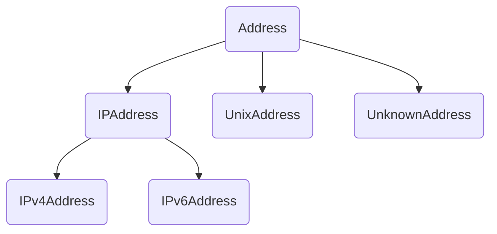

# 站在巨人的肩膀上

> [C++高性能分布式服务器框架](https://github.com/sylar-yin/sylar)

> [从零开始重写sylar C++高性能分布式服务器框架](https://www.midlane.top/wiki/pages/viewpage.action?pageId=10060952)


# 概述

- 提供网络地址相关的类，支持与网络地址相关的操作。
- IPv4 协议对应 IPv4 地址，长度是 32 位；IPv6 协议对应 IPv6 地址，长度是 128 位；Unix 域套接字地址是一个路径字符串。
- Berkeley 套接字接口拟定了一个通用套接字地址结构 sockaddr，用于表示任意类型的地址，所有的套接字 API 在传入地址参数时都只需要传入 sockaddr 类型，以保证接口的通用性。除通用地址结构 sockaddr 外，还有一系列表示具体的网络地址的结构，这些具体的网络地址结构用于用户赋值，但在使用时，都要转化成 sockaddr 的形式。
```C++
sockaddr表示通用套接字地址结构，其定义如下：
struct sockaddr
{
	unsigned short sa_family; // 地址族，也就是地址类型
	char sa_data[14];         // 地址内容
};
```
- 所有的套接字 API 都是以指针形式接收 sockaddr 参数，并且额外需要一个地址长度参数，这可以保证当 sockaddr 本身不足以容纳一个具体的地址时，可以通过指针取到全部的内容。
- 除 sockaddr 外，套接字接口还定义了一系列具体的网络地址结构，比如 sockaddr_in 表示 IPv4 地址，sockaddr_in6 表示 IPv6 地址，sockaddr_un 表示 Unix 域套接字地址，它们的定义如下：
```C++
struct sockaddr_in 
{
	unsigned short sin_family; // 地址族，IPv4的地址族为AF_INET
	unsigned short sin_port;   // 端口
	struct in_addr sin_addr;   // IP地址，IPv4的地址用一个32位整数来表示
	char sin_zero[8];          // 填充位，填零即可
};
	
struct sockaddr_in6
{
	unsigned short sin6_family; // 地址族，IPv6的地址族为AF_INET6
	in_port_t sin6_port;	   	// 端口
	uint32_t sin6_flowinfo;	    // IPv6流控信息
	struct in6_addr sin6_addr;	// IPv6地址，实际为一个128位的结构体
	uint32_t sin6_scope_id;	    // IPv6 scope-id
};
	
struct sockaddr_un
{
	unsigned short sun_family;  // 地址族，Unix域套字地址族为AF_UNIX
	char sun_path[108];         // 路径字符串
};
```


# Address

- 所有网络地址的基类，抽象类，对应 sockaddr 类型，但只包含抽象方法，不包含具体的成员。
- 除此外，Address 作为地址类还提供了网络地址查询（通过 getaddrinfo() 函数）及本机网卡地址查询功能（通过 getifaddrs() 函数），其中网络地址查询功能可以实现域名解析，网卡地址查询可以获取本机指定网卡的 IP 地址。


# IPAddress

- 继承自 Address。
- IP地址的基类，抽象类，在 Address 基类的基础上，增加了 IP 地址相关的端口以及广播地址、网段地址、子网掩码操作，但只包含抽象方法，不包含具体的成员。


# IPv4Address

- 继承自 IPAddress。
- IPv4 地址类，实体类，表示一个 IPv4 地址，对应 sockaddr_in 类型，包含一个 sockaddr_in 成员，可以操作该成员的网络地址和端口，以及获取广播地址、网段地址、子网掩码操作。


# IPv6Address

- 继承自 IPAddress。
- IPv6 地址类，实体类，表示一个 IPv6 地址，对应 sockaddr_in6 类型，包含一个 sockaddr_in6 成员，可以操作该成员的网络地址和端口，以及获取广播地址、网段地址、子网掩码操作。


# UnixAddress

- 继承自 Address。
- Unix 域套接字类，实体类，表示一个 Unix Socket 地址，对应 sockaddr_un 类型，包含一个 sockaddr_un 对象以及一个路径字符串长度。


# UnknownAddress

- 继承自 Address。
- 表示一个未知类型的套接字地址，实体类，对应 sockaddr 类型，该类与 Address 类的区别是它包含一个 sockaddr 成员，并且是一个实体类。


# 其他说明

- 注意大小端问题，sylar 封装了 byteswapOnLittleEndian() 等方法用于大小端转换。


# 关系图




# 部分相关代码
```C++
/**
 * @filename    address.h
 * @brief   Address模块（对网络地址（如IPv4、IPv6、Unix）的封装）
 * @author  L-ge
 * @version 0.1
 * @modify  2022-07-07
 */
#ifndef __SYLAR_ADDRESS_H__
#define __SYLAR_ADDRESS_H__

#include <memory>
#include <string>
#include <sys/types.h>
#include <sys/socket.h>
#include <sys/un.h>
#include <arpa/inet.h>
#include <unistd.h>
#include <iostream>
#include <vector>
#include <map>

namespace sylar
{

class IPAddress;

/**
 * @brief   网络地址的基类（抽象类）
 */
class Address
{
public:
    typedef std::shared_ptr<Address> ptr;

    /**
     * @brief  通过 sockaddr 指针创建 Address 
     */
    static Address::ptr Create(const sockaddr* addr, socklen_t addrlen);

    /**
     * @brief   通过 host 地址返回对应条件的所有 Address
     *
     * @param   result  传出值，保存满足条件的 Address
     * @param   host    域名，服务器名等，例如，www.sylar.top[:80] （方括号为可选内容）
     * @param   family  协议族（AF_INET、AF_INET6、AF_UNIX）
     * @param   type    socket 类型（SOCK_STREAM、SOCK_DGRAM 等）
     * @param   protocol    协议类型（IPPROTO_TCP、IPPROTO_UDP 等）
     */
    static bool Lookup(std::vector<Address::ptr>& result, const std::string& host, int family = AF_INET, int type = 0, int protocol = 0);
    
    /**
     * @brief   通过 host 地址返回对应条件的任意 Address
     */
    static Address::ptr LookupAny(const std::string& host, int family = AF_INET, int type = 0, int protocol = 0);
    
    /**
     * @brief   通过 host 地址返回对应条件的任意 Address
     */
    static std::shared_ptr<IPAddress> LookupAnyIPAddress(const std::string& host, int family = AF_INET, int type = 0, int protocol = 0);
    
    /**
     * @brief  返回本机所有网卡的<网卡名, 地址, 子网掩码位数> 
     *
     * @param   result  传出参数，保存本机所有地址
     * @param   family  协议族
     */
    static bool GetInterfaceAddresses(std::multimap<std::string, std::pair<Address::ptr, uint32_t> >& result, int family = AF_INET);
    
    /**
     * @brief   获取指定网卡的地址和子网掩码位数
     *
     * @param   result  传出参数，保存该网卡的所有地址
     * @param   iface   网卡名称
     */
    static bool GetInterfaceAddresses(std::vector<std::pair<Address::ptr, uint32_t> >& result, const std::string& iface, int family = AF_INET);

    virtual ~Address() {}

    /**
     * @brief   返回协议族
     */
    int getFamily() const;

    /**
     * @brief   返回sockaddr指针
     */
    virtual const sockaddr* getAddr() const = 0;
    virtual sockaddr* getAddr() = 0;

    /**
     * @brief   返回sockaddr的长度
     */
    virtual socklen_t getAddrLen() const = 0;

    /**
     * @brief   输出可读性的地址
     */
    virtual std::ostream& insert(std::ostream& os) const = 0;

    /**
     * @brief   返回可读性的字符串
     */
    std::string toString() const;

    // 比较函数
    bool operator<(const Address& rhs) const;
    bool operator==(const Address& rhs) const;
    bool operator!=(const Address& rhs) const;
};

/**
 * @brief   IP地址的基类（抽象类）
 */
class IPAddress : public Address
{
public:
    typedef std::shared_ptr<IPAddress> ptr;

    /**
     * @brief  通过域名/IP/服务器名创建 IPAddress 
     *
     * @param   address 域名/IP/服务器名等，例如 www.sylar.top
     * @param   port    端口号
     */
    static IPAddress::ptr Create(const char* address, uint16_t port = 0);
    
    /**
     * @brief   获取该地址的广播地址 
     *
     * @param   prefix_len  子网掩码位数
     */
    virtual IPAddress::ptr broadcastAddress(uint32_t prefix_len) = 0;

    /**
     * @brief   获取该地址的网段
     *
     * @param   prefix_len  子网掩码位数
     */
    virtual IPAddress::ptr networdAddress(uint32_t prefix_len) = 0;
    
    /**
     * @brief   获取子网掩码的地址
     *
     * @param   prefix_len  子网掩码位数
     */
    virtual IPAddress::ptr subnetMask(uint32_t prefix_len) = 0;
    
    virtual uint32_t getPort() const = 0;
    virtual void setPort(uint16_t v) = 0;
};

/**
 * @brief   IPv4地址类
 */
class IPv4Address : public IPAddress
{
public:
    typedef std::shared_ptr<IPv4Address> ptr;

    /**
     * @brief   使用点分十进制地址创建IPv4Address
     *
     * @param   address 点分十进制地址，例如 192.168.1.1
     * @param   port    端口号
     */
    static IPv4Address::ptr Create(const char* address, uint16_t port = 0);

    IPv4Address(const sockaddr_in& address);
    
    /**
     * @brief   通过二进制地址构造IPv4Address
     *
     * @param   address 二进制地址address
     * @param   port    端口号
     */
    IPv4Address(uint32_t address = INADDR_ANY, uint16_t port = 0);

    const sockaddr* getAddr() const override;
    sockaddr* getAddr() override;
    socklen_t getAddrLen() const override;
    std::ostream& insert(std::ostream& os) const override;

    IPAddress::ptr broadcastAddress(uint32_t prefix_len) override;
    IPAddress::ptr networdAddress(uint32_t prefix_len) override;
    IPAddress::ptr subnetMask(uint32_t prefix_len) override;
    uint32_t getPort() const override;
    void setPort(uint16_t v) override;

private:
    sockaddr_in m_addr;
};

/**
 * @brief   IPv6地址类
 */
class IPv6Address : public IPAddress
{
public:
    typedef std::shared_ptr<IPv6Address> ptr;

    /**
     * @brief   通过IPv6地址字符串构造IPv6Address
     *
     * @param   address IPv6地址字符串
     * @param   port    端口号
     */
    static IPv6Address::ptr Create(const char* address, uint16_t port = 0);

    IPv6Address();
    IPv6Address(const sockaddr_in6& address);

    /**
     * @brief   通过IPv6二进制地址构造IPv6Address 
     *
     * @param   address[16] IPv6二进制地址
     * @param   port        端口号
     */
    IPv6Address(const uint8_t address[16], uint16_t port = 0);

    const sockaddr* getAddr() const override;
    sockaddr* getAddr() override;
    socklen_t getAddrLen() const override;
    std::ostream& insert(std::ostream& os) const override;

    IPAddress::ptr broadcastAddress(uint32_t prefix_len) override;
    IPAddress::ptr networdAddress(uint32_t prefix_len) override;
    IPAddress::ptr subnetMask(uint32_t prefix_len) override;
    uint32_t getPort() const override;
    void setPort(uint16_t v) override;

private:
    sockaddr_in6 m_addr;
};

/**
 * @brief   Unix Socket地址类
 */
class UnixAddress : public Address
{
public:
    typedef std::shared_ptr<UnixAddress> ptr;

    UnixAddress();

    /**
     * @brief   通过路径构造UnixAddress
     *
     * @param   path    UnixSocket路径（长度小于UNIX_PATH_MAX）
     */
    UnixAddress(const std::string& path);

    const sockaddr* getAddr() const override;
    sockaddr* getAddr() override;
    socklen_t getAddrLen() const override;
    void setAddrLen(uint32_t v);
    std::string getPath() const;
    std::ostream& insert(std::ostream& os) const override;

private:
    sockaddr_un m_addr;
    socklen_t m_length;
};

/**
 * @brief   未知地址类
 */
class UnknownAddress : public Address
{
public:
    typedef std::shared_ptr<UnixAddress> ptr;

    UnknownAddress(int family);
    UnknownAddress(const sockaddr& addr);

    const sockaddr* getAddr() const override;
    sockaddr* getAddr() override;
    socklen_t getAddrLen() const override;
    std::ostream& insert(std::ostream& os) const override;

private:
    sockaddr m_addr;
};

/**
 * @brief   流式输出Address   
 */
std::ostream& operator<<(std::ostream& os, const Address& addr);

}

#endif


#include "address.h"
#include "log.h"
#include "endian.h"
#include <sstream>
#include <netdb.h>
#include <ifaddrs.h>
#include <stddef.h>

namespace sylar
{
   
static sylar::Logger::ptr g_logger = SYLAR_LOG_NAME("system");

/**
 * @brief   创建掩码
 *          以bits=1，sizeof(T)是1字节举例，1左移7位就是1000 0000，再减1就是0111 1111
 */
template<class T>
static T CreateMask(uint32_t bits)
{
    return (1 << (sizeof(T) * 8 - bits)) - 1;
}

/**
 * @brief  求value的二进制中1的个数 
 */
template<class T>
static uint32_t CountBytes(T value)
{
    uint32_t result = 0;
    for(; value; ++result)
    {
        value &= value - 1;
    }
    return result;
}

Address::ptr Address::Create(const sockaddr* addr, socklen_t addrlen)
{
    if(addr == nullptr)
    {
        return nullptr;
    }

    Address::ptr result;
    switch(addr->sa_family)
    {
        case AF_INET:
            result.reset(new IPv4Address(*(const sockaddr_in*)(addr)));
            break;
        case AF_INET6:
            result.reset(new IPv6Address(*(const sockaddr_in6*)(addr)));
            break;
        default:
            result.reset(new UnknownAddress(*addr));
            break;
    }
    return result;
}

bool Address::Lookup(std::vector<Address::ptr>& result, const std::string& host, int family, int type, int protocol)
{
    addrinfo hints, *results, *next;
    hints.ai_flags = 0;
    hints.ai_family = family;
    hints.ai_socktype = type;
    hints.ai_protocol = protocol;
    hints.ai_addrlen = 0;
    hints.ai_canonname = NULL;
    hints.ai_addr = NULL;
    hints.ai_next = NULL;

    std::string node;
    const char* service = NULL;

    // 检查ipv6 address service
    if(!host.empty() && host[0] == '[')
    {
        // 在host.c_str()+1所指向的字符串的前host.size()-1个字节中搜索第一次出现字符'['的位置
        const char* endipv6 = (const char*)memchr(host.c_str() + 1, ']', host.size() - 1);
        if(endipv6)
        {
            if(*(endipv6 + 1) == ':')
            {
                service = endipv6 + 2;
            }
            node = host.substr(1, endipv6 - host.c_str() - 1);
        }
    }

    // 检查node service
    if(node.empty())
    {
        service = (const char*)memchr(host.c_str(), ':', host.size());
        if(service)
        {
            if(!memchr(service + 1, ':', host.c_str() + host.size() - service - 1))
            {
                node = host.substr(0, service - host.c_str());
                ++service;
            }
        }
    }

    if(node.empty())
    {
        node = host;
    }

    int error = getaddrinfo(node.c_str(), service, &hints, &results);
    if(error)
    {
        SYLAR_LOG_DEBUG(g_logger) << "Address:Lookup getaddress(" << host << ", "
            << family << ", " << type << ") err=" << error << "errstr=" << gai_strerror(error);
        return false;
    }

    next = results;
    while(next)
    {
        result.push_back(Create(next->ai_addr, (socklen_t)next->ai_addrlen));
        next = next->ai_next;
    }

    freeaddrinfo(results);
    return !result.empty();
}
    
Address::ptr Address::LookupAny(const std::string& host, int family, int type, int protocol)
{
    std::vector<Address::ptr> result;
    if(Lookup(result, host, family, type, protocol))
    {
        return result[0];
    }
    return nullptr;
}

std::shared_ptr<IPAddress> Address::LookupAnyIPAddress(const std::string& host, int family, int type, int protocol)
{
    std::vector<Address::ptr> result;
    if(Lookup(result, host, family, type, protocol))
    {
        for(auto& i : result)
        {
            IPAddress::ptr v = std::dynamic_pointer_cast<IPAddress>(i);
            if(v)
            {
                return v;
            }
        }
    }
    return nullptr;
}

bool Address::GetInterfaceAddresses(std::multimap<std::string, std::pair<Address::ptr, uint32_t> >& result, int family)
{
    struct ifaddrs *next, *results;
    if(getifaddrs(&results) != 0)
    {
        SYLAR_LOG_DEBUG(g_logger) << "Address::GetInterfaceAddresses getifaddrs "
            << " err=" << errno << " errstr=" << strerror(errno);
        return false;
    }

    try
    {
        for(next = results; next; next = next->ifa_next)
        {
            Address::ptr addr;
            uint32_t prefix_len = ~0u;
            if(family != AF_UNSPEC && family != next->ifa_addr->sa_family)
            {
                continue;
            }

            switch(next->ifa_addr->sa_family)
            {
                case AF_INET:
                    {
                        addr = Create(next->ifa_addr, sizeof(sockaddr_in));
                        uint32_t netmask = ((sockaddr_in*)next->ifa_netmask)->sin_addr.s_addr;
                        prefix_len = CountBytes(netmask);
                    }
                    break;
                case AF_INET6:
                    {
                        addr = Create(next->ifa_addr, sizeof(sockaddr_in6));
                        in6_addr& netmask = ((sockaddr_in6*)next->ifa_netmask)->sin6_addr;
                        prefix_len = 0;
                        for(int i=0; i<16; ++i)
                        {
                            prefix_len += CountBytes(netmask.s6_addr[i]);
                        }
                    }
                    break;
                default:
                    break;
            }

            if(addr)
            {
                result.insert(std::make_pair(next->ifa_name, std::make_pair(addr, prefix_len)));
            }
        }
    }
    catch(...)
    {
        SYLAR_LOG_ERROR(g_logger) << "Address:GetInterfaceAddresses exception";
        freeifaddrs(results);
        return false;
    }
    freeifaddrs(results);
    return !result.empty();
}

bool Address::GetInterfaceAddresses(std::vector<std::pair<Address::ptr, uint32_t> >& result, const std::string& iface, int family)
{
    if(iface.empty() || iface == "*")
    {
        if(family == AF_INET || family == AF_UNSPEC)
        {
            result.push_back(std::make_pair(Address::ptr(new IPv4Address()), 0u));
        }
        
        if(family == AF_INET6 || family == AF_UNSPEC)
        {
            result.push_back(std::make_pair(Address::ptr(new IPv6Address()), 0u));
        }
        return true;
    }

    std::multimap<std::string, std::pair<Address::ptr, uint32_t> > results;
    if(!GetInterfaceAddresses(results, family))
    {
        return false;
    }

    auto its = results.equal_range(iface);
    for(; its.first != its.second; ++its.first)
    {
        result.push_back(its.first->second);
    }
    return !result.empty();
}

int Address::getFamily() const
{
    return getAddr()->sa_family;
}

std::string Address::toString() const
{
    std::stringstream ss;
    insert(ss);
    return ss.str();
}

bool Address::operator<(const Address& rhs) const
{
    socklen_t minlen = std::min(getAddrLen(), rhs.getAddrLen());
    int result = memcmp(getAddr(), rhs.getAddr(), minlen);
    if(result < 0)
    {
        return true;
    }
    else if(result > 0)
    {
        return false;
    }
    else if(getAddrLen() < rhs.getAddrLen())
    {
        return true;
    }
    return false;
}

bool Address::operator==(const Address& rhs) const
{
    return getAddrLen() == rhs.getAddrLen()
        && memcmp(getAddr(), rhs.getAddr(), getAddrLen()) == 0;
}

bool Address::operator!=(const Address& rhs) const
{
    return !(*this == rhs);
}

IPAddress::ptr IPAddress::Create(const char* address, uint16_t port)
{
    addrinfo hints, *results;
    memset(&hints, 0, sizeof(addrinfo));
    hints.ai_flags = AI_NUMERICHOST;
    hints.ai_family = AF_UNSPEC;

    int error = getaddrinfo(address, NULL, &hints, &results);
    if(error)
    {
        SYLAR_LOG_DEBUG(g_logger) << "IPAddress::Create(" << address
            << ", " << port << ") error=" << error
            << " errno=" << errno << " errstr=" << strerror(errno);
        return nullptr;
    }

    try
    {
        IPAddress::ptr result = std::dynamic_pointer_cast<IPAddress>(
                Address::Create(results->ai_addr, (socklen_t)results->ai_addrlen));
        if(result)
        {
            result->setPort(port);
        }
        freeaddrinfo(results);
        return result;
    }
    catch(...)
    {
        freeaddrinfo(results);
        return nullptr;
    }
}
    
IPv4Address::ptr IPv4Address::Create(const char* address, uint16_t port)
{
    IPv4Address::ptr rt(new IPv4Address);
    rt->m_addr.sin_port = byteswapOnLittleEndian(port);
    int result = inet_pton(AF_INET, address, &rt->m_addr.sin_addr);
    if(result <= 0)
    {
        SYLAR_LOG_DEBUG(g_logger) << "IPv4Address::Create(" << address << ", "
            << port << ") rt=" << result << " errno=" << errno
            << " errstr=" << strerror(errno);
        return nullptr;
    }
    return rt;

}

IPv4Address::IPv4Address(const sockaddr_in& address)
{
    m_addr = address;
}
    
IPv4Address::IPv4Address(uint32_t address, uint16_t port)
{
    memset(&m_addr, 0, sizeof(m_addr));
    m_addr.sin_family = AF_INET;
    m_addr.sin_port = byteswapOnLittleEndian(port);
    m_addr.sin_addr.s_addr = byteswapOnLittleEndian(address);
}

const sockaddr* IPv4Address::getAddr() const
{
    return (sockaddr*)&m_addr;
}

sockaddr* IPv4Address::getAddr()
{
    return (sockaddr*)&m_addr;
}

socklen_t IPv4Address::getAddrLen() const
{
    return sizeof(m_addr);
}

std::ostream& IPv4Address::insert(std::ostream& os) const
{
    uint32_t addr = byteswapOnLittleEndian(m_addr.sin_addr.s_addr);
    os << ((addr >> 24) & 0xff) << "."
       << ((addr >> 16) & 0xff) << "."
       << ((addr >> 8) & 0xff) << "."
       << (addr & 0xff);
    os << ":" << byteswapOnLittleEndian(m_addr.sin_port);
    return os;
}

IPAddress::ptr IPv4Address::broadcastAddress(uint32_t prefix_len)
{
    if(prefix_len > 32)
    {
        return nullptr;
    }

    sockaddr_in baddr(m_addr);
    baddr.sin_addr.s_addr |= byteswapOnLittleEndian(CreateMask<uint32_t>(prefix_len));
    return IPv4Address::ptr(new IPv4Address(baddr));
}

IPAddress::ptr IPv4Address::networdAddress(uint32_t prefix_len)
{
    if(prefix_len > 32)
    {
        return nullptr;
    }

    sockaddr_in baddr(m_addr);
    baddr.sin_addr.s_addr &= byteswapOnLittleEndian(CreateMask<uint32_t>(prefix_len));
    return IPv4Address::ptr(new IPv4Address(baddr));
}

IPAddress::ptr IPv4Address::subnetMask(uint32_t prefix_len)
{
    sockaddr_in subnet;
    memset(&subnet, 0, sizeof(subnet));
    subnet.sin_family = AF_INET;
    subnet.sin_addr.s_addr = ~byteswapOnLittleEndian(CreateMask<uint32_t>(prefix_len));
    return IPv4Address::ptr(new IPv4Address(subnet));
}

uint32_t IPv4Address::getPort() const
{
    return byteswapOnLittleEndian(m_addr.sin_port);
}

void IPv4Address::setPort(uint16_t v)
{
    m_addr.sin_port = byteswapOnLittleEndian(v);
}

IPv6Address::ptr IPv6Address::Create(const char* address, uint16_t port)
{
    IPv6Address::ptr rt(new IPv6Address);
    rt->m_addr.sin6_port = byteswapOnLittleEndian(port);
    int result = inet_pton(AF_INET6, address, &rt->m_addr.sin6_addr);
    if(result <= 0)
    {
        SYLAR_LOG_DEBUG(g_logger) << "IPv6Address::Create(" << address << ", "
            << port << ") rt=" << result << " errno=" << errno
            << " errstr=" << strerror(errno);
        return nullptr;
    }
    return rt;
}

IPv6Address::IPv6Address()
{
    memset(&m_addr, 0, sizeof(m_addr));
    m_addr.sin6_family = AF_INET6;
}

IPv6Address::IPv6Address(const sockaddr_in6& address)
{
    m_addr = address;
}

IPv6Address::IPv6Address(const uint8_t address[16], uint16_t port)
{
    memset(&m_addr, 0, sizeof(m_addr));
    m_addr.sin6_family = AF_INET6;
    m_addr.sin6_port = byteswapOnLittleEndian(port);
    memcpy(&m_addr.sin6_addr.s6_addr, address, 16);
}

const sockaddr* IPv6Address::getAddr() const
{
    return (sockaddr*)&m_addr;
}

sockaddr* IPv6Address::getAddr()
{
    return (sockaddr*)&m_addr;
}

socklen_t IPv6Address::getAddrLen() const
{
    return sizeof(m_addr);
}

std::ostream& IPv6Address::insert(std::ostream& os) const
{
    os << "[";
    uint16_t* addr = (uint16_t*)m_addr.sin6_addr.s6_addr;
    bool used_zeros = false;
    for(size_t i = 0; i < 8; ++i)
    {
        if(addr[i] == 0 && !used_zeros)
        {
            continue;
        }
        if(i && addr[i-1] == 0 && !used_zeros)
        {
            os << ":";
            used_zeros = true;
        }
        if(i)
        {
            os << ":";
        }
        os << std::hex << (int)byteswapOnLittleEndian(addr[i]) << std::dec;
    }

    if(!used_zeros && addr[7] == 0)
    {
        os << "::";
    }

    os << "]" << byteswapOnLittleEndian(m_addr.sin6_port);
    return os;
}

IPAddress::ptr IPv6Address::broadcastAddress(uint32_t prefix_len)
{
    sockaddr_in6 baddr(m_addr);
    baddr.sin6_addr.s6_addr[prefix_len / 8] |= CreateMask<uint8_t>(prefix_len % 8);
    for(int i = prefix_len / 8 + 1; i < 16; ++i)
    {
        baddr.sin6_addr.s6_addr[i] = 0xff;
    }
    return IPv6Address::ptr(new IPv6Address(baddr));
}

IPAddress::ptr IPv6Address::networdAddress(uint32_t prefix_len)
{
    sockaddr_in6 baddr(m_addr);
    baddr.sin6_addr.s6_addr[prefix_len / 8] &= CreateMask<uint8_t>(prefix_len % 8);
    for(int i = prefix_len / 8 + 1; i < 16; ++i)
    {
        baddr.sin6_addr.s6_addr[i] = 0x00;
    }
    return IPv6Address::ptr(new IPv6Address(baddr));
}

IPAddress::ptr IPv6Address::subnetMask(uint32_t prefix_len)
{
    sockaddr_in6 subnet;
    memset(&subnet, 0, sizeof(subnet));
    subnet.sin6_family = AF_INET6;
    subnet.sin6_addr.s6_addr[prefix_len / 8] = ~CreateMask<uint8_t>(prefix_len % 8);
    for(uint32_t i = 0; i < prefix_len / 8; ++i)
    {
        subnet.sin6_addr.s6_addr[i] = 0xff;
    }
    return IPv6Address::ptr(new IPv6Address(subnet));
}

uint32_t IPv6Address::getPort() const
{
    return byteswapOnLittleEndian(m_addr.sin6_port);
}

void IPv6Address::setPort(uint16_t v)
{
    m_addr.sin6_port = byteswapOnLittleEndian(v);
}

static const size_t MAX_PATH_LEN = sizeof(((sockaddr_un*)0)->sun_path) - 1;
UnixAddress::UnixAddress()
{
    memset(&m_addr, 0, sizeof(m_addr));
    m_addr.sun_family = AF_UNIX;
    m_length = offsetof(sockaddr_un, sun_path) + MAX_PATH_LEN;
}

UnixAddress::UnixAddress(const std::string& path)
{
    memset(&m_addr, 0, sizeof(m_addr));
    m_addr.sun_family = AF_UNIX;
    m_length = path.size() + 1;

    if(!path.empty() && path[0] == '\0')
    {
        --m_length;
    }

    if(m_length > sizeof(m_addr.sun_path))
    {
        throw std::logic_error("path too long");
    }
    
    memcpy(m_addr.sun_path, path.c_str(), m_length);
    m_length += offsetof(sockaddr_un, sun_path);
}

const sockaddr* UnixAddress::getAddr() const
{
    return (sockaddr*)&m_addr;
}

sockaddr* UnixAddress::getAddr()
{
    return (sockaddr*)&m_addr;
}

socklen_t UnixAddress::getAddrLen() const
{
    return m_length;
}

void UnixAddress::setAddrLen(uint32_t v)
{
    m_length = v;
}

std::string UnixAddress::getPath() const
{
    std::stringstream ss;
    if(m_length > offsetof(sockaddr_un, sun_path)
            && m_addr.sun_path[0] == '\0')
    {
        ss << "\\0" << std::string(m_addr.sun_path + 1,
                m_length - offsetof(sockaddr_un, sun_path) - 1);
    }
    else 
    {
        ss << m_addr.sun_path;
    }
    return ss.str();
}

std::ostream& UnixAddress::insert(std::ostream& os) const
{
    if(m_length > offsetof(sockaddr_un, sun_path)
            && m_addr.sun_path[0] == '\0')
    {
        os << "\\0" << std::string(m_addr.sun_path + 1,
                m_length - offsetof(sockaddr_un, sun_path) - 1);
    }
    return os << m_addr.sun_path;
}

UnknownAddress::UnknownAddress(int family)
{
    memset(&m_addr, 0, sizeof(m_addr));
    m_addr.sa_family = family;
}

UnknownAddress::UnknownAddress(const sockaddr& addr)
{
    m_addr = addr;
}

const sockaddr* UnknownAddress::getAddr() const
{
    return (sockaddr*)&m_addr;
}

sockaddr* UnknownAddress::getAddr()
{
    return (sockaddr*)&m_addr;
}

socklen_t UnknownAddress::getAddrLen() const
{
    return sizeof(m_addr);
}

std::ostream& UnknownAddress::insert(std::ostream& os) const
{
    os << "[UnknownAddress family=" << m_addr.sa_family << "]";
    return os;
}

std::ostream& operator<<(std::ostream& os, const Address& addr)
{
    return addr.insert(os);
}

}
```


# 广告时间：基于sylar框架实现的小demo(希望给个star)

> [基于redis的参数查询服务](https://github.com/L-ge/awesome-sylar/tree/main/projects/paramquery)
